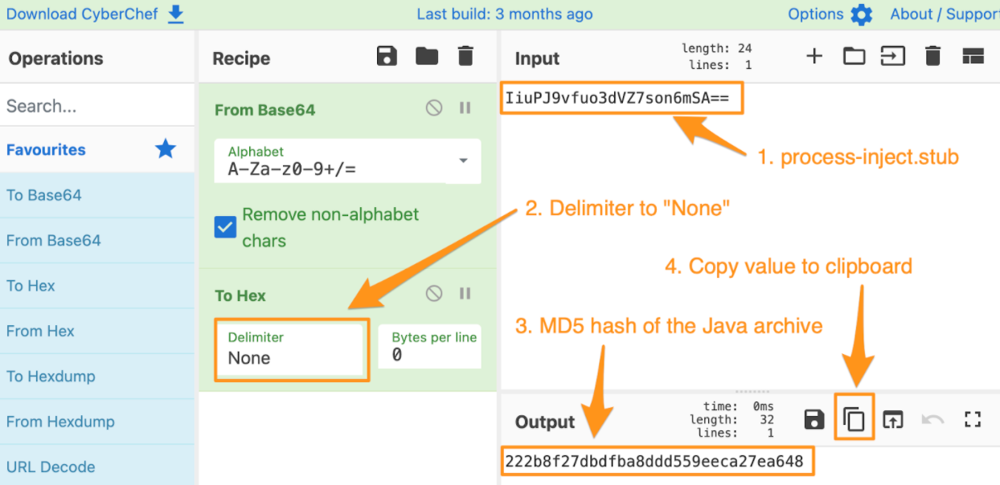
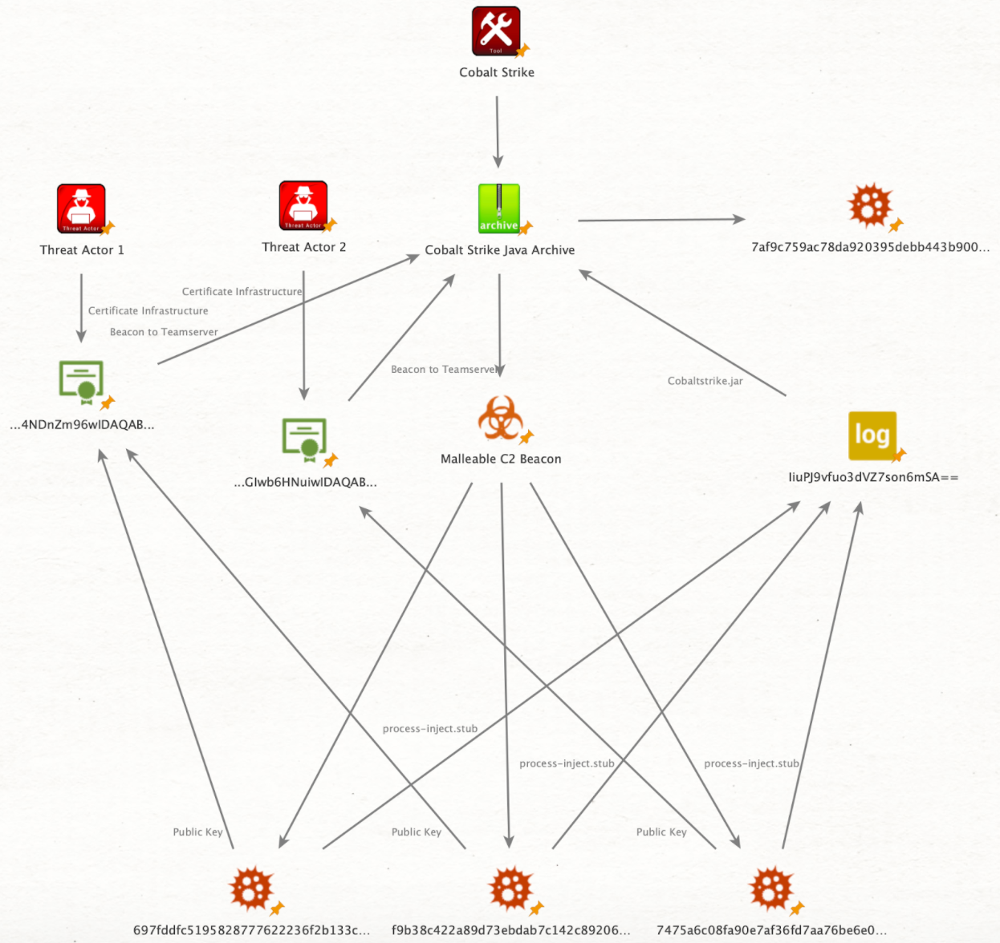
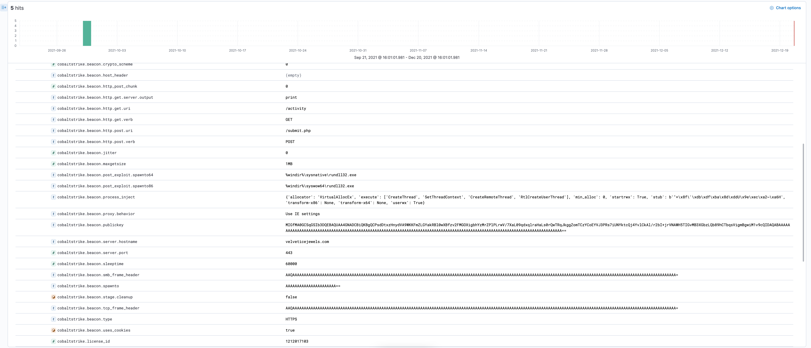

Please check out our [previous post](../02.collecting-cobalt-strike-beacons/article.md) on how to collect Cobalt Strike beacon implants. We'll build on that information to extract the configurations from the beacons.

In this post, we'll walk through manually analyzing a Cobalt Strike C2 configuration from a binary beacon payload using the excellent [Cobalt Strike Configuration Extractor (CSCE)](https://github.com/strozfriedberg/cobaltstrike-config-extractor). We'll also cover enabling some newer features of the Elastic Stack that will allow you to do this at scale across all your monitored endpoints, by extracting the beacons from memory.

!!! info "Shout Out"

    The team at Blackberry has a tremendous handbook called “[Finding Beacons in the Dark](https://www.blackberry.com/us/en/forms/enterprise/ebook-beacons-in-the-dark)” (registration required) that dives extensively into Cobalt Strike beacon configurations. We’ll discuss a few fields in the configurations here, but if you’re interested in learning about how beacons function, we strongly recommend checking that resource out.

## Cobalt Strike Configuration Extractor

The [Cobalt Strike Configuration Extractor (CSCE)](https://github.com/strozfriedberg/cobaltstrike-config-extractor) by Stroz Friedberg is a “python library and set of scripts to extract and parse configurations from Cobalt Strike beacons”.

To use the CSCE, we’ll create a Python virtual environment, activate it, and install the CSCE Python package.

```text title="Setting up the Cobalt Strike Configuration Extractor"
$ python3 -m venv csce

$ source csce/bin/activate

(csce) $ pip3 install libcsce

...truncated...
Collecting libcsce
  Using cached libcsce-0.1.0-py3-none-any.whl (24 kB)
Collecting pefile>=2019.4.18
...truncated...
```

Next, we can run the CSCE on the beacon payload we extracted from memory to see if there’s any interesting information stored we can collect (we’ll add the `--pretty` flag to make the output easier to read as a JSON document).

```text title="Viewing the atomic indicators of the CS beacon configuration"
(csce) $ csce --pretty beacon.exe

{
  "beacontype": [
    "HTTPS"
  ],
  "sleeptime": 45000,
  "jitter": 37,
  "maxgetsize": 1403644,
  "spawnto": "GNEtW6h/g4dQzm0dOkL5NA==",
  "license_id": 334850267,
  "cfg_caution": false,
  "kill_date": "2021-12-24",
  "server": {
    "hostname": "clevelandclinic[.]cloud",
    "port": 443,
    "publickey": "MIGfMA0GCSqGSIb3DQEBAQUAA4G...
...truncated...
```

Immediately, we can see that the beacon uses HTTPS to communicate and that the domain is `clevelandclinic[.]cloud`. This gives us an atomic indicator that we can do some analysis on. Looking at the [Malleable Command and Control documentation](https://www.cobaltstrike.com/help-malleable-c2), we can get a description of the configuration variables.

As an example, we can see that the `sleeptime` is `450000` milliseconds, which changes the default beacon check in from every 60-seconds to 450-seconds, or 7 ½ minutes. Additionally, we see a jitter of `37` meaning that there is a random jitter of 37% of `450000` milliseconds (`166,500` milliseconds), so the beacon checkin could be between `283,000` - `450,000` milliseconds (4.7 - 7 ½ minutes).

Additionally, the `publickey` field is used by the Cobalt Strike Team Server to encrypt communications between the server and the beacon. This is different from normal TLS certificates used when accessing the C2 domain with a browser or data-transfer libraries, like `cURL`. This field is of note because the Team Server uses the same publickey for each beacon, so this field is valuable in clustering beacons with their perspective Team Server because threat actors often use the same Team Server for multiple campaigns, so this data from the configuration can be used to link threat actors to multiple campaigns and infrastructure.

Continuing to look at the configuration output, we can see another interesting section around the `process-inject` nested field, `stub`:

```text title="Viewing the process-inject.stub field"
(csce) $ csce --pretty beacon.exe

...truncated...
  "process-inject": {
    "allocator": "NtMapViewOfSection",
    "execute": [
      "CreateThread 'ntdll!RtlUserThreadStart'",
      "CreateThread",
      "NtQueueApcThread-s",
      "CreateRemoteThread",
      "RtlCreateUserThread"
    ],
    "min_alloc": 17500,
    "startrwx": false,
    "stub": "IiuPJ9vfuo3dVZ7son6mSA==",
    "transform-x86": [
      "prepend '\\x90\\x90'"
    ],
...
```

The `stub` field contains the Base64 encoded MD5 file hash of the Cobalt Strike Java archive. To convert this, we can again use CyberChef, this time add the “From Base64” and “To Hex” [recipes](https://gchq.github.io/CyberChef/#recipe=From_Base64('A-Za-z0-9%2B/%3D',true)To_Hex('None',0)), ensure you change the “Delimiter” to “None” in the “To Hex” recipe.



Now that we have the MD5 value of the Java archive (`222b8f27dbdfba8ddd559eeca27ea648`), we can check that against online databases like VirusTotal to get additional information, specifically, the SHA256 hash (`7af9c759ac78da920395debb443b9007fdf51fa66a48f0fbdaafb30b00a8a858`).


Finally, we can verify the SHA256 hash with CobaltStrike to identify the version of the Java archive by going to [https://verify.cobaltstrike.com](https://verify.cobaltstrike.com) and searching for the hash.


Now we know that this beacon was created using a licensed version of Cobalt Strike 4.4.

Another field from the configuration that is helpful in clustering activity is the `license_id` field.

```text title="Viewing Cobalt Strike watermark"
...truncated
  "spawnto": "GNEtW6h/g4dQzm0dOkL5NA==",
  "license_id": 334850267,
  "cfg_caution": false,
...truncated...
```

This is commonly referred to as the Watermark and is a 9-digit value that is unique per license. While this value can be modified, it can still be used in conjunction with the `process-inject.stub` and `publickey` fields (discussed above) to cluster infrastructure and activity groups.

These are just a few fields that can be used to identify and cluster activities using configurations extracted from the Cobalt Strike beacon. If you’re interested in a very in-depth analysis of the configuration, we recommend you check out the [Finding Beacons in the Dark Cobalt Strike handbook by the team at Blackberry](https://www.blackberry.com/us/en/forms/enterprise/ebook-beacons-in-the-dark).

## Putting Analysis to Action

To test out our analyst playbook for collecting Cobalt Strike beacon payloads, their configurations, and metadata contained within; we can apply those to more data to identify clusters of activity.



In the above illustration, we can cluster threat actors based on their shared uses of the beacon payload public key, which as we described above, is unique per Team Server. This would allow us to group multiple beacon payload hashes, infrastructure, and campaigns to a single Threat Actor.

As always, using the atomic indicators extracted from the beacon payload configurations (`clevelandclinic[.]cloud` in our example) allow you to identify additional shared infrastructure, target verticals, and threat actor capabilities.

### This time at full speed

All of the steps that we've highlighted in this release, as well as the [previous release](../02.collecting-cobalt-strike-beacons/article.md), can be automated and written into Elasticsearch using the [Cobalt Strike Beacon Extraction](../../../../tools/cobalt-strike-extractor/index.md) project.



## Summary

In this post, we highlighted new features in the Elastic Stack that can be used to collect Cobalt Strike Malleable C2 beacon payloads. Additionally, we covered the processes to build Fleet policies to extract beacon payloads from memory and their configurations.

These Fleet policies and processes enable security analysts to collect Cobalt Strike beacon payloads and their configurations to identify threat actor controlled infrastructure and cluster activity.

## Artifacts

<table>
  <tr>
   <td>Observable
   </td>
   <td>Type
   </td>
   <td>Note
   </td>
  </tr>
  <tr>
   <td><code>697fddfc5195828777622236f2b133c0a24a6d0dc539ae7da41798c4456a3f89</code>
   </td>
   <td>SHA256
   </td>
   <td>Cobalt Strike Malleable C2 beacon payload
   </td>
  </tr>
  <tr>
   <td><code>7475a6c08fa90e7af36fd7aa76be6e06b9e887bc0a6501914688a87a43ac7ac4</code>
   </td>
   <td>SHA256
   </td>
   <td>Cobalt Strike Malleable C2 beacon payload
   </td>
  </tr>
  <tr>
   <td><code>f9b38c422a89d73ebdab7c142c8920690ee3a746fc4eea9175d745183c946fc5</code>
   </td>
   <td>SHA256
   </td>
   <td>Cobalt Strike Malleable C2 beacon payload
   </td>
  </tr>
  <tr>
   <td><code>clevelandclinic[.]cloud</code>
   </td>
   <td>domain-name
   </td>
   <td>Cobalt Strike Malleable C2 domain
   </td>
  </tr>
  <tr>
   <td><code>104[.]197[.]142[.]19</code>
   </td>
   <td>ipv4-addr
   </td>
   <td>Cobalt Strike Malleable C2 IP address
   </td>
  </tr>
  <tr>
   <td><code>192[.]64[.]119[.]19</code>
   </td>
   <td>ipv4-addr
   </td>
   <td>Cobalt Strike Malleable C2 IP address
   </td>
  </tr>
</table>
