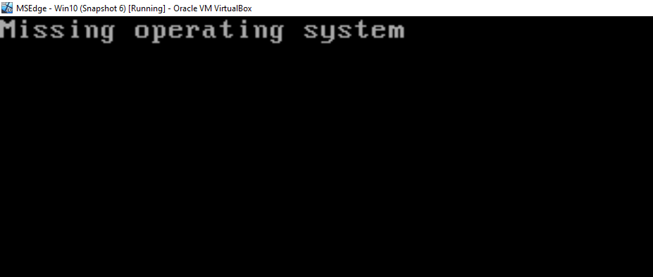
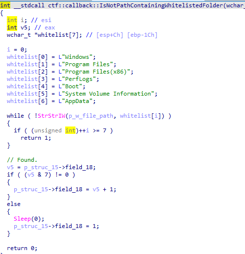
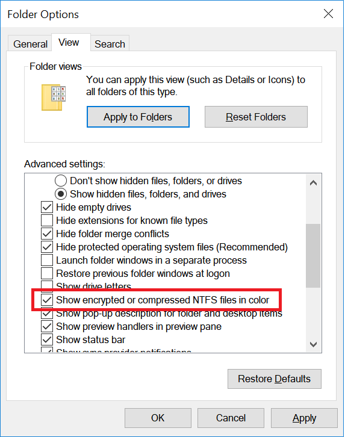
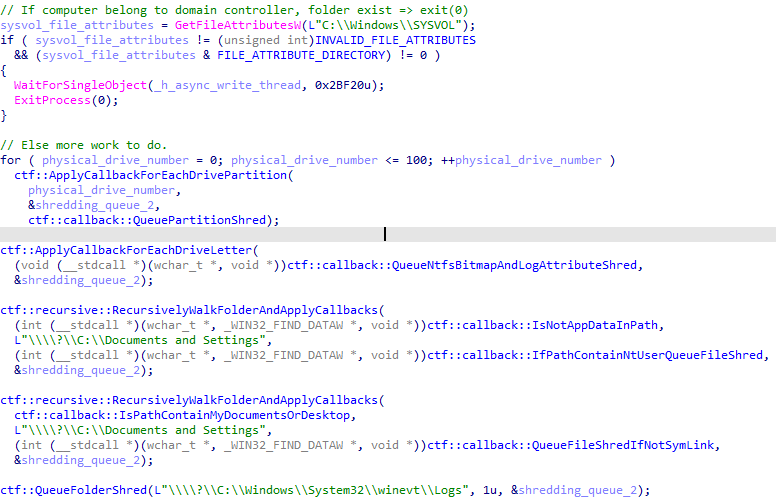
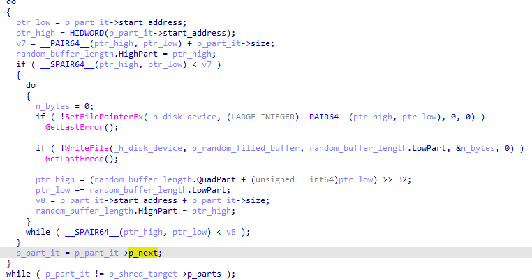
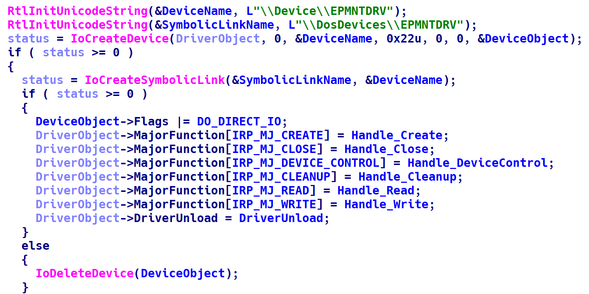
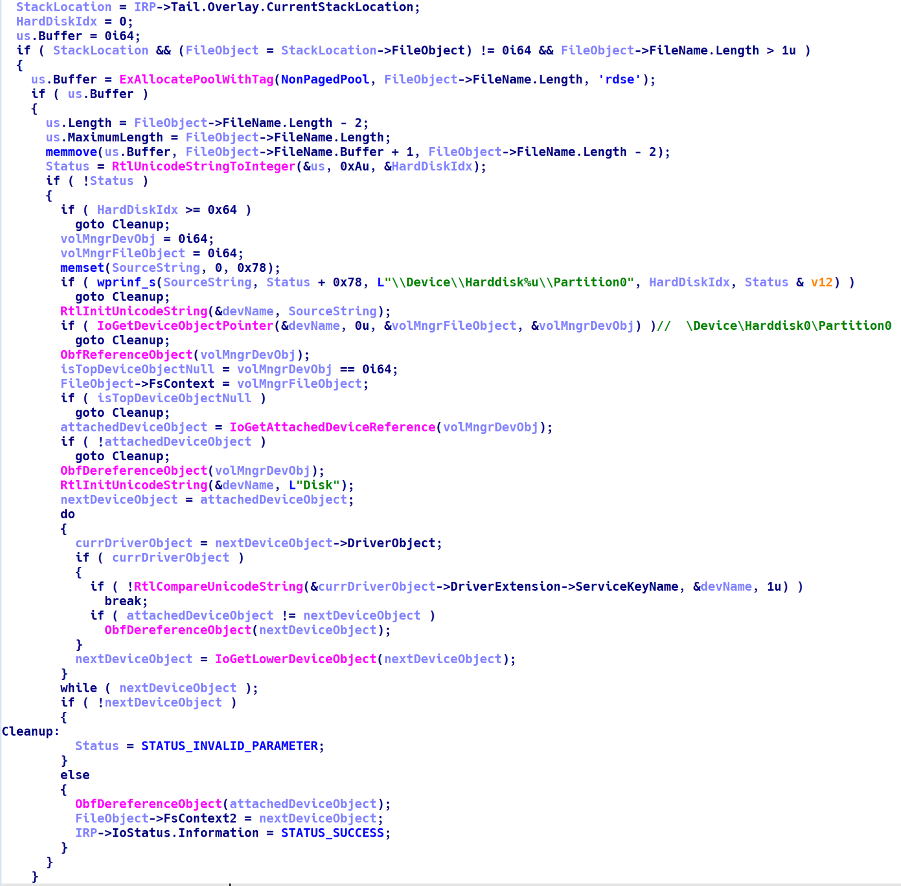
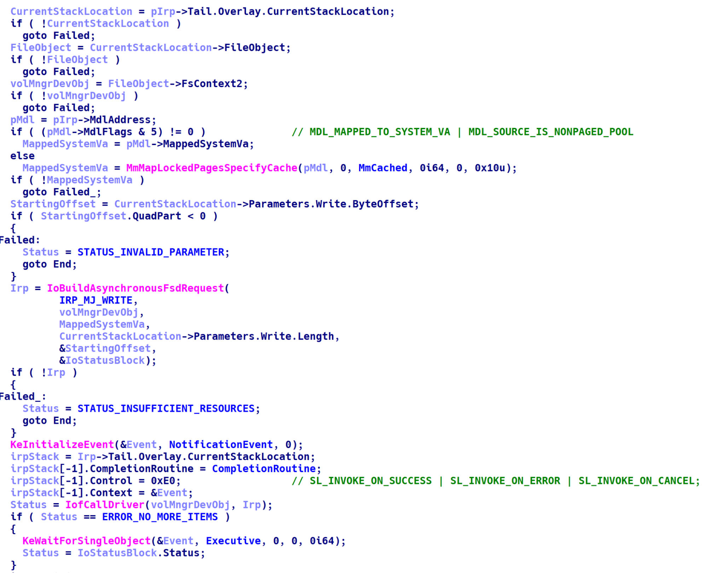

## Introduction

On February 23, 2022, the ESET threat research team [disclosed a series of findings](https://twitter.com/ESETresearch/status/1496581903205511181) pertaining to a Data Wiper malware campaign, impacting hundreds of systems across Ukraine, named [HERMETICWIPER](https://twitter.com/juanandres_gs/status/1496607141888724997). Elastic previously published research on [Operation Bleeding Bear](https://elastic.github.io/security-research/malware/2022/01/01.operation-bleeding-bear/article/), a campaign targeted towards Ukrainian assets with similar destructive intentions.

Malware Wipers remain a common tactic of adversaries looking to cause havoc on systems impacted by their payloads. Typically this class of malware is designed to wipe the contents of any drives a system may have, rendering the end-users personal data lost. Many more recent examples of this class of payload incorporate tactics that also tamper with the boot process, with HERMETICWIPER being no exception.

Customers leveraging the Elastic Agent version 7.9+, and above are protected against this specific malware, with further research being undertaken to improve detection efficacy.


## Malware Wipers & Ukrainian Targets

Unfortunately, this is not the first time this year that Ukranian systems have been the target of Data-wiping payloads - Microsoft [published findings](https://therecord.media/microsoft-data-wiping-malware-disguised-as-ransomware-targets-ukraine-again/) pertaining to similar, observed attacks that impacted systems within Ukraine, however initially impacting a far smaller number of systems. The publication outlined that the targeting of this specific earlier campaign was focused on multiple government agencies, non-profits, and information technology organizations throughout the country.

## Malware Stage Analysis

HERMETICWIPER is digitally signed by Hermetica Digital Ltd., an organization [registered](https://opencorporates.com/companies/cy/HE419469) in Cyprus, and embeds 4 legitimate driver files from [EaseUS Partition Manager](https://www.easeus.com/partition-manager) that are compressed using MS-DOS utility (`mscompress`). Hermetica Digital Ltd. has revoked the code-signing certificate.

Upon execution, HERMETICWIPER creates a kernel mode service and interacts with it via `DeviceIoControl` API function. The main objective is to corrupt any attached physical drive and render the system data unrecoverable.


Below is a summary of the events generated during the installation phase using, Windows events logs and Elastic Agent.


Following the installation process, HERMETICWIPER determines the dimensions of each partition by calculating the bytes in each sector and sectors in each cluster using the `GetDiskFreeSpaceW` Windows API [function](https://docs.microsoft.com/en-us/windows/win32/api/fileapi/nf-fileapi-getdiskfreespacew).

The malware interacts with the IOCTL interface, passing the parameter `IOCTL_VOLUME_GET_VOLUME_DISK_EXTENTS` with a value of `0x560000` to the device driver in order to retrieve the physical location of the root driver (`\\.\C`).  The root drive corresponds to the volume Windows uses to boot, and its identification is essential to achieve a destructive impact.

The NTFS/FAT boot sector and random file physical offsets are enumerated for each accessible physical drive, and then overwritten by the output of the CryptGenRandom [API function](https://docs.microsoft.com/en-us/windows/win32/api/wincrypt/nf-wincrypt-cryptgenrandom) and a series of `FSCTL_GET_RETRIEVAL_POINTERS` and `FSCTL_MOVE_FILE IOCTL`s.

Once the system crashes or restarts, the system is unable to boot and the data is corrupted.



## Interesting Functionality

Similar to different ransomware families, HERMETICWIPER avoids specific critical folders and files during the wiping process. This ensures the machine is still operable and will not impact the disk wiping/file corrupting process at a later stage.



Another interesting technique observed when targeted files are queued for wiping is how they are accessed by concatenating the value `::$INDEX_ALLOCATION` to a filename. This documented [NTFS trick](https://sec-consult.com/blog/detail/pentesters-windows-ntfs-tricks-collection/) is an additional method to bypass access-control list (ACL) permissions on targeted files to provide more reliability when accessing these files.


HERMETICWIPER also modifies two registry settings during execution (`ShowCompColor` and `ShowInfoTip`), setting those key values to `0`. Within Windows, when a user chooses to compress NTFS directories/files, there is a setting that allows the user to differentiate them in Windows Explorer showing them as blue representing compressed data or green for encrypted data. This is an attempt by the malware to not set off any suspicious behavior to the user with different coloring on directories/files before the disk corruption occurs on the machine.



## Shredding Component Analysis

The malware wipes specific target folders/files writing pre-generated random data at specific disk addresses. It does this by setting up 4 different shredding queues in the binary.


Each queue usage and its functionality is undetermined, but are used at different points in the sample. The shredding queue is composed of a linked list of targets which contain random pre-generated data (generated at queuing) of the size of the target, the disk number and a linked list of “file” parts with disk addresses and sizes.

```c++ title="HERMETICWIPER Structure for ShredTarget function"
struct ctf::ShredTarget
{
ctf::ShredTarget *p_next;
ctf::ShredTarget *p_prev;
ctf::FilePart *p_parts;
int disk_number;
uint8_t *p_random_filled_buffer;
int p_random_filled_buffer_size;
};
```

```c++ title="HERMETICWIPER Structure for FilePart function"
struct ctf::FilePart
{
ctf::FilePart *p_next;
ctf::FilePart *p_prev;
uint64_t start_address;
uint64_t size;
};
```

```c++ title="HERMETICWIPER targeting file, folder, and disk partitions"
ctf::QueueFileShred
ctf::QueueFolderShred
ctf::callback::IfPathContainNtUserQueueFileShred
ctf::callback::QueueNtfsBitmapAndLogAttributeShred
ctf::callback::QueueFileShredIfNotSymlink
ctf::callback::QueuePartitionFirstClusterShred
ctf::callback::QueuePartitionShred
```

The malware emphasizes the following items that are targeted for shredding.

* The dropped driver if something goes wrong or after service start:


* The malware process itself if driver launch goes wrong:


* The disk’s partition first cluster (enumerates up to 100):


* The System Volume information direct used to store Windows restore points:


Interestingly if the computer doesn’t belong to a domain controller it will target more assets:



After queuing the different targets previously described, the sample starts different  synchronous/asynchronous shredding threads for each of its queues:


The thread launcher will then start a new thread for each target.


The shredding thread will then iterate through the target’s file parts and use the driver for writing at addresses on specified disk.




## Driver Analysis

The driver that is loaded by the user mode component is quite similar to the driver that belongs to Eldos Rawdisk and has been leveraged previously by threat actors like [Shamoon](https://securelist.com/shamoon-the-wiper-further-details-part-ii/57784/) and Lazarus. The difference is that HERMETICWIPER abuses a driver (`epmntdrv.sys`) that belongs to EaseUS Partition Master, a legitimate disk partitioning software.

When the driver is loaded, it creates a device named `\\Device\\EPMNTDRV` and creates a symbolic link to be exposed to user mode. Then, it initializes the driver object with the following entry points.



Looking at the dispatch function that handles the `IRP_MJ_CREATE` requests, we can see that  the driver builds the name of the symlink `\Device\HarddiskX\Partition0` and saves a pointer to its file object on the driver’s file object fs context. The driver then uses the volume manager device object to obtain a pointer to the highest level device object in the disk device stack.

After that, it iterates over the stack looking for the Disk driver, that is the Microsoft storage class driver that implements functionality common to all storage devices. Once found, it saves a pointer to its device object in the `FsContext2` field of the file object structure.



Moving to the function that handles the write requests, we can see that it builds an asynchronous [Input Output Request Packet](https://docs.microsoft.com/en-us/windows-hardware/drivers/gettingstarted/i-o-request-packets) (IRP), which is an API used for drivers to communicate with each other, and forwards it the volume manager device. The buffer used in the IRP is described by the [Memory Descriptor List](https://docs.microsoft.com/en-us/windows-hardware/drivers/ddi/wdm/ns-wdm-_mdl) (MDL) driver function. Finally, a completion routine is provided that will free the MDL and release memory used by the IRP.



The `read` requests are similar to the `write` requests in concept, in other words, the `IoBuildsynchronousFsdRequest()` [API function](https://docs.microsoft.com/en-us/windows-hardware/drivers/ddi/wdm/nf-wdm-iobuildsynchronousfsdrequest) uses the `IRP_MJ_READ` [driver function](https://docs.microsoft.com/en-us/windows-hardware/drivers/ifs/irp-mj-read) instead of the IRP_MJ_WRITE [driver function](https://docs.microsoft.com/en-us/windows-hardware/drivers/kernel/irp-mj-write) when sending the IRP to the driver. Finally, the routine that handles I/O control codes finds the highest device object in the stack where the volume manager is located and calls `IoBuildDeviceIoControlRequest()` to forward the IRP that contains the I/O control code to the appropriate driver.

!!! note

    All in all, the driver functionality is very simple. It acts as a proxy between user space and the low level file system drivers, allowing raw disk sector manipulation and as a result circumventing Windows operating system security features.

## Prebuilt Detection Engine Alerts

The following existing [public detection rules](https://github.com/elastic/detection-rules) can also be used to detect some of the employed post exploitation techniques described by  Symantec Threat Intelligence Team and ESET [[1](https://symantec-enterprise-blogs.security.com/blogs/threat-intelligence/shuckworm-gamaredon-espionage-ukraine)][[2](https://symantec-enterprise-blogs.security.com/blogs/threat-intelligence/ukraine-wiper-malware-russia)][[3](https://www.welivesecurity.com/2022/03/01/isaacwiper-hermeticwizard-wiper-worm-targeting-ukraine/)] :

* [Suspicious Cmd Execution via WMI](https://github.com/elastic/detection-rules/blob/main/rules/windows/execution_suspicious_cmd_wmi.toml) (Deployment of wiper via Impacket WMI)
* [Direct Outbound SMB Connection](https://github.com/elastic/detection-rules/blob/main/rules/windows/lateral_movement_direct_outbound_smb_connection.toml) (SMB spreader)
* [Remotely Started Services via RPC](https://github.com/elastic/detection-rules/blob/main/rules/windows/lateral_movement_remote_services.toml) (Remcom)
* [Lateral Tool Transfer](https://github.com/elastic/detection-rules/blob/main/rules/windows/lateral_movement_executable_tool_transfer_smb.toml) (staging PE via file shares for remote execution)
* [Potential Credential Access via Windows Utilities](https://github.com/elastic/detection-rules/blob/main/rules/windows/credential_access_cmdline_dump_tool.toml)
* [Potential Credential Access via LSASS Memory Dump](https://github.com/elastic/detection-rules/blob/main/rules/windows/credential_access_suspicious_lsass_access_memdump.toml)
* [Process Execution from an Unusual Directory](https://github.com/elastic/detection-rules/blob/main/rules/windows/execution_from_unusual_directory.toml)
* [Execution from Unusual Directory - Command Line](https://github.com/elastic/detection-rules/blob/main/rules/windows/execution_from_unusual_path_cmdline.toml)
* [Scheduled Task Execution](https://github.com/elastic/detection-rules/blob/main/rules/windows/persistence_suspicious_scheduled_task_runtime.toml)
* [Scheduled Task Creation](https://github.com/elastic/detection-rules/blob/main/rules/windows/persistence_local_scheduled_task_creation.toml)
* [Suspicious MSHTA Execution](https://github.com/elastic/detection-rules/blob/main/rules/windows/defense_evasion_mshta_beacon.toml)  

## YARA Rules

```
rule Windows_Wiper_HERMETICWIPER {
    meta:
        Author = "Elastic Security"
        creation_date = "2022-02-24"
        last_modified = "2022-02-24"
        os = "Windows"
        arch = "x86"
        category_type = "Wiper"
        family = "HERMETICWIPER"
        threat_name = "Windows.Wiper.HERMETICWIPER"
        description = "Detects HERMETICWIPER used to target Ukrainian organization"
        reference_sample = "1bc44eef75779e3ca1eefb8ff5a64807dbc942b1e4a2672d77b9f6928d292591"

    strings:
        $a1 = "\\\\?\\C:\\Windows\\System32\\winevt\\Logs" wide fullword
        $a2 = "\\\\.\\EPMNTDRV\\%u" wide fullword
        $a3 = "tdrv.pdb" ascii fullword
        $a4 = "%s%.2s" wide fullword
        $a5 = "ccessdri" ascii fullword
        $a6 = "Hermetica Digital"
    condition:
        all of them
}

```

## Observables

| Observable                                                        | Type    | Reference     | Note          |
|-------------------------------------------------------------------|---------|---------------|---------------|
| `1bc44eef75779e3ca1eefb8ff5a64807dbc942b1e4a2672d77b9f6928d292591` | SHA-256 | Wiper malware | HERMETICWIPER |
| `0385eeab00e946a302b24a91dea4187c1210597b8e17cd9e2230450f5ece21da` | SHA-256 | Wiper malware | HERMETICWIPER |
| `3c557727953a8f6b4788984464fb77741b821991acbf5e746aebdd02615b1767` | SHA-256 | Wiper malware | HERMETICWIPER |
| `2c10b2ec0b995b88c27d141d6f7b14d6b8177c52818687e4ff8e6ecf53adf5bf` | SHA-256 | Wiper malware | HERMETICWIPER |

## References

The following research was referenced throughout the document:

* <https://twitter.com/ESETresearch/status/1496581903205511181>
* <https://twitter.com/juanandres_gs/status/1496607141888724997>
* <https://elastic.github.io/security-research/malware/2022/01/01.operation-bleeding-bear/article/>
* <https://therecord.media/microsoft-data-wiping-malware-disguised-as-ransomware-targets-ukraine-again/>
* <https://opencorporates.com/companies/cy/HE419469>
* <https://www.easeus.com/partition-manager>
* <https://docs.microsoft.com/en-us/windows/win32/devio/device-input-and-output-control-ioctl->
* <https://docs.microsoft.com/en-us/windows/win32/api/fileapi/nf-fileapi-getdiskfreespacew>
* <https://docs.microsoft.com/en-us/windows/win32/secauthz/access-tokens>
* <https://docs.microsoft.com/en-us/windows/win32/api/libloaderapi/nf-libloaderapi-findresourcew>
* <https://docs.microsoft.com/en-us/windows/win32/api/libloaderapi/nf-libloaderapi-loadresource>
