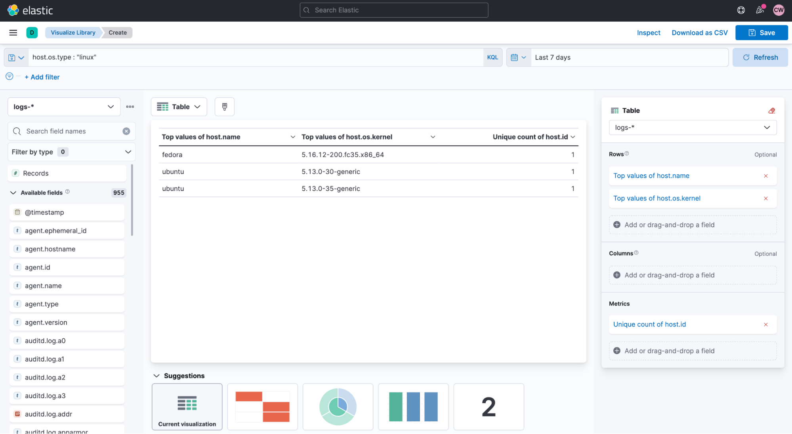
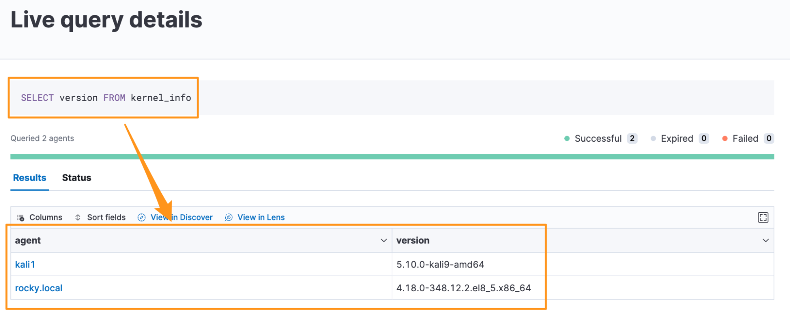
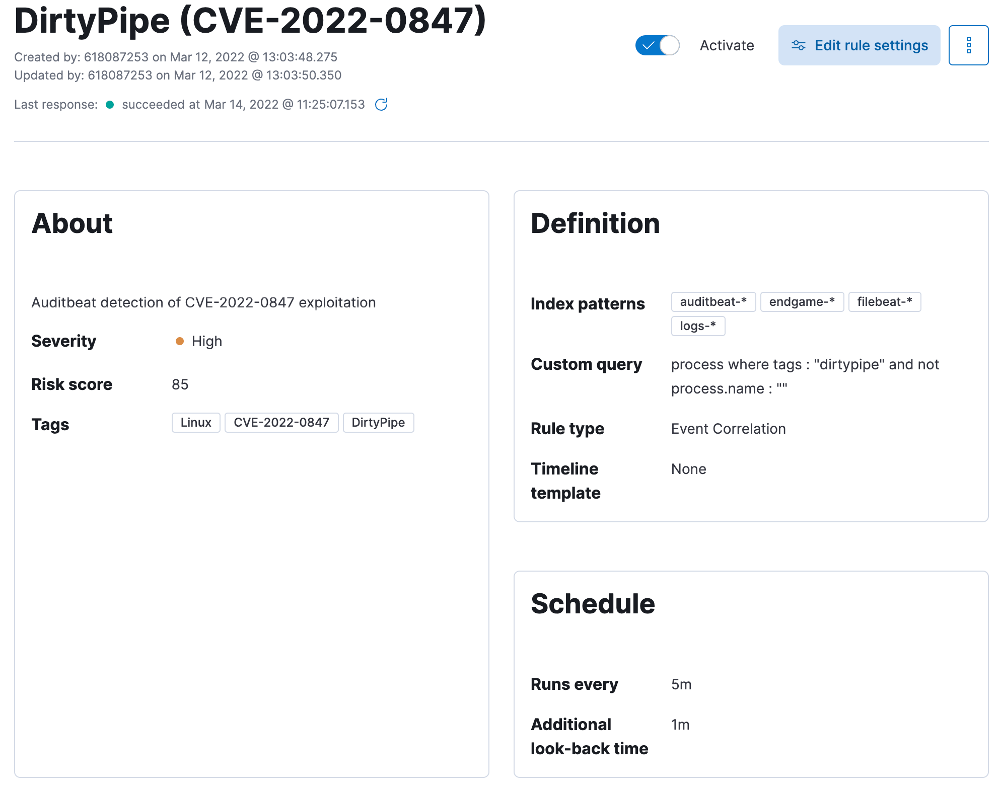
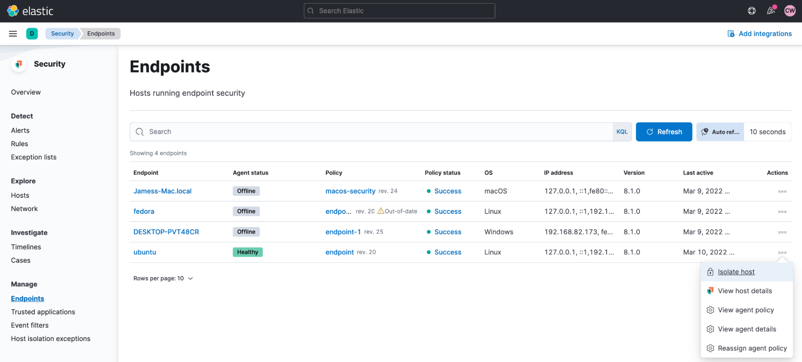

## Preamble

Dirty Pipe is a local privilege escalation vulnerability that is easily exploitable with a handful of working exploit POCs already available. Its broad scope (any user-readable file and affected Linux versions) along with its evolving nature (the SUID shell backdoor exploit) make CVE-2022-0847 especially dangerous for administrators of systems that are potentially vulnerable.

### What is Dirty Pipe (CVE-2022-0847)?

[CVE-2022-0847](https://cve.mitre.org/cgi-bin/cvename.cgi?name=CVE-2022-0847) is a Linux local privilege escalation vulnerability, discovered by security researcher Max Kellermann that takes advantage of the way the Linux kernel manages page files and named pipes allowing for the overwriting of data in read-only files. This vulnerability impacts Linux kernels 5.8 and later until any version before 5.16.11, 5.15.25, and 5.10.102.

### What is the impact?

With many POC’s already released, this vulnerability can be easily exploited to gain root-level privileges by, for instance, rewriting sensitive files like “`/etc/passwd`” or hijacking a SUID root binary (like `sudo`) via injection of malicious code

### What is Elastic doing about it?

Elastic is releasing detection logic and `Auditd` rules that can be used to detect exploitation of this vulnerability.

## Dirty Pipe Details

The vulnerability can be exploited due to a flaw in the new pipe buffer structure where a flag member lacked proper initialization and could then contain a stale value. This could then be used to write to pages within the page cache behind read-only files, allowing for privilege escalation. Given the specific nature of this vulnerability, detection can be quite difficult.

### Linux Pipes & CVE-2022-0847

[Pipes](https://man7.org/linux/man-pages/man2/pipe.2.html) are an interprocess communication mechanism represented as a file within Linux that can receive input data and provide an output for that data. The output of one process can become the input of another using a “pipe” to forward that data between.

Pipes are managed by the CPU in memory and their data is referred to as a “page”.

The exploitation of this vulnerability utilizes a process called “page splicing”. Page splicing is used to merge data between different pipe pages in memory without having to rewrite the data.

The flag we referenced in the summary is the `PIPE_BUF_FLAG_CAN_MERGE` flag. This must be set in order for a page cache to be merged and is only set when the pipe page becomes full. Howerver, if the page cache is emptied completely this flag remains (lack of initialization) which is where the problem lies.

The exploit functions generally by:

1. Opening a new pipe
2. Filling the pipe’s page cache with arbitrary data in order to set the `PIPE_BUF_FLAG_CAN_MERGE` flag
3. Draining the page cache of data but retaining the `PIPE_BUF_FLAG_CAN_MERGE` flag and replacing the data with the new data they want to overwrite a read-only file with
4. The splice (“page splicing”) [syscall](https://man7.org/linux/man-pages/man2/syscalls.2.html) is then used to merge the pages (the pipe page and target file page) leading to the new data being added to a target file bypassing the read-only permissions

Many of the exploit POCs observed so far target the `/etc/passwd` file to overwrite and provide the users with elevated root privileges. Other variants of the exploit released allow for the creation of a SUID shell backdoor by overwriting a binary that has SUID permissions (superuser capabilities) giving the user a root shell and complete control.

We anticipate that adversaries and researchers will develop a multitude of other exploitation chains with this particular vulnerability.

### Proof Of Concept Code

The security community has developed a multitude of different tests that adversaries may take advantage of in future attacks against systems. POCs listed below are authored to help security researchers identify if systems are impacted by the vulnerability, and furthermore - test detection strategies.

* Original Max Kellermann write-up: [https://dirtypipe.cm4all.com/](https://dirtypipe.cm4all.com/)
* SUID shell: ​​[https://haxx.in/files/dirtypipez.c](https://haxx.in/files/dirtypipez.c)
* Passwd overwrite: [https://github.com/liamg/traitor](https://github.com/liamg/traitor)
* Passwd overwrite: ​​[https://github.com/imfiver/CVE-2022-0847](https://github.com/imfiver/CVE-2022-0847)
* Metasploit module: [https://github.com/rapid7/metasploit-framework/pull/16303](https://github.com/rapid7/metasploit-framework/pull/16303)

## Finding systems vulnerable to Dirty Pipe

Beyond using a traditional vulnerabilty scanner, there are several ways to detect systems vulnerable to Dirty Pipe.

### Using the Elastic Security Integration

If you have Auditbeat, Filebeat (with the Auditd module enabled), or the Elastic Agent (with the Security or Auditd integrations deployed) you can use the Lens visualization tool (located in Kibana) to quickly compile and save a list of vulnerable systems as evidenced in the screenshot below:

<figure markdown>
  
<figcaption>Analyzing your infrastructure for kernel versions impacted by Dirty Pipe</figcaption>
</figure>

### Using the Osquery Manager Integration

Additionally, you can use the [Osquery Manager integration](https://docs.elastic.co/en/integrations/osquery_manager) to collect the kernel information from all endpoints. To do this, you need to add the Osquery Manager integration to an Elastic Agent policy (Integrations → Osquery Manager → Add Osquery Manager). Once you’ve added the integration, you can perform a simple query: `SELECT version FROM kernel_info;` which will return the hostname and Linux kernel version from all endpoints with the policy.

<figure markdown>
  
<figcaption>Using Osquery Manager to collect kernel versions</figcaption>
</figure>

## Detecting CVE-2022-0847 exploitation using Auditd

[`Auditd`](https://linux.die.net/man/8/auditd) is the userspace component of the Linux Auditing System. Auditd stands for Audit Daemon and is a background running service responsible for collecting and writing log files to disk. The Linux Audit System includes a kernel component that hooks system calls and communicates those to `Auditd`. `Auditd` is capable of logging System Calls, File Access, and certain pre-configured Audit events.

You can install and enable `Auditd` for free with the package manager on your Linux distribution of choice.

### Auditd rules

`Auditd` rules define what is to be captured and logged. These rules are generally defined in an `audit.rules` file and placed at `/etc/audit/audit.rules` or `/etc/audit/rules.d/audit.rules`. Events are written to `/var/log/audit/audit.log` on the local system.

Once you have installed and enabled Auditd, you can add the below lines to your `audit.rules` file to detect Dirty Pipe exploitation attempts.

```bash title="Dirty Pipe Auditd rules"
-a always,exit -F arch=b64 -S splice -F a0=0x3 -F a2=0x5 -F a3=0x0 -F key=dirtypipe
-a always,exit -F arch=b64 -S splice -F a0=0x6 -F a2=0x8 -F a3=0x0 -F key=dirtypipe
-a always,exit -F arch=b64 -S splice -F a0=0x7 -F a2=0x9 -F a3=0x0 -F key=dirtypipe
```

!!! note

    The aforementioned rules were adapted by Elastic Security from initial findings by [Jonas LeJon](https://twitter.com/jonasl/status/1501840914381258756).

## Linux Auditing System event collection with Elastic

There are a few different ways to collect Linux Auditing System events using Elastic. You can either use the Elastic Agent with the Auditd integration, Auditbeat, or the Auditd module for Filebeat.

!!! info

    Remember, if you're using the Auditd integrations for the Elastic Agent or Filebeat, you'll need to create the [Auditd rules described above](https://elastic.github.io/security-research/intelligence/2022/03/03.dirty-pipe/article/#auditd-rules).

### The Elastic Agent w/Auditd Integration

The Elastic Agent with the [Auditd Integration](https://docs.elastic.co/en/integrations/auditd) allows for the collection of Auditd rules. To collect these events, you need to add the Auditd integration to an Elastic Agent policy (Integrations → Auditd → Add Auditd).

<figure markdown>
  
<figcaption>Elastic Agent Auditd integration</figcaption>
</figure>

Once this integration is installed to an Elastic Agent policy and deployed to endpoints, you will see Auditd events populated in Kibana.

You can verify that you are receiving Auditd events in Kibana by using the Kibana query `event.dataset : "auditd.log"`.

### Auditbeat

You can use the [Auditbeat Auditd module](https://www.elastic.co/guide/en/beats/auditbeat/current/auditbeat-module-auditd.html) to collect the Linux Audit Framework logs. To do this, [install Auditbeat](https://www.elastic.co/guide/en/beats/auditbeat/current/auditbeat-installation-configuration.html). You might encounter errors if another process besides Auditbeat, such as `Auditd`, is registered to receive data from the Linux Audit Framework. To prevent this conflict, you can stop and disable Auditd from running.

```bash title="Stopping and disabling Auditd"
sudo service auditd.service stop
sudo chkconfig auditd.service off
```

Edit the `/etc/auditbeat/auditbeat.yml` file to point to your local, remote, or cloud cluster and add the Dirty Pipe rules provided above in the Auditd rules section.

```yaml title="Adding Dirty Pipe detection rules to the Auditbeat configuration file"
# ===== Modules configuration =====

auditbeat.modules:

* module: auditd

# Load audit rules from separate files. Same format as audit.rules(7)

  audit_rule_files: [ '${path.config}/audit.rules.d/*.conf' ]
  audit_rules: |

## Define audit rules here

## Create file watches (-w) or syscall audits (-a or -A). Uncomment these

## examples or add your own rules

    -a always,exit -F arch=b64 -S splice -F a0=0x3 -F a2=0x5 -F a3=0x0 -F key=dirtypipe
    -a always,exit -F arch=b64 -S splice -F a0=0x6 -F a2=0x8 -F a3=0x0 -F key=dirtypipe
    -a always,exit -F arch=b64 -S splice -F a0=0x7 -F a2=0x9 -F a3=0x0 -F key=dirtypipe

…truncated…
```

Check the configuration and connectivity of Auditbeat using the `test` commands

```bash title="Testing the Auditbeat configuration and output settings"
sudo auditbeat test config
sudo auditbeat test output
```

Run the Auditbeat setup command using `sudo auditbeat setup`.

Start Auditbeat using `sudo systemctl start auditbeat.service`

Now you should be able to verify events are being populated in the `auditbeat-*` Data View within Kibana.

<figure markdown>
  
<figcaption>Auditbeat Data View in Kibana</figcaption>
</figure>

### Filebeat

You can use the [Auditd module for Filebeat](https://www.elastic.co/guide/en/beats/filebeat/current/filebeat-module-auditd.html) to collect the Auditd logs as well. To do this, [install Filebeat](https://www.elastic.co/guide/en/beats/filebeat/current/filebeat-installation-configuration.html) and then enable the Auditd module

`sudo filebeat modules enable auditd` 

Next, go into the Auditd configuration file and enable log collection, test, setup, and then start Filebeat.


```yaml title="Enabling Auditd log in the Filebeat configuration file"
sudo vi /etc/filebeat/modules.d/auditd.yml

# Module: auditd

# Docs: <https://www.elastic.co/guide/en/beats/filebeat/master/filebeat-module-auditd.html>

* module: auditd
  log:
    enabled: true

# Set custom paths for the log files. If left empty

# Filebeat will choose the paths depending on your OS

    #var.paths:
```

```bash title="Testing the Filebeat configuration and output settings"
sudo filebeat test config
sudo filebeat test output
```

Run the Filebeat setup command using `sudo filebeat setup`.

Start Filebeat using `sudo systemctl start filebeat.service`

## Detecting Dirty Pipe with Elastic

Now that Linux Audit Framework events are being populated by either the Elastic Agent, Auditbeat, or Filebeat, you can run queries to detect exploitation attempts using the Kibana Query Language (KQL) in Discover or the Endpoint Query Language (EQL) in Kibana’s Security → Timelines → New Timeline → Correlation query editor.

### Hunt queries in Kibana

KQL query compatible with using the Elastic Agent, Auditbeat, or Filebeat:

```text title="KQL query to detect Dirty Pipe exploitation attempts"
auditd.log.key : dirtypipe and process.name : *
```

EQL query compatible with using the Auditbeat:

```eql title="EQL query to detect Dirty Pipe exploitation attempts"
process where tags : "dirtypipe" and not process.name : ""
```

### Detection Engine alerts

You can also create a Detection Engine alert to monitor for exploitation attempts.

<figure markdown>
  
<figcaption>Dirty Pipe Detection Rule</figcaption>
</figure>

Exploitation attempts will be recorded in the Kibana Security Solution in the Alerts section.

<figure markdown>
  
<figcaption>A preview of alerts created pertaining to the log keys created by Auditd</figcaption>
</figure>

## Respond to Observed Threats

Elastic makes it easy to quickly respond to a threat by isolating the host while still allowing it to communicate with your stack in order to continue monitoring actions taken and/or remediate the threat.

<figure markdown>
  
<figcaption>In-platform capabilities of Elastic Security demonstrating response capabilities</figcaption>
</figure>

## Defense in Depth Recommendations

The following steps can be leveraged to improve a network’s protective posture:

1. Review and ensure that you have deployed the latest stable and vendor-supplied kernel for your OS’
2. Review and implement the above detection logic within your environment using technology described in the post
3. Maintain backups of your critical systems to aid in quick recovery

## References¶

The following research was referenced throughout the document:

* Exploit CVE reference: [CVE-2022-0847](https://cve.mitre.org/cgi-bin/cvename.cgi?name=CVE-2022-0847)
* Write-up using eBPF for some detections: [https://sysdig.com/blog/cve-2022-0847-dirty-pipe-sysdig](https://sysdig.com/blog/cve-2022-0847-dirty-pipe-sysdig/)
* Original Max Kellermann write-up: [https://dirtypipe.cm4all.com/](https://dirtypipe.cm4all.com/)
* SUID shell: ​​[https://haxx.in/files/dirtypipez.c](https://haxx.in/files/dirtypipez.c)
* Passwd overwrite: [https://github.com/liamg/traitor](https://github.com/liamg/traitor)
* Passwd overwrite: ​​[https://github.com/imfiver/CVE-2022-0847](https://github.com/imfiver/CVE-2022-0847)
* Metasploit module: [https://github.com/rapid7/metasploit-framework/pull/16303](https://github.com/rapid7/metasploit-framework/pull/16303)
* Original Auditd detection logic: [https://twitter.com/jonasl/status/1501840914381258756?s=20&t=MIWwwXpl5t0JiopVxX5M5Q](https://twitter.com/jonasl/status/1501840914381258756?s=20&t=MIWwwXpl5t0JiopVxX5M5Q)
