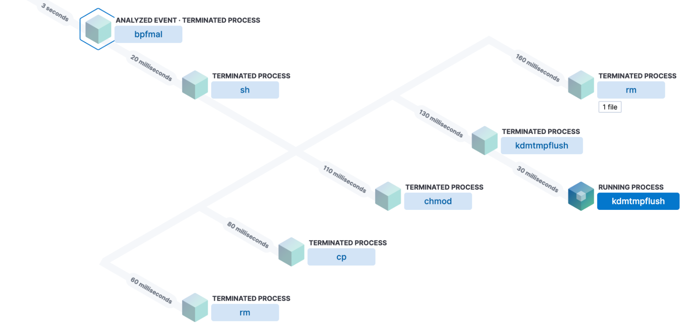
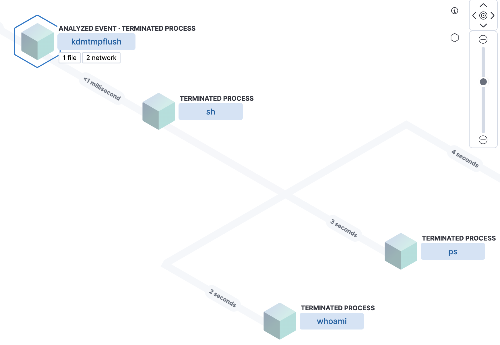
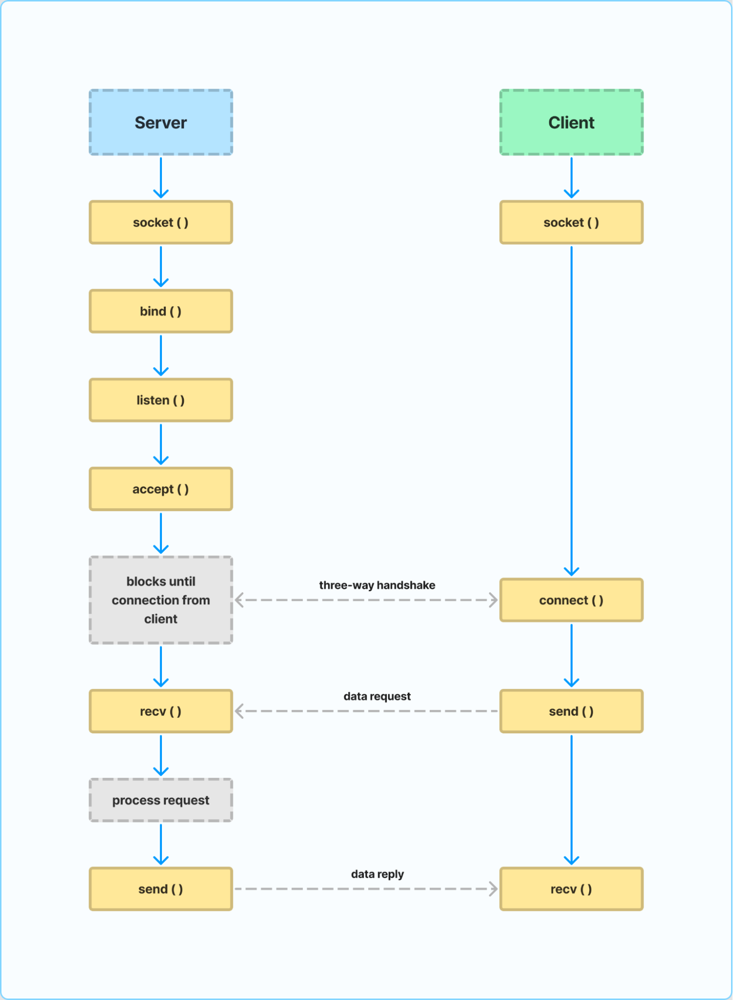
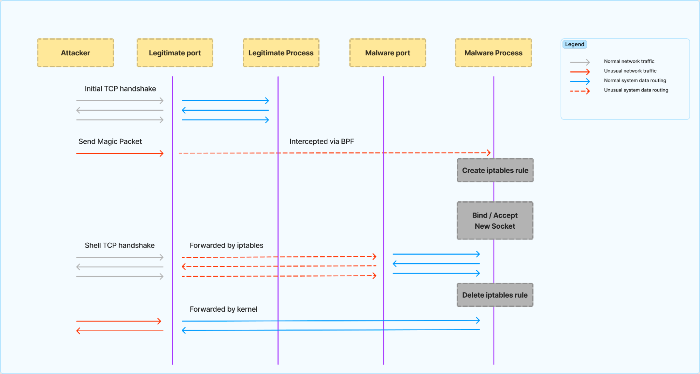
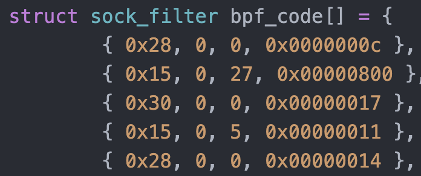
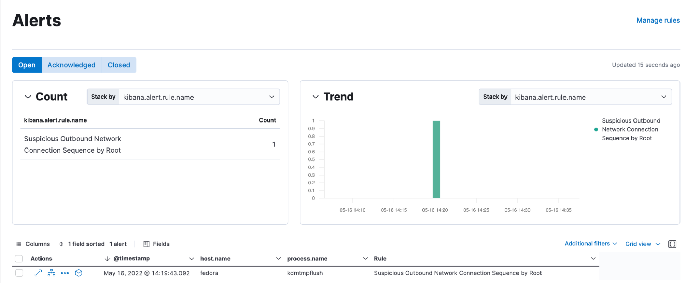
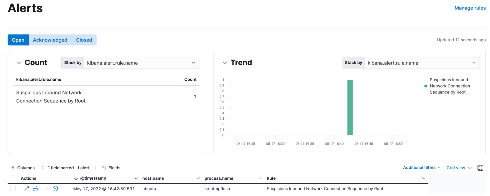
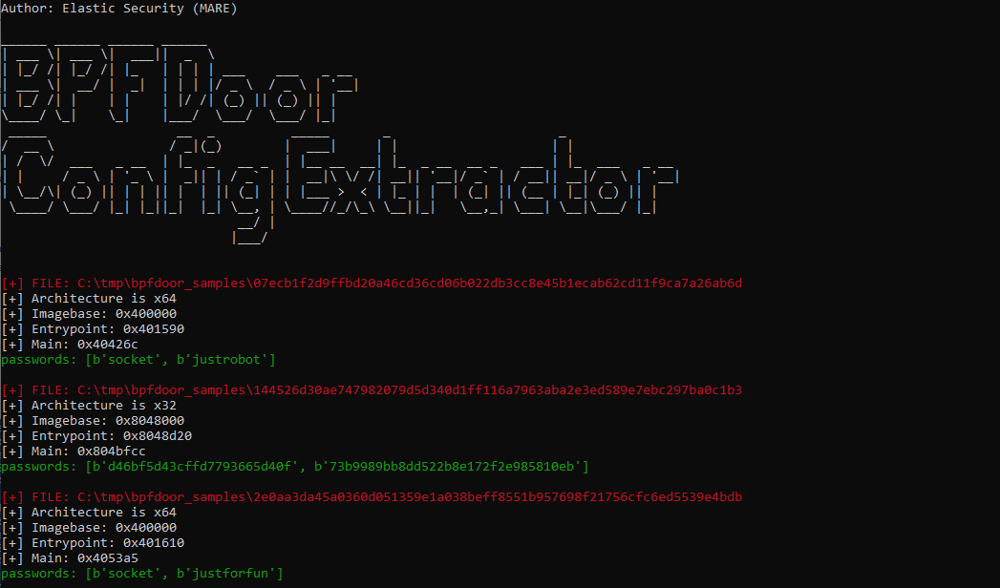
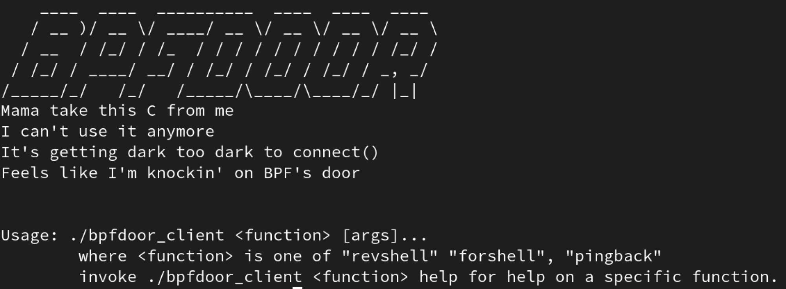

## Preamble

[BPFDoor](https://doublepulsar.com/bpfdoor-an-active-chinese-global-surveillance-tool-54b078f1a896) is a backdoor payload specifically crafted for Linux. Its purpose is for long-term persistence in order to gain re-entry into a previously or actively compromised target environment. It notably utilizes BPF along with a number of other techniques to achieve this goal, taking great care to be as efficient and stealthy as possible. PWC researchers discovered this very interesting piece of malware in 2021. PWC attributes this back door to a specific group from China, Red Menshen, and detailed a number of interesting components in a high-level threat research post released [last week](https://www.pwc.com/gx/en/issues/cybersecurity/cyber-threat-intelligence/cyber-year-in-retrospect/yir-cyber-threats-report-download.pdf).

PWC’s findings indicated that ​​Red Menshen had focused their efforts on targeting specific Telecommunications, Government, Logistics, and Education groups across the Middle East and Asia. This activity has been across a Monday-to-Friday working period, between 01:00 UTC and 10:00 UTC, indicating that the operators of the malware were consistent in their attacks, and operation during a working week.

Perhaps most concerningly, the payload itself has been observed across the last 5 years in various phases of development and complexity, indicating that the threat actor responsible for operating the malware has been at it for some time, undetected in many environments.

!!! tip "BPFDoor Tools"

    The Elastic Security Team has created a few tools that will aid researchers in analyzing the BPFDoor malware.
    
    The BPFDoor scanner will allow you to scan for hosts infected with the BPFDoor malware and the BPFDoor configuration extractor will allow you to extrapolate the malware’s configuration or hardcoded values which can lead to additional observations you can use for further analysis, developing additional signatures or connecting to the backdoor utilizing our client.
    
    * [BPFDoor scanner](../../../../tools/bpfdoor-scanner/index.md)
    * [BPFDoor configuration extractor](../../../../tools/bpfdoor-config-extractor/index.md)

## General Analysis

Red Menshen has leveraged a network of VPS servers to act as a controller network and access these systems via compromised routers based out of Taiwan. The routers act as a VPN network for the adversarial groups via a sequence of specifically crafted packets sent to an infected host. [Researchers](https://doublepulsar.com/bpfdoor-an-active-chinese-global-surveillance-tool-54b078f1a896) have indicated that this payload is pervasive and that compromised hosts have been observed across the US, South Korea, Hong Kong, Turkey, India, Vietnam, and Myanmar.

BPF-based malware payloads, while ultimately uncommon, serve a specific purpose on Linux-based hosts where stealthy and performant operations are critical for success. Tools such as [BPFDoor](https://doublepulsar.com/bpfdoor-an-active-chinese-global-surveillance-tool-54b078f1a896) are not alone. Recently, [Pangu Labs](https://www.pangulab.cn/en/post/the_bvp47_a_top-tier_backdoor_of_us_nsa_equation_group/) discovered a payload by the name of  [Bvp47](https://www.pangulab.cn/en/post/the_bvp47_a_top-tier_backdoor_of_us_nsa_equation_group/), a sensor that used stealthy BPF-based telemetry to acquire detailed information about the workloads running on infected hosts.

[eBPF](https://ebpf.io/) (Extended Berkeley Packet Filters), a new evolution of BPF used increasingly today, is gaining popularity amongst system operators given its efficiency and proven, powerful capabilities leveraged often for system performance, network, and security telemetry collection. Adversaries are taking note and it is our assumption that malware targeting cloud systems will increasingly leverage these methods in the future.

## Attack Lifecycle

This inherently passive backdoor payload is built to be a form of persistence –  a method to regain access if the first or second stage payloads are lost. It is built for and intended to be installed on high-uptime servers or appliances, IoT/SCADA, or cloud systems with access to the Internet.  The backdoor usually sits in temporary storage so if a server were to be rebooted or shut down, the backdoor would be lost.

It should be assumed that if this malware is found on a system the initial-access (1st stage) or post-exploitation (2nd stage) payloads are still most likely present and possibly active elsewhere in the environment. This backdoor excels at stealth, taking every opportunity to blend in and remain undetected.

In the below steps, we will break BPFDoor’s actions down according to the vast majority of the samples available.

1. When executed the binary copies itself into `/dev/shm/`. A temporary filesystem `/dev/shm` stands for shared memory and is a temporary file storage facility serving as an efficient means of inter-process communication
2. Renames its process to `kdmtmpflush`, a hardcoded process name
3. Initializes itself with the `-init` flag and forks itself. Forking in Linux means creating a new process by duplicating the calling process
4. Deletes itself by removing the original binary invoked. The forked process continues to run
5. Alters the forked processes' creation and modification time values, also known as [timestomping](https://attack.mitre.org/techniques/T1070/006/)
6. Creates a new process environment for itself and removes the old one setting (spoofing) a new process name. It changes the way it appears on the system akin to wearing a mask. The process is still `kdmtmpflush` but if you were to run a ps you would see whatever value it set
7. Creates a process ID (PID) file in `/var/run`. PID files are text files containing the process of the associated program meant for preventing multiple starts, marking residency, and used by the program to stop itself. This file resides in `/var/run`, another temporary file storage facility
8. Creates a raw network socket. On Linux, a socket is an endpoint for network communication that allows you to specify in detail every section of a packet allowing a user to implement their own transport layer protocol above the internet (IP) level
9. Sets BPF filters on the raw socket. [BPF](https://www.kernel.org/doc/html/v5.12/networking/filter.html) allows a user-space program to attach a filter onto any socket and allow or disallow certain types of data to come through the socket
10. Observes incoming packets
11. If a packet is observed that matches the BPF filters and contains the required data it is passed to the backdoor for processing
12. It forks the current process again
13. Changes the forked processes working directory to `/`
14. Changes (spoofs) the name of the forked process to a hardcoded value
15. Based on the password or existence of a password sent in the “magic packet” the backdoor provides a reverse shell, establishes a bind shell, or sends back a ping

!!! note "Atypical BPFDoor sample"

    Of note there is one [sample](https://www.virustotal.com/gui/file/07ecb1f2d9ffbd20a46cd36cd06b022db3cc8e45b1ecab62cd11f9ca7a26ab6d/detection) we have come across that does not seem to exhibit steps 1 - 4. It doesn’t alter its initial name to a hardcoded value and simply executes from its placed location, otherwise, it models the same behavior.

Below you can see visual representations of the BPFDoor process tree, utilizing Elastic’s Analyzer View. The first image displays the tree prior to active use of the backdoor (i.e reverse shell, bind shell, or pingback) and the second image after a reverse shell has connected and performed post-exploitation activities.  

<figure markdown>
  
<figcaption>Elastic Analyzer View of the BPFDoor initial invocation process tree</figcaption>
</figure>

<figure markdown>
  
<figcaption>Elastic Analyzer View of BPFDoor following a reverse shell connection and post exploitation actions</figcaption>
</figure>

## Defense Evasion Insights

BPFDoor is interesting given the anti-forensics, and obfuscation tactics used. Astute readers will observe slight differences in the PID tree visible when running a `ps ajxf` on an infected host when compared to executed data within the Analyzer View inside of Elastic. This is due to the process name spoofing mentioned in step 6 (above) of the attack lifecycle above. The image below is taken from a system running BPFDoor with an active reverse shell connection established:

<figure markdown>
  
<figcaption>An observed running process created by the BPFDoor reverse shell</figcaption>
</figure>

The difference lies in the fact that `kdmtmpflush` and `sh` are run prior to spoofing, and are captured at runtime by Elastic Endpoint. This is an accurate representation of the processes active on the host, further confirming the importance of appropriate observation software for Linux hosts - you can’t always trust what you see on the local system:

<figure markdown>
  
<figcaption>Elastic Analyzer View of BPFDoor demonstrating real process capture.</figcaption>
</figure>

BPFDoor also holds in its repertoire the ability to subvert the traditional Linux socket client - server architecture in order to hide its malicious traffic. The methods which it utilizes to achieve this are both unusual and intriguing.

The sockets interface is almost synonmous with TCP/IP communication.  This simple interface has endured for over 40 years - predating both Linux and Windows implementations.

<figure markdown>
  
<figcaption>Example of how TCP/IP and socket interfaces function</figcaption>
</figure>

BPFDoor uses a raw socket (as opposed to 'cooked' ones that handle IP/TCP/UDP headers transparently) to observe every packet arriving at the machine, ethernet frame headers and all.  While this might sound like a stealthy way to intercept traffic, it's actually not – on any machine with a significant amount of network traffic the CPU usage will be consistently high.

That's where BPF comes in - an extremely efficient, kernel-level packet filter is the perfect tool to allow the implant to ignore 99% of network traffic and only become activated when a special pattern is encountered. This implant looks for a so-called magic packet in every TCP, UDP and ICMP packet received on the system.

Once activated, a typical reverse shell - which this back door also supports - creates an outbound connection to a listener set up by the attacker. This has the advantage of bypassing firewalls watching inbound traffic only.  This method is well-understood by defenders, however. The sneakiest way to get a shell connected would be to reuse an existing packet flow, redirected to a separate process.

In this attack, the initial TCP handshake is done between the attacker and a completely legitimate process – for example nginx or sshd. These handshake packets happen to be also delivered to the backdoor (like every packet on the system) but are filtered out by BPF. Once the connection is established, however, BPFDoor sends a magic packet to the legitimate service. The implant receives it and makes a note of the originating IP and port the attacker is using, and it opens a new listening socket on an inconspicuous port (42391 - 43391).

The implant then reconfigures the firewall to temporarily redirect all traffic from the attacker’s IP/port combination to the new listening socket.  The attacker initiates a second TCP handshake on the same legitimate port as before, only now iptables forwards those packets to the listening socket owned by the implant. . This establishes the communication channel between attacker and implant that will be used for command and control. The implant then covers its tracks by removing the iptables firewall rules that redirected the traffic.

Despite the firewall rule being removed, traffic on the legitimate port will continue to be forwarded to the implant due to how Linux statefully tracks connections. No visible traffic will be addressed to the implant port (although it will be delivered there).

<figure markdown>
  
<figcaption>A diagram representing the aforementioned network flows</figcaption>
</figure>

## BPF Filters

As stated in step 9 (above), [BPF](https://www.kernel.org/doc/html/v5.12/networking/filter.html) or Berkeley Packet Filters is a technology from the early ’90s that allows a user-space program to attach a network filter onto any socket and allow or disallow certain types of data to come through the socket. These filters are made up of bytecode that runs on an abstract virtual machine in the Linux kernel. The BPF virtual machine has functionality to inspect all parts of incoming packets and make an allow/drop decision based on what it sees. . You can see in the image example below what this looks like within the BPFDoor source code:

<figure markdown>
  
<figcaption>BPFDoor source code BPF Filters</figcaption>
</figure>

We took this BPF code, converted it, and wrote it up as pseudo code in an effort to aid our research and craft packets able to successfully get through these filters in order to activate the backdoor.

<figure markdown>
  
<figcaption>BPFDoor source code BPF Filter Pseudocode</figcaption>
</figure>

The above capabilities allow BPFDoor to attach a filter onto any socket and allow or disallow certain types of data to come through the socket - used carefully by the adversary to invoke a series of different functions within the payload.

## Historical Analysis

We wanted to see over time, between BPFDoor payloads, what, if anything, the threat actors modified. A number of samples were detonated and analyzed ranging from the uploaded source code to a [sample](https://www.virustotal.com/gui/file/599ae527f10ddb4625687748b7d3734ee51673b664f2e5d0346e64f85e185683/detection) uploaded last month. We found that the behavior over time did not change a great deal. It maintained the same relative attack lifecycle with a few variations with the hardcoded values such as passwords, process names, and files - this is not uncommon when compared to other malware samples that look to evade detection or leverage payloads across a variety of victims.

We posture that the threat group would change passwords and update process or file names in an effort to improve operational security and remain hidden. It also makes sense that the general functionality of the backdoor would not change in any great way. As the saying goes “If it's not broken, don’t fix it”. Our malware analysis and reverse engineering team compared the source code (uploaded to [VirusTotal](https://www.virustotal.com/gui/file/8b9db0bc9152628bdacc32dab01590211bee9f27d58e0f66f6a1e26aea7552a6/detection) and found on [Pastebin](https://pastebin.com/raw/kmmJuuQP)) to a recently uploaded sample highlighting some of the notable changes within the main function of the malware in the images below.

<figure markdown>
  
<figcaption>A side by side comparison of the main functions for the Pastebin source code and a sample uploaded to VT last month focusing on the hardcoded string values for the passwords, process names and file name</figcaption>
</figure>

As we mentioned earlier, one recent [sample](https://www.virustotal.com/gui/file/07ecb1f2d9ffbd20a46cd36cd06b022db3cc8e45b1ecab62cd11f9ca7a26ab6d/detection) we have come across that does not seem to exhibit some of the tactics of prior payloads has been observed - It doesn’t alter its initial name to a hardcoded value and simply executes from its placed location, otherwise, it models relatively the same behavior.

## Linux Malware Sophistication

A trend we have had the privilege of observing at Elastic, is the threat landscape of Linux targeted attacks - these being focused often on cloud workloads, or systems that typically have less observational technology configured in many of the environments we see. The trend of complex, well-designed payloads is something that is often simply overlooked, and specifically in the case of BPFDoor, remained hidden for years.

It is important to consider these workloads a critical component of your security posture: A lack of visibility within cloud workloads will eventually lead to large gaps in security controls - adversarial groups are further growing to understand these trends, and act accordingly. Best practices state that endpoint defenses should be consistent across the fleet of systems under management, and conform to a least privilege architecture.

## Detection of BPFDoor

After researching this malware it became apparent as to why the backdoor remained in use and hidden for so long. If you aren’t intimately familiar with Linux process abnormalities or weren’t looking for it you would generally not detect it. Even though it takes advantage of Linux capabilities in a stealthy manner to evade detection, there are still opportunities for both behavioral and signature-based detections.

The first area of opportunity we witnessed while testing was the behavior we observed during the initial execution of the malware, specifically its working directory, in a shared memory location `/dev/shm`. This is a native temporary filesystem location in Linux that uses RAM for storage, and a binary executing from it let alone generating network connections is fairly uncommon in practice.

During execution, BPFDoor removes existing files from `/dev/shm` and copies itself there prior to initialization. A detection for this would be any execution of a binary from this directory as root (you have to be root to write to and read from this directory).

This was verified by detonating the binary in a VM while our Elastic Agent was installed and observing the sequence of events. You can see an image of this detection on the Kibana Security Alerts page below. This rule is publicly available as an Elastic SIEM detection rule - [Binary Executed from Shared Memory Directory](https://github.com/elastic/detection-rules/blob/main/rules/linux/execution_process_started_in_shared_memory_directory.toml):

<figure markdown>
  
<figcaption>Elastic Alert in Kibana - Binary Executed from Shared Memory Directory</figcaption>
</figure>

The second opportunity we noticed, for detection, was a specific PID file being created in `/var/run`. We noticed the dropped PID file was completely empty while doing a quick query via the [Osquery integration](https://docs.elastic.co/en/integrations/osquery_manager) to the `/var/run` directory. While this is not inherently malicious, it is unusual for the file size of a PID to be `0` or above `10` bytes and thus we created an additional rule centered around detecting this unusual behavior.

Our [Abnormal Process ID or Lock File Created](https://github.com/elastic/detection-rules/blob/main/rules/linux/execution_abnormal_process_id_file_created.toml) rule identifies the creation of a PID file in the main directory of `/var/run` with no subdirectory, ignoring common PID files to be expected:

<figure markdown>
  
<figcaption>Elastic Alert in Kibana - Abnormal Process ID or Lock File Created</figcaption>
</figure>

The third area we wanted to look at was the network connections tied to two of the three capabilities (reverse shell and bind shell) the backdoor possesses. We wanted to see if there were any suspicious network connections tied to process or user abnormalities we could sequence together based off of the way BPFDoor handles establishing a reverse or bind shell.

The reverse shell was the first capability focused on. Taking a deep look at the process tree in and around the reverse shell establishment allowed us to key in on what would be considered a strange or even abnormal sequence of events leading to and involving an outbound network connection.

We developed a hunt rule sequence that identifies an outbound network connection attempt followed by a session id change as the root user by the same process entity. The reason we developed these network focused hunt rules is due to possible performance issues caused if running these continually. 

The bind shell was the last capability we honed in on. Identifying an abnormal sequence of events surrounding the bind shell connection was difficult due to the way it forks then accepts the connection and kills the accepting process post established connection. Therefore we had to focus on the sequence of events within the process entity id directly involving the network connection and subsequent killing of the accepting process.

After developing the 2 detection rules along with the 2 hunt rules listed below and in addition to the 6 YARA signatures deployed we were able to detect BPFDoor in a myriad of different ways and within different stages of its life cycle. As stated earlier though, if you detect this malware in your environment it should be the least of your concerns given the threat actor will most likely have already successfully compromised your network via other means.

<figure markdown>
  
<figcaption>Elastic Detection Summary of complete BPFDoor attack lifecycle</figcaption>
</figure>

### Existing Detection Rules

The following Elastic Detection Rules will identify BPFDoor activity:

* [Abnormal Process ID or Lock File Created](https://github.com/elastic/detection-rules/blob/main/rules/linux/execution_abnormal_process_id_file_created.toml)
* [Binary Executed from Shared Memory Directory](https://github.com/elastic/detection-rules/blob/main/rules/linux/execution_process_started_in_shared_memory_directory.toml)

### Hunting Queries

This EQL rule can be used to successfully identify BPFDoor reverse shell connections having been established within your environment:

```eql title="EQL BPFDoor reverse shell hunt query"
sequence by process.entity_id with maxspan=1m
[network where event.type == "start" and event.action == "connection_attempted" and user.id == "0" and not process.executable : ("/bin/ssh", "/sbin/ssh", "/usr/lib/systemd/systemd")]
[process where event.action == "session_id_change" and user.id == "0"]
```

<figure markdown>
  
<figcaption>Elastic Alert in Kibana - Suspicious Network Connection Attempt by Root</figcaption>
</figure>

The hunt rule we created here identifies a sequence of events beginning with a session id change, followed by a network connection accepted, in correlation with ptmx file creation and a deletion of the process responsible for accepting the network connection. This EQL rule can be used to successfully identify BPFDoor bind shell connections within your environment:

```eql title="EQL BPFDoor bind shell hunt query"
sequence by process.entity_id with maxspan=1m
[process where event.type == "change" and event.action == "session_id_change" and user.id == 0 and not process.executable : ("/bin/ssh", "/sbin/ssh", "/usr/lib/systemd/systemd")]
[network where event.type == "start" and event.action == "connection_accepted" and user.id == 0]
[file where event.action == "creation" and user.id == 0 and file.path == "/dev/ptmx"]
[process where event.action == "end" and user.id == 0 and not process.executable : ("/bin/ssh", "/sbin/ssh", "/usr/lib/systemd/systemd")]
```

<figure markdown>
  
<figcaption>Elastic Alert in Kibana - Suspicious Network Connection Accept by Root</figcaption>
</figure>

### YARA Rules

In addition to behavioral detection rules in the Elastic Endpoint, we are releasing a set of BPFDoor Yara signatures for the community.

```text title="BPFDoor YARA rule"
rule Linux_Trojan_BPFDoor_1 {

    meta:
        Author = "Elastic Security"
        creation_date = "2022-05-10"
        last_modified = "2022-05-10"
        os = "Linux"
        arch = "x86"
        category_type = "Trojan"
        family = "BPFDoor"
        threat_name = "Linux.Trojan.BPFDoor"
        description = "Detects BPFDoor malware."
        reference_sample = "144526d30ae747982079d5d340d1ff116a7963aba2e3ed589e7ebc297ba0c1b3"
    strings:
        $a1 = "hald-addon-acpi: listening on acpi kernel interface /proc/acpi/event" ascii fullword
        $a2 = "/sbin/iptables -t nat -D PREROUTING -p tcp -s %s --dport %d -j REDIRECT --to-ports %d" ascii fullword
        $a3 = "avahi-daemon: chroot helper" ascii fullword
        $a4 = "/sbin/mingetty /dev/tty6" ascii fullword
        $a5 = "ttcompat" ascii fullword
    condition:
        all of them
}

rule Linux_Trojan_BPFDoor_2 {
    meta:
        Author = "Elastic Security"
        creation_date = "2022-05-10"
        last_modified = "2022-05-10"
        os = "Linux"
        arch = "x86"
        category_type = "Trojan"
        family = "BPFDoor"
        threat_name = "Linux.Trojan.BPFDoor"
        description = "Detects BPFDoor malware."
        reference_sample = "3a1b174f0c19c28f71e1babde01982c56d38d3672ea14d47c35ae3062e49b155"
    strings:
        $a1 = "hald-addon-acpi: listening on acpi kernel interface /proc/acpi/event" ascii fullword
        $a2 = "/sbin/mingetty /dev/tty7" ascii fullword
        $a3 = "pickup -l -t fifo -u" ascii fullword
        $a4 = "kdmtmpflush" ascii fullword
        $a5 = "avahi-daemon: chroot helper" ascii fullword
        $a6 = "/sbin/auditd -n" ascii fullword
    condition:
        all of them
}

rule Linux_Trojan_BPFDoor_3 {
    meta:
        Author = "Elastic Security"
        creation_date = "2022-05-10"
        last_modified = "2022-05-10"
        os = "Linux"
        arch = "x86"
        category_type = "Trojan"
        family = "BPFDoor"
        threat_name = "Linux.Trojan.BPFDoor"
        description = "Detects BPFDoor malware."
        reference_sample = "591198c234416c6ccbcea6967963ca2ca0f17050be7eed1602198308d9127c78"
    strings:
        $a1 = "[-] Spawn shell failed." ascii fullword
        $a2 = "[+] Packet Successfuly Sending %d Size." ascii fullword
        $a3 = "[+] Monitor packet send." ascii fullword
        $a4 = "[+] Using port %d"
        $a5 = "decrypt_ctx" ascii fullword
        $a6 = "getshell" ascii fullword
        $a7 = "getpassw" ascii fullword
        $a8 = "export %s=%s" ascii fullword
    condition:
        all of them
}

rule Linux_Trojan_BPFDoor_4 {
    meta:
        Author = "Elastic Security"
        creation_date = "2022-05-10"
        last_modified = "2022-05-10"
        os = "Linux"
        arch = "x86"
        category_type = "Trojan"
        family = "BPFDoor"
        threat_name = "Linux.Trojan.BPFDoor"
        description = "Detects BPFDoor malware."
        reference_sample = "591198c234416c6ccbcea6967963ca2ca0f17050be7eed1602198308d9127c78"
    strings:
        $a1 = { 45 D8 0F B6 10 0F B6 45 FF 48 03 45 F0 0F B6 00 8D 04 02 00 }
    condition:
        all of them
}

rule Linux_Trojan_BPFDoor_5 {
    meta:
        Author = "Elastic Security"
        creation_date = "2022-05-10"
        last_modified = "2022-05-10"
        os = "Linux"
        arch = "x86"
        category_type = "Trojan"
        family = "BPFDoor"
        threat_name = "Linux.Trojan.BPFDoor"
        description = "Detects BPFDoor malware."
        reference_sample = "76bf736b25d5c9aaf6a84edd4e615796fffc338a893b49c120c0b4941ce37925"
    strings:
        $a1 = "getshell" ascii fullword
        $a2 = "/sbin/agetty --noclear tty1 linux" ascii fullword
        $a3 = "packet_loop" ascii fullword
        $a4 = "godpid" ascii fullword
        $a5 = "ttcompat" ascii fullword
        $a6 = "decrypt_ctx" ascii fullword
        $a7 = "rc4_init" ascii fullword
        $b1 = { D0 48 89 45 F8 48 8B 45 F8 0F B6 40 0C C0 E8 04 0F B6 C0 C1 }
    condition:
        all of ($a*) or 1 of ($b*)
}

rule Linux_Trojan_BPFDoor_6 {
    meta:
        Author = "Elastic Security"
        creation_date = "2022-05-10"
        last_modified = "2022-05-10"
        os = "Linux"
        arch = "x86"
        category_type = "Trojan"
        family = "BPFDoor"
        threat_name = "Linux.Trojan.BPFDoor"
        description = "Detects BPFDoor malware."
        reference_sample = "dc8346bf443b7b453f062740d8ae8d8d7ce879672810f4296158f90359dcae3a"
    strings:
        $a1 = "getpassw" ascii fullword
        $a2 = "(udp[8:2]=0x7255) or (icmp[8:2]=0x7255) or (tcp[((tcp[12]&0xf0)>>2):2]=0x5293)" ascii fullword
        $a3 = "/var/run/haldrund.pid" ascii fullword
        $a4 = "Couldn't install filter %s: %s" ascii fullword
        $a5 = "godpid" ascii fullword
    condition:
        all of them
}
```

## Interacting with BPFDoor

The Elastic Security Team has released several tools that can aid in further research regarding BPFDoor to include a network scanner used to identify infected hosts, a BPFDoor malware configuration extractor, and a BPFDoor client binary that can be used to actively interact with a sample.

### BPFDoor Scanner

The Elastic Security Team [has released](../../../../tools/bpfdoor-scanner/index.md) a Python script that can identify if you have BPFDoor infected hosts.

The scanner sends a packet to a defined IP address using the default target port (`68/UDP`)and default interface. It listens to return traffic on port `53/UDP`.

<figure markdown>
  
<figcaption>BPFDoor scanner tool</figcaption>
</figure>

### BPFDoor Configuration Extractor

This tool will allow you to extract configurations from any BPFDoor malware you may have collected. This will allow you to develop additional signatures and further analysis of the malware as well as your environment.

The BPFDoor configuration extractor can be downloaded [here](../../../../tools/bpfdoor-config-extractor/index.md).

<figure markdown>
  
<figcaption>BPFDoor configuration extractor</figcaption>
</figure>

### BPFDoor Client POC

Quickly after beginning our research into this malware we realized we would also need to actively interact with BPFDoor in order to observe the full extent of the capabilities that it possesses and monitor what these capabilities would look like from a host and SIEM level.

In order to do this, we had to break down the BPF filters in the BPFDoor source code so we could craft packets for the different protocols. To do this, we used [Scapy](https://scapy.net/), a packet manipulation program, to ensure we could pass the filters for the purpose of activating the backdoor. Once we ensured we could pass the filters, Rhys Rustad-Elliott, an engineer at Elastic built a BPFDoor client that accepts a password, IP address, and port allowing you to connect to a BPFDoor sample and interact if you possess the sample's hardcoded passwords.

Depending on the password or lack of password provided, BPFDoor will behave exactly the same way it would in the wild. You can invoke a reverse shell, establish a bind shell, or connect to it with no supplied password to receive a ping-back confirming its installation.

<figure markdown>
  
<figcaption>A preview of the BPFDoor Client developed by Elastic Security to assist in research</figcaption>
</figure>

Researchers looking to use BPFDoor can [reach out to Elastic Security](mailto:threat-notification@elastic.co) for access to the BPFDoor client POC. Please note that these tools will be shared at our discretion with those in the trusted security community looking to improve the detection of this vulnerability.

## Impact

The following MITRE ATT&CK Tactic, Techniques, and Sub-techniques have been observed with the BPFDoor malware.

### Tactics

Tactics represent the "why" of an ATT&CK technique or sub-technique. It is the adversary's tactical goal: the reason for performing an action.

* [Execution](https://attack.mitre.org/tactics/TA0002/)

### Techniques (sub-techniques)

Techniques (and sub-techniques) represent 'how' an adversary achieves a tactical goal by performing an action.

* [Native API](https://attack.mitre.org/techniques/T1106/)
* [External Remote Services](https://attack.mitre.org/techniques/T1133/)
* [Hide Artifacts](https://attack.mitre.org/techniques/T1564/)
* [Indicator Removal on Host](https://attack.mitre.org/techniques/T1070/)
* [Non-Application Layer Protocol](https://attack.mitre.org/techniques/T1095/)
* [Command and Scripting Interpreter: Unix Shell](https://attack.mitre.org/techniques/T1059/004)
* [Abuse Elevation Control Mechanism: Setuid and Setgid](https://attack.mitre.org/techniques/T1548/001/)

## Source Pseudocode

To clearly articulate the details of this malware, we’ve created [two diagrams](media/bpfdoor_pseudocode.pdf) that outline the specific pseudocode for BPFDoor based on the source code uploaded to VT and found on Pastebin. While this contains a lot of detail, it is simple to understand if researchers choose to further this research.

## Summary

While threat groups continue to increase in maturity, we expect this kind of mature, well designed and hidden threat will continue to be found within Linux environments. These kinds of findings reiterate the importance of comprehensive security controls across the entirety of a fleet, rather than simply focusing on user endpoints.

BPFDoor demonstrates a perfect example of how important monitoring workloads within Linux environments can be. Payloads such as this are near-on impossible to observe and detect without sufficient controls, and should be considered a moving trend within the general adversarial landscape.

## Observables

| Observable                                                       | Type         | Reference            | Note                             |
|------------------------------------------------------------------|--------------|----------------------|----------------------------------|
| `/dev/shm/kdmtmpflush`                                             | process name | BPFDoor process name | Observed process name of BPFDoor |
| `/var/run/haldrund.pid`                                            | file name    | BPFDoor file name    | Observed BPFDoor PID file        |
| `/var/run/kdevrund.pid`                                            | file name    | BPFDoor file name    | Observed BPFDoor PID file        |
| `/var/run/xinetd.lock`                                             | file name    | BPFDoor file name    | Observed BPFDoor lock file       |
| `74ef6cc38f5a1a80148752b63c117e6846984debd2af806c65887195a8eccc56` | SHA-256      | BPFDoor malware      |                                  |
| `07ecb1f2d9ffbd20a46cd36cd06b022db3cc8e45b1ecab62cd11f9ca7a26ab6d` | SHA-256      | BPFDoor malware      |                                  |
| `76bf736b25d5c9aaf6a84edd4e615796fffc338a893b49c120c0b4941ce37925` | SHA-256      | BPFDoor malware      |                                  |
| `93f4262fce8c6b4f8e239c35a0679fbbbb722141b95a5f2af53a2bcafe4edd1c` | SHA-256      | BPFDoor malware      |                                  |
| `96e906128095dead57fdc9ce8688bb889166b67c9a1b8fdb93d7cff7f3836bb9` | SHA-256      | BPFDoor malware      |                                  |
| `599ae527f10ddb4625687748b7d3734ee51673b664f2e5d0346e64f85e185683` | SHA-256      | BPFDoor malware      |                                  |
| `2e0aa3da45a0360d051359e1a038beff8551b957698f21756cfc6ed5539e4bdb` | SHA-256      | BPFDoor malware      |                                  |
| `f47de978da1dbfc5e0f195745e3368d3ceef034e964817c66ba01396a1953d72` | SHA-256      | BPFDoor malware      |                                  |
| `fd1b20ee5bd429046d3c04e9c675c41e9095bea70e0329bd32d7edd17ebaf68a` | SHA-256      | BPFDoor malware      |                                  |
| `5faab159397964e630c4156f8852bcc6ee46df1cdd8be2a8d3f3d8e5980f3bb3` | SHA-256      | BPFDoor malware      |                                  |
| `f8a5e735d6e79eb587954a371515a82a15883cf2eda9d7ddb8938b86e714ea27` | SHA-256      | BPFDoor malware      |                                  |
| `5b2a079690efb5f4e0944353dd883303ffd6bab4aad1f0c88b49a76ddcb28ee9` | SHA-256      | BPFDoor malware      |                                  |
| `97a546c7d08ad34dfab74c9c8a96986c54768c592a8dae521ddcf612a84fb8cc` | SHA-256      | BPFDoor malware      |                                  |
| `c80bd1c4a796b4d3944a097e96f384c85687daeedcdcf05cc885c8c9b279b09c` | SHA-256      | BPFDoor malware      |                                  |
| `4c5cf8f977fc7c368a8e095700a44be36c8332462c0b1e41bff03238b2bf2a2d` | SHA-256      | BPFDoor malware      |                                  |

## References

* https://doublepulsar.com/bpfdoor-an-active-chinese-global-surveillance-tool-54b078f1a896
* https://www.pwc.com/gx/en/issues/cybersecurity/cyber-threat-intelligence/cyber-year-in-retrospect/yir-cyber-threats-report-download.pdf
* https://www.pangulab.cn/en/post/the_bvp47_a_top-tier_backdoor_of_us_nsa_equation_group
* https://www.pangulab.cn/en/post/the_bvp47_a_top-tier_backdoor_of_us_nsa_equation_group
