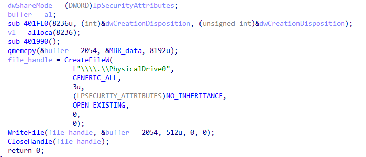
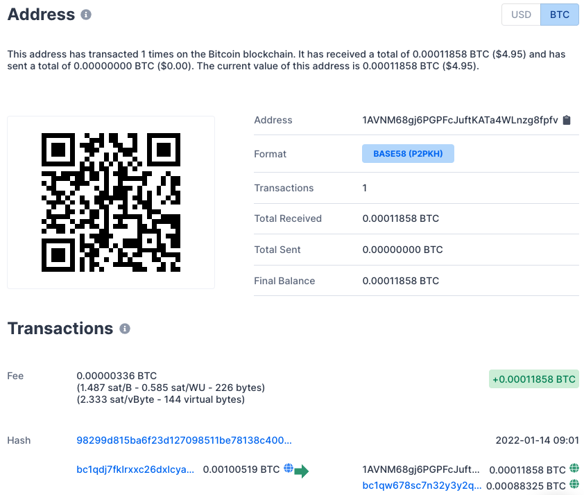
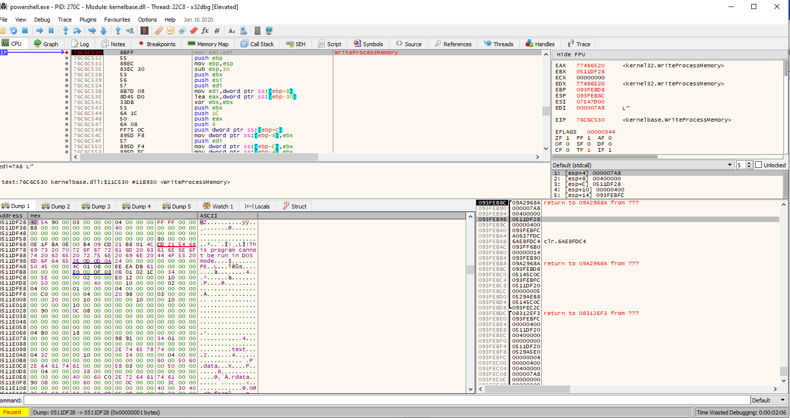
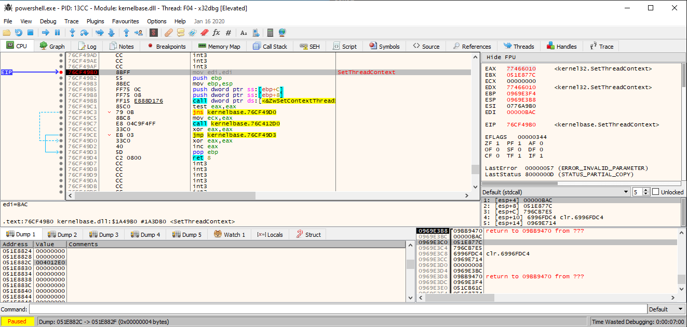
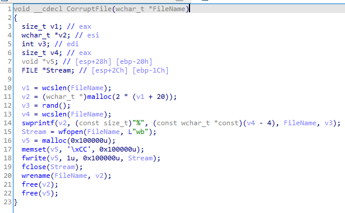
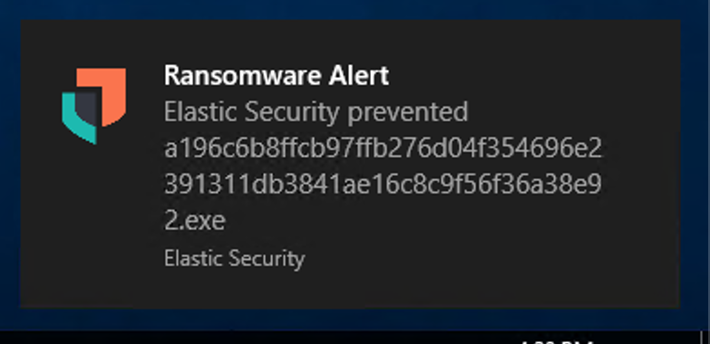
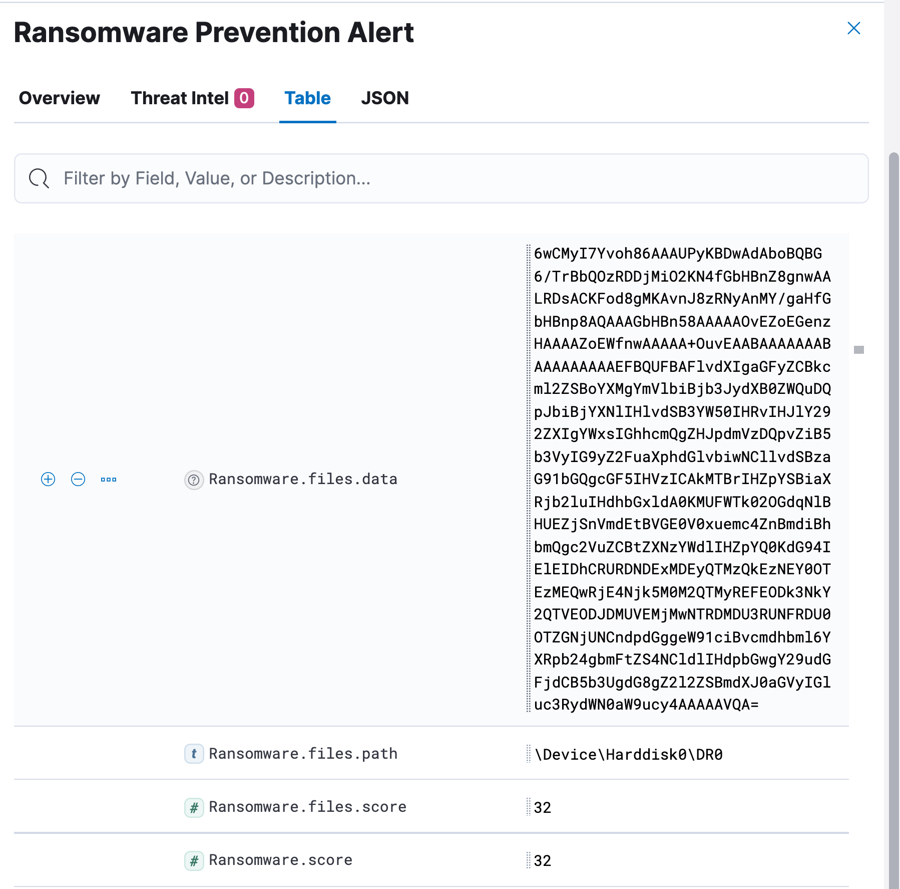
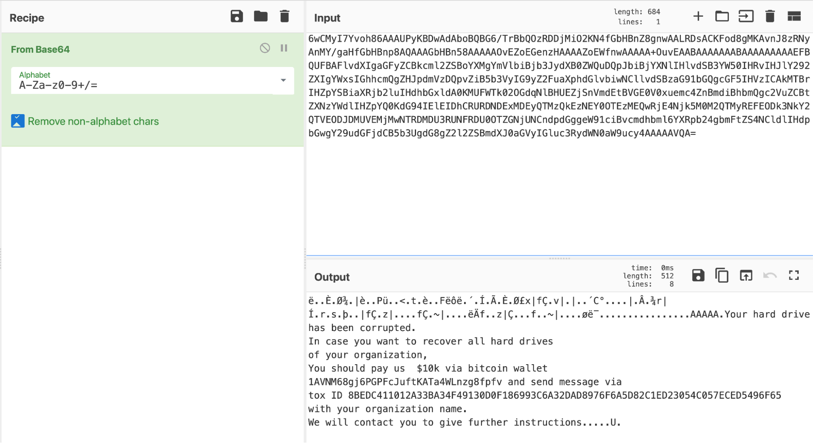

## Key Takeaways

* Elastic Security provides new analysis and insights into targeted campaign against Ukraine organizations with
  destructive malware reported over the weekend of Jan 15, 2022
* Techniques observed include process hollowing, tampering with Windows Defender, using a Master Boot Record (MBR)
  wiper, and file corruptor component
* Elastic Security prevents each stage of the described campaign using prebuilt endpoint protection features


## Overview

Over this past weekend (1/15/2022), Microsoft released details of a new
[campaign targeting Ukrainian government entities](https://www.microsoft.com/security/blog/2022/01/15/destructive-malware-targeting-ukrainian-organizations/)
and organizations with destructive malware. In a multi-staged attack, one malware component known as WhisperGate
utilizes a wiping capability on the Master Boot Record (MBR), making any machine impacted inoperable after boot-up.

Within another stage, a file infector component is used to corrupt files in specific directories with specific file
extensions. The elements used in this campaign lack the common characteristics of a ransomware compromise -- in this
case the adversary uses the same Bitcoin address for each victim and offers no sign of intent to decrypt the
victim's machine.

The Ukrainian National Cyber Security Coordination Center has been referring to this threat activity on its official
[Twitter](https://twitter.com/ncsccUA/status/1482733473228013569?s=20) and
[Facebook](https://www.facebook.com/ncsccUA/posts/449966023412420) accounts as Operation Bleeding Bear.


_Translation: Update information on the cyber attack on January 13-14 on Ukrainian infrastructure. For a coordinated
response report the incident: report@ncscc.gov.ua_

**Elastic users are fully protected** from attacks like these through our advanced malware detection and Ransomware
Protection capabilities in the platform. The Elastic Security team continues to monitor these events. This case
highlights the importance of prevention when it's up against ransomware and malware with destructive capabilities.

## Malware analysis breakdown (Stages 1-4)

### Stage 1: WhisperGate MBR payload

The Master Boot Record (MBR) is software that executes stored start-up information and, most importantly, informs the
system of the location of the bootable partition on disk that contains the user's operating system. If tampered with,
this can result in the system being inoperable -- a common tactic for malware and ransomware campaigns over the years to
interrupt operation of the infected system.

The stage 1 binary is named `stage1.exe` and has low complexity. A `8192`  byte buffer containing the new MBR data that
includes the ransom note is allocated on the stack. A file handle is retrieved from **CreateFileW** pointing to the first
physical drive which represents the MBR. That file handle is then called by **WriteFile** which takes only `512` bytes
from the buffer writing over the Master Boot Record.



The host is subsequently rendered inoperable during the next boot-up sequence. Below is a screenshot showing the
ransom note from an affected virtual machine.


Contained within the ransom note are instructions soliciting payment to a bitcoin wallet address of
[1AVNM68gj6PGPFcJuftKATa4WLnzg8fpfv](https://www.blockchain.com/btc/address/1AVNM68gj6PGPFcJuftKATa4WLnzg8fpfv). The wallet
does not appear to have received funds from victims as of the publication of this post.



### Stage 2/3: Discord downloader and injector

Once the payload has gained a foothold, further destructive capabilities are facilitated by the stage 2 binary, called `stage2.exe`.
This binary pulls down and launches a payload hosted via the Discord content delivery network, a
[recently](https://www.riskiq.com/blog/external-threat-management/discord-cdn-abuse-malware/)
[reported](https://www.zscaler.com/blogs/security-research/discord-cdn-popular-choice-hosting-malicious-payloads) approach
which is increasingly being used by malicious actors.


The obfuscated .NET payload (described as Stage 3 below) is then executed in memory, setting off a number of events including:

* Writing and executing a VBS script that uses PowerShell to add a Windows Defender exclusion on the root directory (C:\)

```text title="Writing and executing a VBS script"
"C:\Windows\System32\WScript.exe""C:\Users\jim\AppData\Local\Temp\Nmddfrqqrbyjeygggda.vbs"
```

```text title="Uses PowerShell to add a Windows Defender exclusion"
powershell.exe Set-MpPreference -ExclusionPath 'C:\'
```

* [AdvancedRun](https://www.nirsoft.net/utils/advanced_run.html), a program used to run Windows applications with
  different settings, is then dropped to disk and executed in order to launch the Service Control Manager and stop
  the Windows Defender service (WinDefend).

```powershell title="AdvancedRun is used to stop Windows Defender"
"C:\Users\jim\AppData\Local\Temp\AdvancedRun.exe" /EXEFilename "C:\Windows\System32\sc.exe" `
  /WindowState 0 /CommandLine "stop WinDefend"  /StartDirectory "" /RunAs 8 /Run
```

* AdvancedRun is used again when launching PowerShell to recursively delete the Windows Defender directory and its files.

```powershell title="AdvancedRun deleting the Windows Defender directory"
"C:\Users\jim\AppData\Local\Temp\AdvancedRun.exe" `
  /EXEFilename "C:\Windows\System32\WindowsPowerShell\v1.0\powershell.exe" /WindowState 0 `
  /CommandLine "rmdir 'C:\ProgramData\Microsoft\Windows Defender' -Recurse" `
  /StartDirectory "" /RunAs 8 /Run
```

* Copies `InstallUtil.exe` is a command-line utility that allows users to install and uninstall server resources from
  the local machine into the user's `%TEMP%` directory. This action leverages the file for
  [process hollowing](https://www.elastic.co/blog/ten-process-injection-techniques-technical-survey-common-and-trending-process)
  by launching it in a suspended state.



* It then proceeds to allocate memory (`VirtualAllocEx`), write the file corruptor payload (described as the Final Stage
  below) into memory (`WriteProcessMemory`), modify the thread entry point (`SetThreadContext`) to point to the file
  corruptor entry point, and start execution of the file corruptor (`ResumeThread`).



### Final stage: File corruptor

The final file corruptor payload is loaded in memory via process hollowing to the InstallUtil process. The file corruptor:

* Targets any local hard drives, attached USB drives, or mounted network shares
* Scans directories for files matching internal hard-coded extension list (excluding the Windows folder)

```text
.3DM .3DS .602 .7Z .ACCDB .AI .ARC .ASC .ASM .ASP .ASPX .BACKUP .BAK .BAT .BMP .BRD
.BZ .BZ2 .C .CGM .CLASS .CMD .CONFIG .CPP .CRT .CS .CSR .CSV .DB .DBF .DCH .DER .DIF
.DIP .DJVU.SH .DOC .DOCB .DOCM .DOCX .DOT .DOTM .DOTX .DWG .EDB .EML .FRM .GIF .GO
.GZ .H .HDD .HTM .HTML .HWP .IBD .INC .INI .ISO .JAR .JAVA .JPEG .JPG .JS .JSP .KDBX
.KEY .LAY .LAY6 .LDF .LOG .MAX .MDB .MDF .MML .MSG .MYD .MYI .NEF .NVRAM .ODB .ODG .ODP
.ODS .ODT .OGG .ONETOC2 .OST .OTG .OTP .OTS .OTT .P12 .PAQ .PAS .PDF .PEM .PFX .PHP .PHP3
.PHP4 .PHP5 .PHP6 .PHP7 .PHPS .PHTML .PL .PNG .POT .POTM .POTX .PPAM .PPK .PPS .PPSM .PPSX
.PPT .PPTM .PPTX .PS1 .PSD .PST .PY .RAR .RAW .RB .RTF .SAV .SCH .SHTML .SLDM .SLDX .SLK
.SLN .SNT .SQ3 .SQL .SQLITE3 .SQLITEDB .STC .STD .STI .STW .SUO .SVG .SXC .SXD .SXI .SXM
.SXW .TAR .TBK .TGZ .TIF .TIFF .TXT .UOP .UOT .VB .VBS .VCD .VDI .VHD .VMDK .VMEM .VMSD
.VMSN .VMSS .VMTM .VMTX .VMX .VMXF .VSD .VSDX .VSWP .WAR .WB2 .WK1 .WKS .XHTML .XLC .XLM
.XLS .XLSB .XLSM .XLSX .XLT .XLTM .XLTX .XLW .YML .ZIP
```

* Overwrites the start of each targeted file with 1MB of static data (byte `0xCC`), regardless of file size
* Renames each targeted file to a randomized extension
* Deletes self with the command:

```text title="Overwriting, renaming, and deleting files"
cmd.exe /min /C ping 111.111.111.111 -n 5 -w 10 > Nul & Del /f /q <running process path>
```



## MBR protection with Elastic Security

Changes to the MBR are particularly strong signals of anomalous and destructive activity typically associated with
ransomware. To counteract this, Elastic security researchers built an MBR protection component based around these
signals into our multi-layered ransomware protection feature.

When a process attempts to overwrite the contents of the MBR, the prewrite buffer and other associated process
metadata will be analyzed inline before any changes are written to disk. If the activity is deemed malicious in nature,
the process will either be terminated immediately (prevention mode) and / or an appropriate ransomware alert will be
generated (prevention and detection modes) to allow security operators time to respond.

When configured in prevention mode, Elastic Security's ransomware protection ensures that the integrity of the MBR is
fully preserved, with no changes ever reaching disk thanks to the synchronous framework leveraged by the feature ---
effectively preventing the ransomware attack in their tracks as the offending process is terminated.

When `WriteFile` is invoked on `PhysicalDrive0` on a host running Elastic Security with ransomware protection enabled,
the pending change will immediately be analyzed and deemed malicious. Afterwards, the process will be terminated, the
endpoint user will be alerted via a popup notification, and a ransomware prevention alert will be sent to and stored
in Elasticsearch. The intended ransom note can be easily deciphered after Base64 decoding the contents of the
prewrite buffer found in the alert within Kibana.



It is important to note that while this behaviour is detected by Elastic, it is not specific to this payload and rather
the behaviour the payload is exhibiting. This increases our chance of being able to detect and prevent malicious behaviors,
even when a static signature of the malware is not known. Threat actors find this kind of control more difficult to
evade than traditional, signature-based detection and prevention approaches.

## Observing WhisperGate in Elastic Security

By observing the process hash of the stage 1 dropper above (`a196c6b8ffcb97ffb276d04f354696e2391311db3841ae16c8c9f56f36a38e92`)
via the process.hash function within Elastic Security, we can isolate the ransomware alert and analyze the blocked attempt
at overwriting the MBR.




As we can see, the data is stored as a Base64 encoded string in Elasticsearch. Decoded, we can see the contents of the
ransom note that would be displayed to the end user of an affected system.



## Alert breakdown and defensive recommendations

The following alerts were triggered in Elastic Security during our investigations:

### Endpoint Security Integration Alerts

**Stage 1 - MBR Wiper** (`a196c6b8ffcb97ffb276d04f354696e2391311db3841ae16c8c9f56f36a38e92)`

* Malware Prevention Alert
* Ransomware Prevention Alert (MBR overwrite)

**Stage 2 - Downloader** (`dcbbae5a1c61dbbbb7dcd6dc5dd1eb1169f5329958d38b58c3fd9384081c9b78`)

* Malware Prevention Alert

**Stage 3 + Stage 4 - Injector/File Corruptor** (`34CA75A8C190F20B8A7596AFEB255F2228CB2467BD210B2637965B61AC7EA907`))

* Ransomware Prevention Alert (canary files)
* Malicious Behaviour Prevention Alert -  Binary Masquerading via Untrusted Path
* Memory Threat Prevention Alert

### Prebuilt Detection Engine Alerts

The following existing [public detection rules](https://github.com/elastic/detection-rules) can also be used to detect
some of the employed techniques:

* [Suspicious Execution via Windows Management Instrumentation (WMI)](https://github.com/elastic/detection-rules/blob/main/rules/windows/execution_suspicious_cmd_wmi.toml)
* [Windows Defender Exclusions Added via PowerShell](https://github.com/elastic/detection-rules/blob/main/rules/windows/defense_evasion_defender_exclusion_via_powershell.toml)
* [Connection to Commonly Abused Web Services](https://github.com/elastic/detection-rules/blob/main/rules/windows/command_and_control_common_webservices.toml)
* [Process Execution from an Unusual Directory](https://github.com/elastic/detection-rules/blob/main/rules/windows/execution_from_unusual_directory.toml)
* [Windows Script Executing PowerShell](https://github.com/elastic/detection-rules/blob/82ec6ac1eeb62a1383792719a1943b551264ed16/rules/windows/initial_access_script_executing_powershell.toml)
* [Disabling Windows Defender Security Settings via PowerShell](https://github.com/elastic/detection-rules/blob/ef7548f04c4341e0d1a172810330d59453f46a21/rules/windows/defense_evasion_disabling_windows_defender_powershell.toml)

### Hunting queries

Detect attempt to tamper with Windows defender settings via [NirSoft AdvancedRun](https://www.nirsoft.net/utils/advanced_run.html)
executed by [the Stage 3 injector](https://www.virustotal.com/gui/file/923eb77b3c9e11d6c56052318c119c1a22d11ab71675e6b95d05eeb73d1accd6/community):

```eql title="Detect attempts to tamper with Windows Defender"
process where event.type == "start" and
process.pe.original_file_name == "AdvancedRun.exe" and
process.command_line :
   ("*rmdir*Windows Defender*Recurse*",
    "*stop WinDefend*")
```

Masquerade as InstallUtil via code injection :

```eql title="Identifies code injection with InstallUtil"
process where event.type == "start" and
process.pe.original_file_name == "InstallUtil.exe" and
not process.executable : "?:\\Windows\\Microsoft.NET\\*"
```

## MITRE ATT&CK

* [T1561.002 - Disk Structure Wipe](https://attack.mitre.org/techniques/T1561/002/)
* [T1562.001 - Disable or Modify Tools](https://attack.mitre.org/techniques/T1562/001/)
* [T1047 - Windows Management Instrumentation](https://attack.mitre.org/techniques/T1047/)
* [T1102 - Web Service](https://attack.mitre.org/techniques/T1102/)
* [T1055 - Process Injection](https://attack.mitre.org/techniques/T1055/)
* [T1027 - Obfuscated Files or Information](https://attack.mitre.org/techniques/T1027/)

## Summary

These targeted attacks on Ukraine using destructive malware match a similar pattern observed in the past such as
[NotPetya](https://www.wired.com/story/notpetya-cyberattack-ukraine-russia-code-crashed-the-world/). By leveraging
different malware components to wipe machines and corrupt files, it's apparent there was no intent to recover any funds,
but likely a technique used to sow chaos and doubt into Ukraine's stability.

As these events are still ongoing, we wanted to release some initial analysis and observations from our perspective.
We also wanted to highlight the prevention capabilities of Elastic Security across each stage of this attack,
available to everyone today.

Existing Elastic Security users can access these capabilities within the product. If you're new to Elastic Security,
take a look at our [Quick Start guides](https://www.elastic.co/training/free#quick-starts)
(bite-sized training videos to get you started quickly) or our
[free fundamentals training courses](https://www.elastic.co/training/free#fundamentals). You can always get started with
a [free 14-day trial of Elastic Cloud](https://cloud.elastic.co/registration?elektra=whats-new-elastic-security-7-16-blog).

## Indicators

Indicator                                                          | Type   | Note
-------------------------------------------------------------------|--------|-----------------------------
`a196c6b8ffcb97ffb276d04f354696e2391311db3841ae16c8c9f56f36a38e92` | SHA256 | Stage1.exe (MBR wiper)
`dcbbae5a1c61dbbbb7dcd6dc5dd1eb1169f5329958d38b58c3fd9384081c9b78` | SHA256 | Stage2.exe (Downloader)
`923eb77b3c9e11d6c56052318c119c1a22d11ab71675e6b95d05eeb73d1accd6` | SHA256 | Stage3 (Injector - original)
`9ef7dbd3da51332a78eff19146d21c82957821e464e8133e9594a07d716d892d` | SHA256 | Stage3 (Injector - fixed)
`34CA75A8C190F20B8A7596AFEB255F2228CB2467BD210B2637965B61AC7EA907` | SHA256 | Stage4 (File Corruptor)
