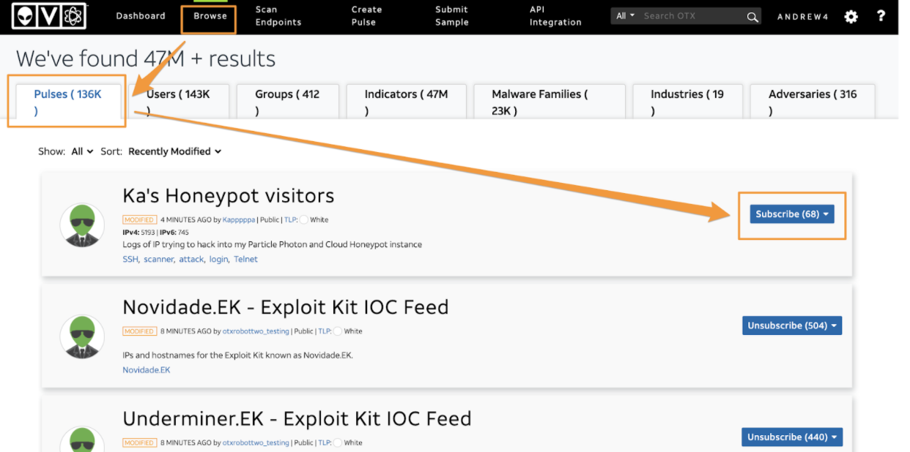
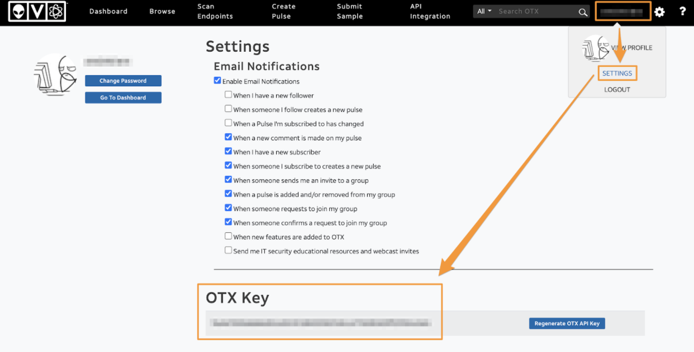
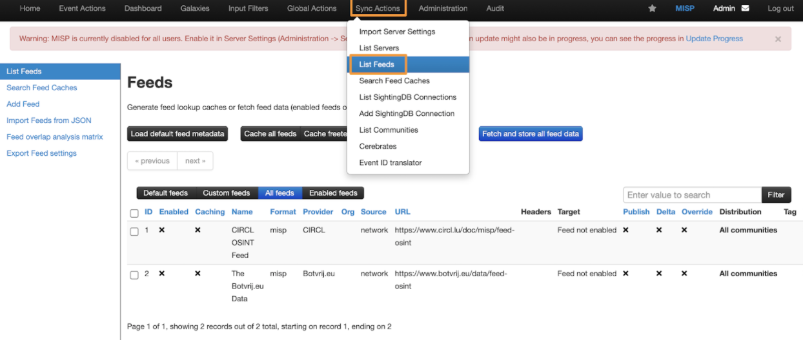
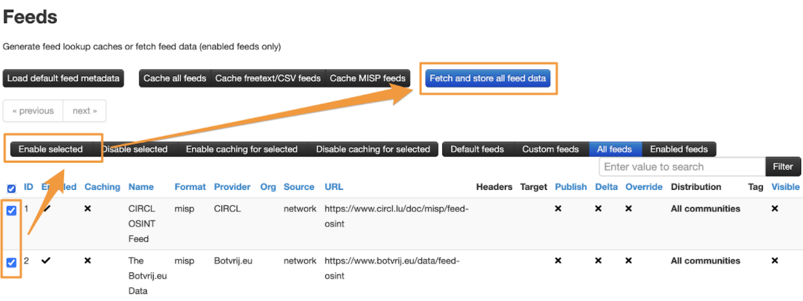
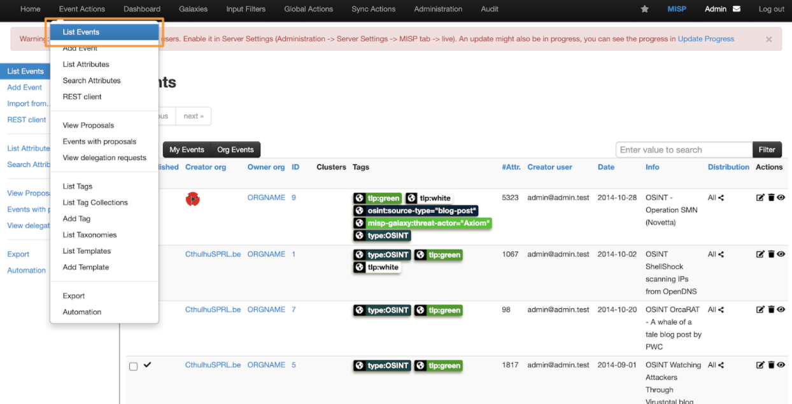
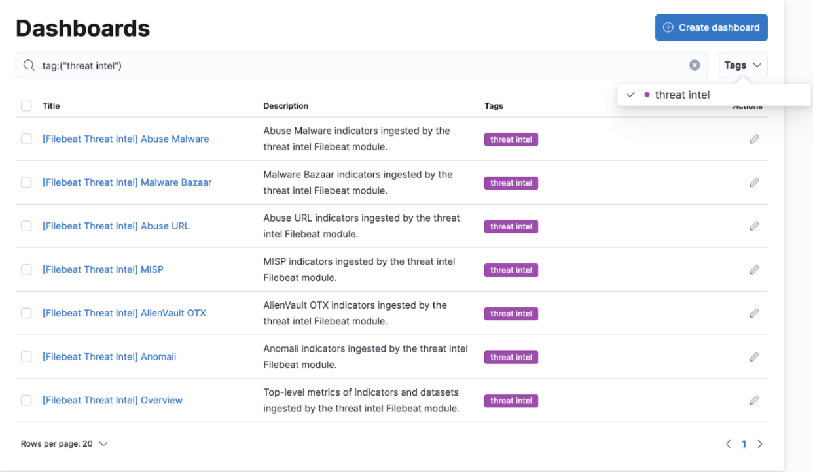

The ability for security teams to integrate threat data into their operations substantially helps their organization
identify potentially malicious endpoint and network events using indicators identified by other threat research teams.
In this blog, we'll cover how to ingest threat data with the Threat Intel Filebeat module. In future blog posts, we'll
cover enriching threat data with the Threat ECS fieldset and operationalizing threat data with Elastic Security.

## Elastic Filebeat modules

Elastic Filebeat modules simplify the collection, parsing, and visualization of data stored in common log formats. Elastic
publishes a variety of [Filebeat modules](https://www.elastic.co/guide/en/beats/filebeat/current/filebeat-modules.html)
that are focused on collecting the data you want for use within Elasticsearch. These modules provide a standardized and
"turnkey" method to ingest specific data sources into the Elastic Stack.

Using these capabilities, the Threat Intel Filebeat module:

* Consumes threat data from six open source feeds
* Loads threat data into Elasticsearch
* Normalizes threat data into the [Threat ECS fieldset](https://www.elastic.co/guide/en/ecs/current/ecs-threat.html)
* Enables threat analysis through dashboards and visualizations

Analysts and threat hunters can use this data for raw threat hunting, enrichment, intelligence analysis and production,
and detection logic.


The six feeds included with the 7.13 Filebeat Threat Intel module are as follows (additional feeds may be added in the future):

* [Abuse.ch Malware](https://urlhaus-api.abuse.ch/v1/payloads/recent)
* [Abuse.ch URL](https://urlhaus.abuse.ch/)
* [AlienVault Open Threat Exchange (OTX)](https://otx.alienvault.com/)
* [Anomali Limo](https://www.anomali.com/resources/limo)
* [Malware Bazaar](https://bazaar.abuse.ch/)
* [Malware Information Sharing Platform (MISP)](https://www.misp-project.org/)

Using the Threat Intel Filebeat module, you can choose from several open source threat feeds, store the data in Elasticsearch,
and leverage the Kibana Security App to aid in security operations and intelligence analysis.

## Threat Intel Filebeat module

Generally, the Filebeat Threat Intel module can be started without any configuration to collect logs from Abuse.ch feeds,
Anomali Limo, and Malware Bazaar. However, the optional AlienVault OTX and MISP datasets require tokens to authenticate
to their feed sources. Thankfully, obtaining a token is a simple process.

### AlienVault OTX

The team over at Alien Labs® has created the Open Threat Exchange (OTX)® as an open threat intelligence community. This
environment provides access to a diverse community of researchers and practitioners. OTX allows anyone in the community
to discuss, research, validate, and share threat data. Additionally, OTX has an Application Programming Interface (API)
endpoint that provides a read-only feed; which is how the Filebeat module consumes the OTX threat data.

To access the OTX API, you simply need to [create an account](https://otx.alienvault.com/). Once you have an account,
you can subscribe to specific OTX community reports and threat data feeds called "Pulses." These Pulses are retrieved
by the Filebeat module and stored in Elasticsearch.

Pulses are updated at various cadences, but many are daily or even hourly. The Pulse has a summary of the threat, indicators,
and various other enrichments that can help you contextually assess the threat in your environment.

To subscribe to Pulses, select Browse → Pulses, and then subscribe to any Pulses that you'd like. You can sort by the
most recently modified to identify the most active Pulses.



Now that you've subscribed to Pulses of interest, we'll need to collect your API key.

### Retrieving Your API Key

The API key is used to securely authenticate to OTX and obtain the indicators from Pulses.

To retrieve your API key, select your userID →  Settings, and then copy your OTX Key.



Now that we have your OTX Key, let's set up MISP.

## MISP

The Malware Information Sharing Platform (MISP) is an open source project for collecting, storing, distributing, and
sharing indicators about threats.

While MISP is extremely powerful and has a tremendous variety of features, it can be a bit cumbersome to set up. If you
are planning on setting up MISP for production, check out the [official documentation](https://github.com/MISP/MISP/tree/2.4/docs)
for installing MISP on Kali, RHEL (incl. CentOS and Fedora), or Ubuntu.

If your organization doesn't have a MISP instance, you can use one of the many projects that use Docker to get MISP up
and running. There's a [great and maintained project](https://github.com/coolacid/docker-misp) by Jason Kendall (@coolacid)
 that is about as turnkey as you could ask for.

### Standing up CoolAcid's MISP Docker Containers

As a caveat, this will cover a default development deployment of MISP. It should not be used in production. Please see
the [official MISP documentation](https://github.com/MISP/MISP/tree/2.4/docs) for properly deploying a secure MISP instance.

As a few prerequisites, you'll need to have Docker Compose and Git installed:

* **Docker Compose** is used to automate the deployment and configuration of the containers. You can check out
  [Docker's documentation](https://docs.docker.com/compose/install/) on getting Compose installed.
* **Git** is a version-control framework used to coordinate software development throughout contributors and community
  members. You can check out the [Git documentation](https://git-scm.com/book/en/v2/Getting-Started-Installing-Git) on
  getting Git installed.

Next, we need to clone CoolAcid's repository and fire up the containers.

* git clone: Copies the remote repository to your local machine into a file called "docker-misp"
* cd docker-misp: Changes into the "docker-misp" directory
* docker-compose up -d: Uses the docker-compose file in the "docker-misp" directory to download, build, and start all
  of the relevant containers in "detached mode" (in the background)

```text title='Code Block 1 - Starting MISP Containers'
$ git clone https://github.com/coolacid/docker-misp.git
$ cd docker-misp
$ docker-compose up -d

Pulling misp (coolacid/misp-docker:core-latest)...
core-latest: Pulling from coolacid/misp-docker
a54cbf64e415: Pull complete
84e78d2508ee: Pull complete
433476aac54e: Pull complete
780a2dfa04f6: Pull complete
Digest: sha256:7f380ad0d858bdec2c4e220f612d80431b1a0b0cb591311ade38da53b50a4cc1
Status: Downloaded newer image for coolacid/misp-docker:core-latest
Pulling misp-modules (coolacid/misp-docker:modules-latest)...
modules-latest: Pulling from coolacid/misp-docker
cdd040608d7b: Pull complete
4e340668f524: Pull complete
a4501f203bb2: Downloading [=========================================>         ]  166.1MB/201.3MB
2cdaa3afcfca: Download complete
99a18a4e84d6: Downloading [=============================>                     ]  130.8MB/218.3MB
...
```

Once all of the containers are started, simply browse to [https://localhost](https://localhost:8080) and log in with the
default credentials of `admin@admin.test` and a passphrase of `admin`. You will immediately be required to change your passphrase.

### Configuring default MISP feeds

Once you have started the MISP containers and changed your default credentials, hover over Sync Actions and then select
List Feeds.



Highlight the available feeds, select "Enable selected" to enable the default feeds, and then "Fetch and store all feed data."



Next, select on the "Event Actions" menu item, select "List Events" and you'll see data begin to be populated. This will
take a while.



While the data provided by the MISP threat feeds is being downloaded, let's get your API key.

### Collecting Your API Key

To collect your API key, select "Administration" and then "List Users." You will see your account. Next to your "Authkey"
will be an eye icon, select it to show your API key and copy that down.


Now that we have set up and configured MISP and retrieved our API key, we can configure the actual Filebeat module.

## Installing Filebeat

Getting the Threat Intel module is no different than any other Filebeat module. Check out the
[Quick Start guide to install Filebeat](https://www.elastic.co/guide/en/beats/filebeat/current/filebeat-installation-configuration.html)
either as a standalone binary or a package for macOS, Windows, or Linux.

## Configuring the Threat Intel Filebeat module

Once you have Filebeat, we'll simply enable the module (ensure filebeat is in your $PATH).

```text title="Code Block 2 - Enabling the Threat Intel Filebeat Module"
filebeat modules enable threatintel
```

Next, let's configure feeds. We'll do this by modifying the module configuration files. Depending on your OS and
installation method, the configuration files will be located in different locations:

Windows

* `C:\Program Files\Filebeat\modules.d\threatintel.yml`
* If installed with [Chocolatey](https://community.chocolatey.org/packages/filebeat)
  * `C:\ProgramData\chocolatey\lib\filebeat\tools\modules.d\threatintel.yml`

macOS

* `filebeat/modules.d/threatintel.yml`
* If installed with [Homebrew](https://formulae.brew.sh/formula/filebeat)
  * `/usr/local/etc/filebeat/modules.d/threatintel.yml`

Linux

* `filebeat/modules.d/threatintel.yml`
* If Installed with [APT](https://www.elastic.co/guide/en/beats/filebeat/current/setup-repositories.html#_apt) or
  [YUM / dnf](https://www.elastic.co/guide/en/beats/filebeat/current/setup-repositories.html#_yum)
  * `/etc/filebeat/modules.d/threatintel.yml`

Using whichever text editor you're most comfortable with, open `threatintel.yml` and we'll add your OTX API key, your
MISP API key, and validate Anomali's credential pair.

### Abuse URL feed configuration

By default, the Abuse URL feed is enabled and does not need modification. The feed includes domain, URI, and URL
indicators with additional context for significant dates, tags, submitter, status, etc.

```yaml title='Code Block 3 - Configuring the Abuse URL Feed'
abuseurl:
  enabled: true

  # Input used for ingesting threat intel data.
  var.input: httpjson

  # The URL used for Threat Intel API calls.
  var.url: https://urlhaus-api.abuse.ch/v1/urls/recent/

  # The interval to poll the API for updates.
  var.interval: 10m
```

#### Abuse malware feed configuration

By default, the Abuse malware feed is enabled and does not need modification. The feed includes file hashes and hosts
with additional context for significant dates, tags, status, etc.

```yaml title='Code Block 4 - Configuring the Abuse Malware Feed'
abusemalware:
    enabled: true

    # Input used for ingesting threat intel data.
    var.input: httpjson

    # The URL used for Threat Intel API calls.
    var.url: https://urlhaus-api.abuse.ch/v1/payloads/recent/

    # The interval to poll the API for updates.
    var.interval: 10m
```

### MISP feed configuration

By default, the MISP feed is enabled but requires configuration. The feed includes various file and network data with
additional context for significant dates, tags, status, submitter, etc.

The API endpoint that Filebeat will query needs to be configured. If you are running MISP on the same system as Filebeat,
you can use `var.url: https://localhost/event/restSearch`. If you are running MISP elsewhere, you'll need to enter that
hostname or IP address in lieu of `localhost`.

The API token is the "Authkey" that you retrieved during the previous MISP setup steps. You'll enter that as the value
for `var.api_token:`

If you are using a self-signed SSL certificate for MISP, you'll want to disable the SSL verification mode by uncommenting
the `var.ssl.verification_mode: none` line.

```yaml title='Code Block 5 - Configuring the MISP Feed'
misp:
    enabled: true

    # Input used for ingesting threat intel data, defaults to JSON.
    var.input: httpjson

    # The URL of the MISP instance, should end with "/events/restSearch".
    var.url: https://localhost/events/restSearch

    # The authentication token used to contact the MISP API. Found when looking at user account in the MISP UI.
    var.api_token: MISP-Authkey

    # Configures the type of SSL verification done, if MISP is running on self signed certificates
    # then the certificate would either need to be trusted, or verification_mode set to none.
    var.ssl.verification_mode: none

    # Optional filters that can be applied to the API for filtering out results. This should support the majority of
    # fields in a MISP context. For examples please reference the filebeat module documentation.
    #var.filters:
    #  - threat_level: [4, 5]
    #  - to_ids: true

    # How far back to look once the beat starts up for the first time, the value has to be in hours. Each request
    # afterwards will filter on any event newer than the last event that was already ingested.
    var.first_interval: 300h

    # The interval to poll the API for updates.
    var.interval: 5m
```

### AlienVault OTX feed configuration

By default, the AlienVault OTX feed is enabled but requires configuration. The feed includes various file and network
data with additional context for significant dates, tags, etc.

The API token is the "OTX Key" that you retrieved during the AlienVault OTX setup steps. You'll enter that as the value
for `var.api_token:`

```yaml title='Code Block 6 - Configuring the AlienVault OTX Feed'
otx:
  enabled: true

  # Input used for ingesting threat intel data
  var.input: httpjson

  # The URL used for OTX Threat Intel API calls.
  var.url: https://otx.alienvault.com/api/v1/indicators/export

  # The authentication token used to contact the OTX API, can be found on the OTX UI.
  Var.api_token: OTX-Key

  # Optional filters that can be applied to retrieve only specific indicators.
  #var.types: "domain,IPv4,hostname,url,FileHash-SHA256"

  # The timeout of the HTTP client connecting to the OTX API
  #var.http_client_timeout: 120s

  # How many hours to look back for each request, should be close to the configured interval.
  # Deduplication of events is handled by the module.
  var.lookback_range: 1h

  # How far back to look once the beat starts up for the first time, the value has to be in hours.
  var.first_interval: 400h

  # The interval to poll the API for updates
  var.interval: 5m
```

### Anomali feed configuration

By default, the Anomali feed is enabled but requires configuration. The feed includes various file and network data with
additional context for significant dates, tags, etc.

The default username and passphrase for the Limo feed is `guest:guest`, but are commented out. If you do not have other
credential pairs, you can simply uncomment `var.username` and `var.password`.

At the time of this writing, Anomali has 11 collections that they provide as part of their Limo feed. The `var.url`
variable is where the collection is defined. To get a list of the collections, you can query the Anomali Limo collections
API endpoint (while not required, [jq](https://stedolan.github.io/jq/download/) makes the collections easier to read).

```shell title='Code Block 7 - Configuring the Anomali Limo Collections'
$ curl -L -u guest:guest https://limo.anomali.com/api/v1/taxii2/feeds/collections | jq

{
  "collections": [
    {
      "can_read": true,
      "can_write": false,
      "description": "",
      "id": "107",
      "title": "Phish Tank"
    },
    {
      "can_read": true,
      "can_write": false,
      "description": "",
      "id": "135",
      "title": "Abuse.ch Ransomware IPs"
    },
    {
      "can_read": true,
      "can_write": false,
      "description": "",
      "id": "136",
      "title": "Abuse.ch Ransomware Domains"
    },
...
```

The collection ID can be inserted into the Anomali configuration. There are a few ways to do this. You can:

* Manually change the ID
* Enter all of the IDs and comment out all but the collection you're wanting to target
* Create a duplicate Anomali configuration section for each collection

The below example shows the approach of duplicate sections for each collection; notice the different collection ID for
each section (31, 313, 33) in the `var.url:` field.

```yaml title='Code Block 8 - Configuring the Anomali Limo Feed'
  anomali:
    enabled: true

    # Input used for ingesting threat intel data
    var.input: httpjson

    # The URL used for Threat Intel API calls. Limo has multiple different possibilities for URL's depending
    # on the type of threat intel source that is needed.
    var.url: https://limo.anomali.com/api/v1/taxii2/feeds/collections/31/objects

    # The Username used by anomali Limo, defaults to guest.
    var.username: guest

    # The password used by anomali Limo, defaults to guest.
    var.password: guest

    # How far back to look once the beat starts up for the first time, the value has to be in hours.
    var.first_interval: 400h

    # The interval to poll the API for updates
    var.interval: 5m

  anomali:
    enabled: true

    # Input used for ingesting threat intel data
    var.input: httpjson

    # The URL used for Threat Intel API calls. Limo has multiple different possibilities for URL's depending
    # on the type of threat intel source that is needed.
    var.url: https://limo.anomali.com/api/v1/taxii2/feeds/collections/313/objects

    # The Username used by anomali Limo, defaults to guest.
    var.username: guest

    # The password used by anomali Limo, defaults to guest.
    var.password: guest

    # How far back to look once the beat starts up for the first time, the value has to be in hours.
    var.first_interval: 400h

    # The interval to poll the API for updates
    var.interval: 5m

  anomali:
    enabled: true

    # Input used for ingesting threat intel data
    var.input: httpjson

    # The URL used for Threat Intel API calls. Limo has multiple different possibilities for URL's depending
    # on the type of threat intel source that is needed.
    var.url: https://limo.anomali.com/api/v1/taxii2/feeds/collections/33/objects
...
```

Now that we've configured the module to consume threat feed data, let's send the data into Elasticsearch and visualize
it with Kibana.

## Setting up Elasticsearch and Kibana

The Filebeat Threat Intel module will send the configured threat feed data into Elasticsearch, which can be visualized
with Kibana. Please see the Elastic documentation for setting up [Elasticsearch](https://www.elastic.co/guide/en/elasticsearch/reference/current/setup.html)
and [Kibana](https://www.elastic.co/guide/en/kibana/current/setup.html) production environments. Additionally, if you're
looking for a turnkey approach, you can quickly and securely set up an [Elastic Cloud](https://cloud.elastic.co) account.

For this non-production example, we'll be using one of the many projects that use Docker to get Elasticsearch and Kibana
up and running quickly

### Standing up an Elasticsearch and Kibana container

As a caveat, this will cover a convenient default development deployment of Elasticsearch and Kibana. It should not be
used in production. Please see the [Elastic documentation](https://www.elastic.co/guide/en/elasticsearch/reference/current/configuring-stack-security.html)
for properly deploying a secure instance.

We'll simply collect the repository and start the Docker containers.

* git clone: This copies the remote repository to your local machine into a folder called "elastic-container"
* cd elastic-container: Changes into the "elastic-container" directory
* sh elastic-container.sh start: This downloads and starts the Elasticsearch and Kibana containers

```shell title='Code Block 9 - Starting Elastic Containers'
$ git clone https://github.com/peasead/elastic-container.git
$ cd elastic-container
$ sh elastic-container.sh start

7.12.1: Pulling from elasticsearch/elasticsearch
ddf49b9115d7: Already exists
4df4d6995ad2: Pull complete
e180ce5d1430: Pull complete
b3801a448e4f: Downloading [====>                      ]  199.3MB/353.1MB
a3100bfb487c: Download complete
817ce7c869c7: Download complete
485f138f2280: Download complete

7.12.1: Pulling from kibana/kibana
ddf49b9115d7: Already exists
588c50b1b6af: Extracting [====================>       ]  34.93MB/40.52MB
9d32826b6fa0: Download complete
01017880c9d9: Download complete
efcedd43b7be: Download complete
0887ad2a14e0: Download complete
625b277c1f7b: Downloading [=====>                     ]  52.27MB/320.4MB
68815bc8856d: Download complete
e9e0d8f8fa8c: Download complete
```

Check out the repository [documentation](https://github.com/peasead/elastic-container) for additional usage and
configuration options (if needed).

Once all of the containers are started, simply browse to [http://localhost:5601](https://localhost:5601) and log in
with the default credentials of `elastic` and a passphrase of `password`.

## Consuming threat data with Filebeat

There are multiple [output options for Filebeat](https://www.elastic.co/guide/en/beats/filebeat/current/configuring-output.html),
so use whatever is easiest for you. We'll use a local Elasticsearch instance in this example. Using a local instance of
Elasticsearch and Kibana requires no modification to the `filebeat.yml` file.

To validate our configuration, let's first test our configuration and access to Elasticsearch.

* filebeat test config: This will test to ensure your `filebeat.yml` configuration is correct (if you modified it to
  fit your environment)
* filebeat test output - this will test to ensure you can access Elasticsearch

```text title='Code Block 10 - Testing Filebeat Configuration and Connection'
$ filebeat test config
Config OK

$ filebeat test output
elasticsearch: http://localhost:9200...
  parse url... OK
  connection...
    parse host... OK
    dns lookup... OK
    addresses: ::1, 127.0.0.1
    dial up... OK
  TLS... WARN secure connection disabled
  talk to server... OK
  version: 7.12.0
```

To load the dashboards, index pattern, and ingest pipelines, let's run the setup.

* filebeat setup: This will connect to Kibana and load the index pattern, ingest pipelines, and the saved objects
  (tags, visualizations, and dashboards)

```text title='Code Block 11 - Setting Up Filebeat Index Patterns and saved objects in Kibana'
$ filebeat setup

Overwriting ILM policy is disabled. Set `setup.ilm.overwrite: true` for enabling.

Index setup finished.
Loading dashboards (Kibana must be running and reachable)
Loaded dashboards
Setting up ML using setup --machine-learning is going to be removed in 8.0.0. Please use the ML app instead.
See more: https://www.elastic.co/guide/en/machine-learning/current/index.html
Loaded machine learning job configurations
Loaded Ingest pipelines
```

Finally, let's [start Filebeat](https://www.elastic.co/guide/en/beats/filebeat/current/filebeat-starting.html) to begin collecting!

Next, browse to Kibana and select the Dashboards app. To make the dashboards easier to find, they all use the
"threat intel" tag.



There is a dashboard for each feed and an overview dashboard that shows the health of the module.


It may take several minutes for all of the data to be retrieved as the different sources are polled.

## What's next?

We're working on converting the existing visualizations into [Lens](https://www.elastic.co/kibana/kibana-lens) and adding
[drilldown](https://www.elastic.co/guide/en/kibana/current/drilldowns.html) capabilities to each visualization.

Additionally, as we mentioned in the beginning of this post, this is part one of a three-part series on operationalizing
threat data in the Elastic Stack. The next post will cover enhancements to the Threat ECS fieldset and enriching threat
data using local endpoint and network observations.

We're working on adding additional open source and commercial feeds. If you have feeds that you'd like to see prioritized,
please check out the contribution section below.

Finally, we're looking at opportunities to add context and enrichments to observed events with third-party sources.

So stay tuned --- we're continuing to lean hard into empowering our customers to defend their environments. Being able to
action threat data is a key part of that journey.

## How can you contribute?

The [Threat Intel Filebeat module](https://www.elastic.co/guide/en/beats/filebeat/current/filebeat-module-threatintel.html)
was released with Elastic 7.12, which means that it is still in beta. Testing the feeds, configurations, visualizations,
etc. is strongly encouraged. We love hearing feedback.

In addition to the Threat Intel module, there are some other repositories that are related to the collection, processing,
and analysis of TI data:

* The Beats [repository](https://github.com/elastic/beats), where you can contribute to, and enhance, threat data feeds
* The Elastic Common Schema (ECS) [repository](https://github.com/elastic/ecs), where you can be a part of the discussion
  on shaping how threat data is described in the Elastic Stack
* The Kibana [repository](https://github.com/elastic/kibana), where analysts interact with the data stored in Elasticsearch
* The Detection Rules [repository](https://github.com/elastic/detection-rules), where detection logic and rules are
  created and stored

The best way to contribute to the community is to explore the functionality, features, and
[documentation](https://www.elastic.co/guide/en/beats/filebeat/7.12/filebeat-module-threatintel.html) and let us know
through a [Github Issue](https://github.com/elastic/beats/issues/new/choose) if there is a problem or something you'd
like to see.

If you're new to Elastic, experience our latest version of the [Elasticsearch Service](https://www.elastic.co/elasticsearch/service)
on Elastic Cloud. Also be sure to take advantage of our [Quick Start training](https://www.elastic.co/training/elastic-security-quick-start)
to set yourself up for success.
