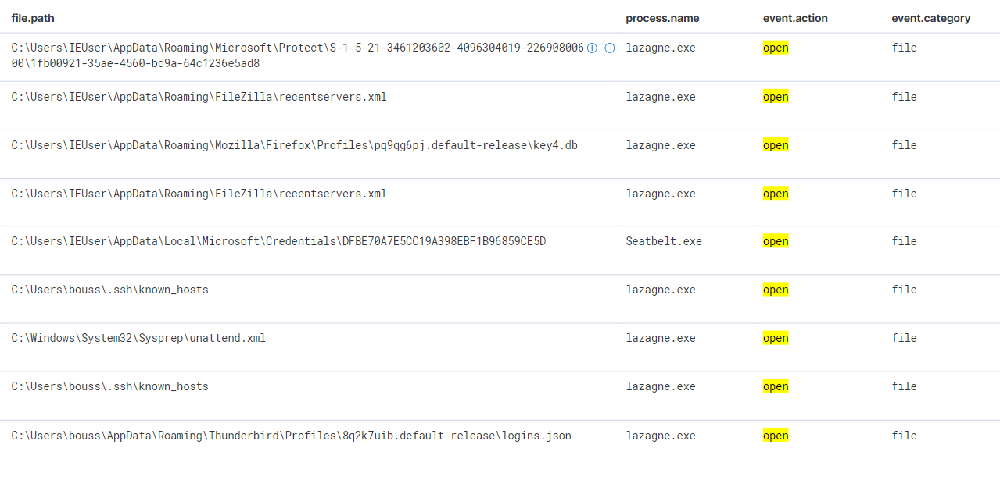
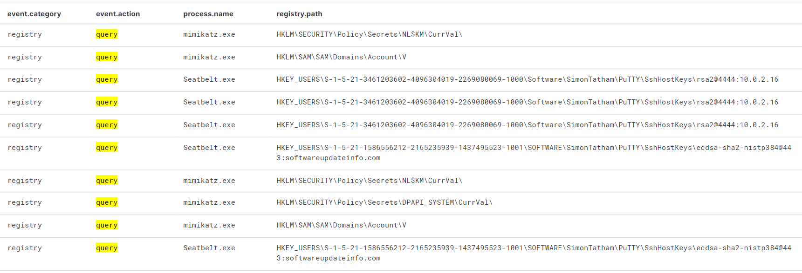
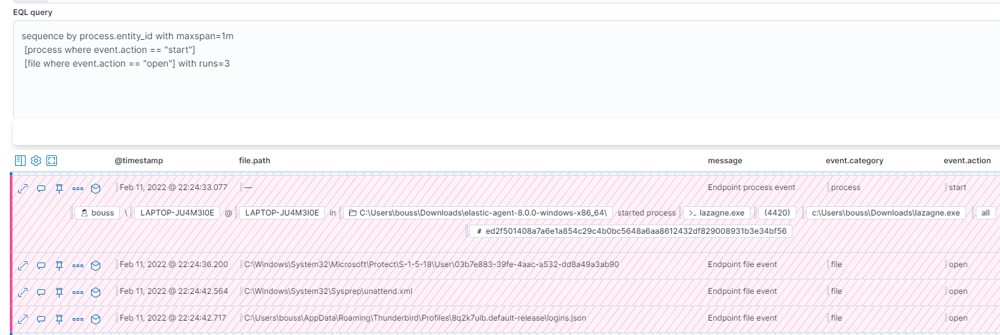

Elastic Endpoint Security provides events that enable defenders with visibility on techniques and procedures which are commonly leveraged to access sensitive files and registry objects.

## Preamble

[Credential Access](https://attack.mitre.org/tactics/TA0006/) consists of techniques for stealing credentials like cookies, API keys, and passwords. It is one of the top critical tactics that is almost guaranteed to occur during an attack lifecycle, ranging from phishing to infostealer malware to more complicated post-exploitation techniques. Therefore, covering it from different angles increases opportunities for early detection and prevention.  

[Elastic Endpoint Security](https://www.elastic.co/endpoint-security/) 7.15 added new [`file`](https://www.elastic.co/guide/en/ecs/current/ecs-file.html#field-file-path) and [`registry`](https://www.elastic.co/guide/en/ecs/current/ecs-allowed-values-event-category.html#ecs-event-category-registry) events to provide defenders with better visibility on techniques and procedures involving some form of sensitive files and/or registry objects access:

* [T1555.003 Credentials from Web Browsers](https://attack.mitre.org/techniques/T1555/003/)
* [T1003.002 Security Account Manager](https://attack.mitre.org/techniques/T1003/002/)
* [T1003.004 LSA Secrets](https://attack.mitre.org/techniques/T1003/004/)
* [T1003.005 Cached Domain Credentials](https://attack.mitre.org/techniques/T1003/005/)
* [T1552.001 Credential in Files](https://attack.mitre.org/techniques/T1552/001/)
* [T1555.004 Windows Credential Manager](https://attack.mitre.org/techniques/T1555/004/)

## Hunting for Credential Access

With the [Endpoint security integration](https://www.elastic.co/guide/en/security/current/install-endpoint.html) enabled, you can explore those new events using generic [KQL](https://www.elastic.co/guide/en/kibana/current/kuery-query.html) or [EQL](https://www.elastic.co/guide/en/elasticsearch/reference/current/eql.html) queries:

```eql title="KQL and EQL queries to view file and registry events."
// EQL via Security -> Timelines -> New -> Correlation
any where event.category in ("file", "registry") 
  and event.action in ("query", "open")

// KQL via Discover
event.category : ("file" or "registry") 
  and event.action : ("open" or "query") 
```

Below, you can see an example of `file` events logged as a result of running two known security assessment tools: [Lazagne](https://github.com/AlessandroZ/LaZagne) and [Seatbelt](https://github.com/GhostPack/Seatbelt). These tools include checks for a multitude of credentials and interesting files used in common software:

<figure markdown>
  
<figcaption>KQL query identifying Lazagne and Seatbelt</figcaption>
</figure>

Here are some example `registry` events logged as a result of running [Mimikatz](https://github.com/gentilkiwi/mimikatz) (`lsadump::sam`, `cache`,  `lsa`, and `secrets` submodules) and Seatbelt (`PuttyHostKeys` SSH enumeration):

<figure markdown>
  
<figcaption>KQL query identifying Mimikatz and Seatbelt</figcaption>
</figure>

Leveraging EQL’s [correlation](https://www.elastic.co/guide/en/elasticsearch/reference/current/eql-syntax.html#eql-sequences) capabilities to link those new events with other event categories (such as [`process`](https://www.elastic.co/guide/en/ecs/current/ecs-allowed-values-event-category.html#ecs-event-category-process), `registry`, [`network`](https://www.elastic.co/guide/en/ecs/current/ecs-allowed-values-event-category.html#ecs-event-category-network), and/or [`authentication`](https://www.elastic.co/guide/en/ecs/current/ecs-allowed-values-event-category.html#ecs-event-category-authentication)) is a great enabler for detection and hunting.

!!! note

    The [`process.entity_id`](https://www.elastic.co/guide/en/ecs/current/ecs-process.html#field-process-entity-id) field is a globally unique identifier used to mitigate PID reuse as well as to identify a specific process over time.

This EQL query uses the `process.entity_id` field to detect a process accessing multiple sensitive files in a short period of time, which is usually a higher-confidence signal than looking for single file access:  

```text title="Process accessing multiple sensitive files in a short period of time"
sequence by process.entity_id with maxspan=1m
 [process where event.action == "start"]

 // at least 3 unique file.paths, runs=* is supported in EQL 7.16+
 [file where event.action == "open"] with runs=3 
```

Here is an example of a match for 3 different and unrelated types of credentials (email, DPAPI system MasterKey and Sysprep unattended):

<figure markdown>
  
<figcaption>EQL query showing email, DPAPI, and Sysprep credentials</figcaption>
</figure>

Now let’s hunt for [remote access to sensitive files over SMB](https://attack.mitre.org/techniques/T1021/002/), such as the following:

<figure markdown>
  
<figcaption>Moving sensitive file with SMB</figcaption>
</figure>

We can detect this behavior with EQL that correlates a remote logon event ([4624](https://docs.microsoft.com/en-us/windows/security/threat-protection/auditing/event-4624)) with sensitive file access by the same [`user.id`](https://www.elastic.co/guide/en/ecs/current/ecs-user.html#field-user-id):

```text title="Correlating remote logon with sensitive file access"
sequence by host.id with maxspan=5m

  [authentication where event.action == "logged-in" and
    /* event 4624 need to be logged */
    winlog.logon.type : "Network" and 
    event.outcome == "success" and source.ip != null and 
    source.ip != "127.0.0.1" and 
    source.ip != "::1"] by winlog.event_data.TargetUserSid

   /* requires Elastic Endpoint Security Integration 7.15+ */
  [file where event.action == "open" and process.pid == 4] by user.id
```

The above query results correlate relevant fields like the [`source.ip`](https://www.elastic.co/guide/en/ecs/current/ecs-source.html#field-source-ip), `user.id`, and [`file.path`](https://www.elastic.co/guide/en/ecs/current/ecs-file.html#field-file-path):

<figure markdown>
  
<figcaption>EQL query correlating relevant fields</figcaption>
</figure>

## Behavior Protection

In addition to being able to use those events in [detection rules](https://github.com/elastic/detection-rules), Elastic Endpoint Security includes built-in malicious behavior protection rules that can automatically react to high-confidence, highly-suspicious sensitive file/registry accesses.

For example, here we can see Elastic Endpoint’s behavior protection rules catching:

* [LSASecretsdumper](https://github.com/gtworek/PSBits/tree/master/LSASecretDumper) - LSA secrets stealing with `LsaOpenSecret` and `LsaQuerySecret` APIs.
* [Mimikatz (lsadump:sam and secrets modules)](https://www.ired.team/offensive-security/credential-access-and-credential-dumping/dumping-lsa-secrets) - modules to dump creds from the SAM and LSA registry keys.
* Lazagne ([DPAPI MasterKeys access](http://www.harmj0y.net/blog/redteaming/operational-guidance-for-offensive-user-dpapi-abuse/)) - stealing MasterKey to decrypt DPAPI protected resources.

<figure markdown>
  
<figcaption>Elastic Endpoint Security preventing credential theft attempts</figcaption>
</figure>

Here are detections of Chrome `Login Data` file access by different infostealers ([Poulight Stealer](https://malpedia.caad.fkie.fraunhofer.de/details/win.poulight_stealer), [AgentTesla](https://malpedia.caad.fkie.fraunhofer.de/details/win.agent_tesla)) including [lolbins](https://lolbas-project.github.io/) (powershell script):

<figure markdown>
  
<figcaption>Elastic Endpoint Security preventing information stealing</figcaption>
</figure>

Below are some example detections for Windows Credential Manager Store access by common stealers AgentTesla and [FormBook](https://malpedia.caad.fkie.fraunhofer.de/details/win.formbook):

<figure markdown>
  
<figcaption>Elastic Endpoint Security preventing Windows Credential Manager Store theft</figcaption>
</figure>

## Monitored File and Registry Paths

The current list of monitored file and registry paths is listed below.  Due to data volume and performance concerns, the Elastic Endpoint generates only one event per `process.entity_id` for a given `file` or `registry` pattern in the list.  From a detection point of view this won’t create any visibility gap since we emit an event on the first file or registry access performed by any process.

```text title="Monitored registry paths"
registry_paths:
  # SAM - Encrypted Local Account Pwd hashes
  - '\REGISTRY\MACHINE\SAM'
  - '\REGISTRY\MACHINE\SAM\SAM\Domains\*'

  # SYSTEM - Bootkey/Syskey GBG, JD, Skew1
  - '\REGISTRY\MACHINE\SYSTEM\ControlSet00?\Control\Lsa\JD'
  - '\REGISTRY\MACHINE\SYSTEM\ControlSet00?\Control\Lsa\Skew1'
  - '\REGISTRY\MACHINE\SYSTEM\ControlSet00?\Control\Lsa\GBG'
  # SECURITY - LSA key, encrypted domain cached pwd and machine account pwd
  - '\REGISTRY\MACHINE\SECURITY\CACHE*'
  - '\REGISTRY\MACHINE\SECURITY\POLICY\SECRETS\*'
  
  # Registry - Putty SSH Keys
  - '\Registry\Machine\Software\SimonTatham\PuTTY\SshHostKeys\*'
  - '\Registry\User\*\Software\SimonTatham\PuTTY\SshHostKeys\*'
  
  # Sysadmin - WinSCP
  - '\REGISTRY\User\*\software\Martin Prikryl\WinSCP 2\Sessions\*\Password*'
  
  # Sysadmin - TeamViewer
  - '\REGISTRY\Machine\SOFTWARE\WOW6432Node\TeamViewer\PrxyPassword*'
  
  # Sysadmin - OpenVPN
  - '\REGISTRY\User\*\Software\OpenVPN-GUI\Configs\auth-data*'

  # Outlook Passwords
  - '\Registry\User\*\Software\Microsoft\Windows NT\CurrentVersion\Windows Messaging Subsystem\Profiles\Outlook\9375CFF0413111d3B88A00104B2A6676\00000001\*Password'
  - '\Registry\Users\*\Software\Microsoft\Office\*.0\Outlook\Profiles\Outlook\9375CFF0413111d3B88A00104B2A6676'
```

```text title="Monitored registry paths"
file_paths:
  # DPAPI - User MasterKey
  # DPAPI - CREDHIST
  - 'C:\Users\*\AppData\Roaming\Microsoft\Protect\*'
  
  # DPAPI - System MasterKey
  - '?:\Windows\System32\Microsoft\Protect\S-1-5-18\User\*'
  
  # CredVault - User
  - '?:\Users\*\AppData\Roaming\Microsoft\Vault\*'
  - '?:\Users\*\AppData\Local\Microsoft\Vault\*'
  
  # CredVault - System
  - '?:\Windows\System32\config\systemprofile\AppData\Local\Microsoft\Vault\*'
  
  # CredMan - Users
  - '?:\Users\*\AppData\Roaming\Microsoft\Credentials\*'
  - '?:\Users\*\AppData\Local\Microsoft\Credentials\*'
  
  # CredMan - System
  - '?:\Windows\System32\config\systemprofile\AppData\Local\Microsoft\Credentials\*'
  - '?:\Windows\System32\config\systemprofile\AppData\Roaming\Microsoft\Credentials\*'
  
  # CredMan - Service
  - '?:\Windows\ServiceProfiles\LocalService\AppData\Local\Microsoft\Credentials\*'
  - '?:\Windows\ServiceProfiles\LocalService\AppData\Roaming\Microsoft\Credentials\*'
  - '?:\Windows\ServiceProfiles\NetworkService\AppData\Local\Microsoft\Credentials\*'
  - '?:\Windows\ServiceProfiles\NetworkService\AppData\Roaming\Microsoft\Credentials\*'
  
  # Unattended creds
  - '?:\Windows\Panther\Unattend.xml'
  - '?:\Windows\Panther\Unattended.xml'
  - '?:\Windows\Panther\Unattend\Unattended.xml'
  - '?:\Windows\Panther\Unattend\Unattend.xml'
  - '?:\Windows\System32\Sysprep\unattend.xml'
  - '?:\Windows\System32\Sysprep\Panther\unattend.xml'
  
  # Browser
  - '*\Users\*\AppData\Roaming\Mozilla\Firefox\Profiles\*.default*\key*.db'
  - '*\Users\*\AppData\Roaming\Mozilla\Firefox\Profiles\*.default*\logins.json'
  - '*\Users\*\AppData\Roaming\Mozilla\Firefox\Profiles\*.default*\cert*.db'
  - '*\Users\*\AppData\Roaming\Mozilla\Firefox\Profiles\*.default*\cookies.sqlite'
  - '*\Users\*\AppData\Roaming\Mozilla\Firefox\Profiles\*.default*\signons.sqlite'
  - '*\Users\*\User Data\Default\Login Data'
  - '*\users\*\AppData\Local\*\User Data\Default\Cookies'
  - '*\Users\*\AppData\Roaming\Opera Software\Opera Stable\*'
  
  # RDP
  - '*\Users\*\AppData\Local\Microsoft Corporation\Remote Desktop Connection Manager\RDCMan.settings'
  - '*\Users\*\AppData\Local\Microsoft\Remote Desktop Connection Manager\RDCMan.settings'
  
  # Database - SVN
  - '?:\Users\*\AppData\Roaming\Subversion\auth\svn.simple'
  
  # Database - postgresql
  - '?:\Users\*\AppData\Roaming\postgresql\pgpass.conf'
  
  # Database - robomongo
  - '?:\Users\*\.3T\robo-3t\*\robo3t.json'
  - '?:\users\*\.3T\robomongo\*\robomongo.json'
  - '?:\users\*\.config\robomongo\*\robomongo.json'
  
  # Database - squirrel
  - '?:\Users\*\.squirrel-sql\SQLAliases23.xml'
  
  # Database - DbVisualizer
  - '?:\Users\*\.dbvis\config70\dbvis.xml'
  
  # Database - SQL Developer
  - '?:\Users\*\AppData\Roaming\SQL Developer\system*\o.jdeveloper.db.connection.*\connections.xml'
  - '?:\Users\*\AppData\Roaming\SQL Developer\system*\o.sqldeveloper.*\product-preferences.xml'
  
  # Cloud - AWS
  - '?:\Users\*\.aws\credentials\*'
  
  # Cloud - GCloud
  - '?:\Users\*\AppData\Roaming\gcloud\*'
  
  # Cloud - Azure
  - '?:\Users\*\.azure\*'
  
  # Cloud - Github
  - '?:\Users\*\.config\git\credentials'
  
  # Cloud - iCloud
  - '?:\users\*\AppData\Roaming\Apple Computer\Preferences\*'
  
  # Private Keys & Certs & Keepass
  - '*.pem'
  - '*.pfx'
  - '*.p12'
  - '*.pvk'
  - '*.key'
  - '*.ppk'
  - '*.rdg'
  - '*.kdb'
  - '*.kdbx'
  
  # Config - IIS Connection Strings
  - '?:\inetpub\wwwroot\*\web.config'
  
  # FileZilla Creds
  - '?:\Users\*\AppData\Roaming\FileZilla\*'
  
  # Jenkins Creds
  - '*\credentials.xml'
  - '*\secrets\master.key'
  - '*\secrets\hudson.util.Secret'
  
  # SSH and SSL
  - '?:\users\*\.ssh\*'
  
  # WIFI
  - '?:\\ProgramData\\Microsoft\\Wlansvc\\Profiles\\Interfaces\\*\\*.xml'
  
  # Collab
  - '?:\Users\*\AppData\Roaming\Slack\Cookies\*'
  - '?:\Users\*\AppData\Roaming\Slack\storage\slack-downloads\*'
  
  # GPP - 'Creds (legacy domains)

  - '?:\ProgramData\Microsoft\Group Policy\History\*\MACHINE\Preferences\Groups\Groups.xml'
  - '?:\ProgramData\Microsoft\Group Policy\History\*\MACHINE\Preferences\DataSources.xml'
  - '?:\ProgramData\Microsoft\Group Policy\History\*\MACHINE\Preferences\ScheduledTasks\ScheduledTasks.xml'
  - '?:\ProgramData\Microsoft\Group Policy\History\*\MACHINE\Preferences\Services\Services.xml'
  - '?:\ProgramData\Microsoft\Group Policy\History\*\MACHINE\Preferences\Registry\registry.xml'
  - '?:\Users\*\AppData\Roaming\KeePass\KeePass*'
  
  # Thunderbird
  - '?:\Users\*\AppData\Roaming\Thunderbird\Profiles\*.default*\*'

  # VPN
  - '?:\Users\*\AppData\Local\NordVPN\NordVPN.exe*\user.config'

  # NTDS.DIT
  - '*\NTDS.DIT'
  
  # SAM
  - '*\SAM'
```

## Closing Thoughts

Leveraging the new events that are collected with our kernel mode driver, and not subject to user mode tampering, we expanded our detection and prevention coverage for both credential discovery and access. Furthermore, combining it with the correlation features of Elastic EQL, we can create interesting hunts and detection rules for a variety of scenarios, with minimal false positive rates.

## References

* [https://github.com/AlessandroZ/LaZagne](https://github.com/AlessandroZ/LaZagne)
* [https://github.com/GhostPack/Seatbelt](https://github.com/GhostPack/Seatbelt)
* [https://posts.specterops.io/operational-guidance-for-offensive-user-dpapi-abuse-1fb7fac8b107](https://posts.specterops.io/operational-guidance-for-offensive-user-dpapi-abuse-1fb7fac8b107)
* [https://github.com/gtworek/PSBits/tree/master/LSASecretDumper](https://github.com/gtworek/PSBits/tree/master/LSASecretDumper)
* [https://github.com/swisskyrepo/PayloadsAllTheThings/blob/master/Methodology%20and%20Resources/Windows%20-%20Mimikatz.md](https://github.com/swisskyrepo/PayloadsAllTheThings/blob/master/Methodology%20and%20Resources/Windows%20-%20Mimikatz.md)